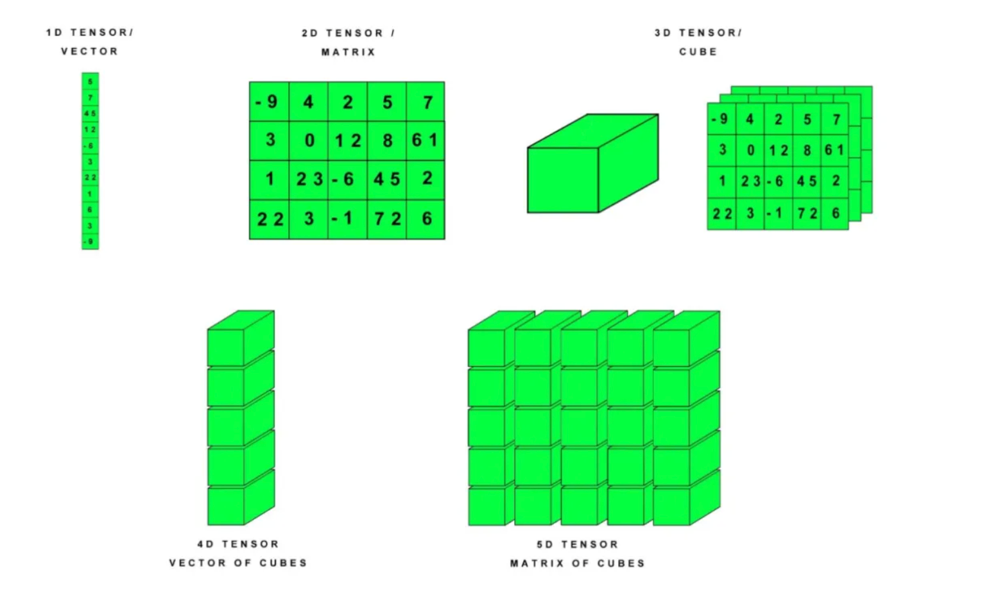

# pytorch的维度变换函数

## [维度转换函数](https://mp.weixin.qq.com/s/x5EsNBlIyAvcXMfJ6Km2ZQ)

1. `torch.unsqueeze(input, dim)`：在指定维度 `dim` 上增加一个新的维度。如果 `dim` 已经存在，则在其前面添加新的维度。
2. `torch.squeeze(input, dim=None)`：移除所有长度为1的维度。如果指定了 `dim`，则只移除该维度。
3. `torch.flatten(input, start_dim=0, end_dim=-1)`：将输入张量从 `start_dim` 到 `end_dim` 的所有维度展平。
4. `torch.view(input, size)` 或 `input.view(size)`：重新调整张量的形状，不改变数据。
5. `torch.reshape(input, shape)`：与 `view` 类似，用于改变张量的形状，但 `reshape` 可以处理更复杂的维度变换，如增加或减少维度。
6. `torch.permute(input, dims)`：重新排列输入张量的维度，`dims` 是一个维度索引的元组。
7. `torch.transpose(input, dim0, dim1)`：交换输入张量的两个维度。
8. `torch.expand(input, size)`：将输入张量沿指定的维度复制扩展。
9. `torch.cat(tensors, dim)`：沿指定维度 `dim` 连接多个张量。
10. `torch.stack(tensors, dim)`：沿新的维度 `dim` 堆叠多个张量，与 `cat` 不同的是，`stack` 会增加一个新的维度。
11. `torch.reapeat`

12. `torch.tile`

```python
positon_embedding = torch.tile(positon_embedding_table[:seq_len],[token_embedding.shape[0],1,1])
# positon_embedding_table[:seq_len] = positon_embedding_table[:5] 取前5个8维
# [:5] 表示 对 第一维 索引
# positon_embedding_table[:seq_len] = 5,8
# [token_embedding.shape[0],1,1] = [1,1,1]
# positon_embedding = 1,5,8
```

## [理解张量](https://mp.weixin.qq.com/s/qB0yJKJTtpcv70MN4OMttQ)

假如你有一个篮子，里面装满了各种颜色的小球。每个小球代表一个数字。现在，如果我们想把这些小球按照一定的顺序排列，比如一行或者一列，这就是一个一维数组。如果你把几行这样的小球排列起来，就形成了一个二维数组，就像一个表格一样。如果你再把这些表格堆叠起来，就形成了一个三维数组。在PyTorch中，张量就是一种用来表示这些不同维度数组的数据结构。



