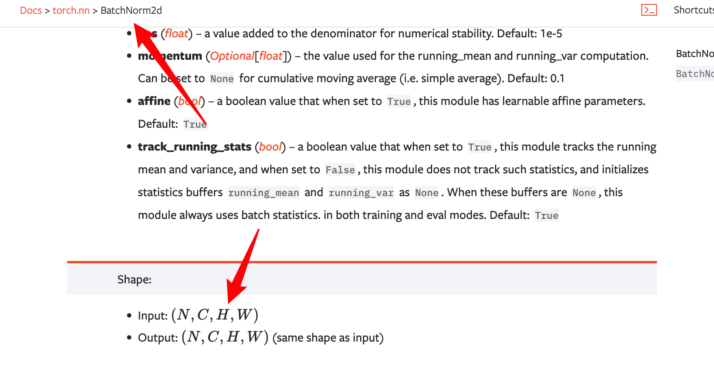

# 5种归一化方法

[45、五种归一化的原理与PyTorch逐行手写实现讲解(BatchNorm/LayerNorm/InsNorm/GroupNorm/WeightNorm)](https://www.bilibili.com/video/BV1Pq4y1a7pH?spm_id_from=333.788.videopod.sections&vd_source=ddd7d236ab3e9b123c4086c415f4939e)

## BatchNorm

> 批归一化、通道级别的归一化

### 官网api，BatchNorm1D & 2D

BatchNorm1D的输入：NCL，用于NLP

BatchNorm2D的输入是四维的，用于图像

一个是三维tensor作为输入

一个是四维tensor作为输入

### BatchNorm1D

 

- 首先，位于torch.nn模块下，是一个class，所以要用的话，需要实例化
- 接下来，看实例化需要接收的参数：
  - num features：输入张量的特征维度，或者通道的数目，或者embedding的大小
  - eps：5种归一化都需要的eps，分母数值稳定性，让分母加上一个微小的量，使得除法能够正常进行，默认1e-05
  - momentum：动量
    - 批归一化在计算均值和方差的时候，momentum通常需要跟track_running_sate联合起来理解，也就是说我们的统计量 通常是通过滑动平均计算出来了，而不是单一时刻的mini batch，是一个累计的过程，为了提高估计的准确度
  - affine：
    - 也就是 gamma & beta，也就是再做完归一化以后，也可以加一个映射，将其映射到一个新的分布上，做一个rescale和recenter

官网定义：

（解释官网定义）均值和标准差是经过整个mini_batch

> 一句话说明 BatchNorm：per channel across mini-batch
>
> 贯穿整个mini batch计算统计量，每个通道单独去算的
>
> gamma 和 beta 是可学习的向量，维度都是C，默认的情况下 $\gamma = 1、\beta=0 $
>
> 标准差用的是有偏估计，也就是计算的标准差是 $\frac{1}{n}$，强调这句话的目的是 ，在计算方差的时候，要用 $\mathrm{unbiased=False}$，这里用得是有偏估计
>
> 在默认情况下，在训练中，会不断的记录历史的均值和方差，并且使用0.1的动量，来做移动的估计，当训练结束以后，用最后一个时刻的估计量来做 inference
>
> 也可以设置 track running states等于false，就是不要记录历史的移动的值

以上是api的介绍

接下来 自己写一个BatchNorm 更好的理解