# LSTM

## RNNCELL

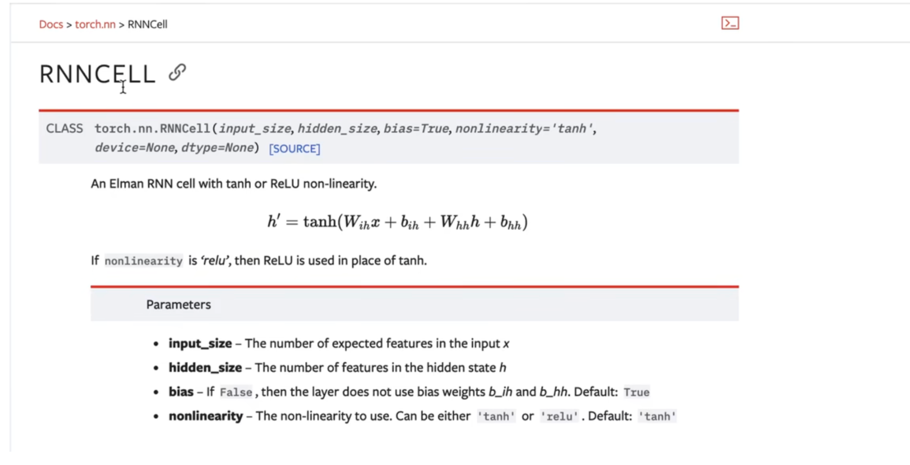

RNNCELL，可以理解为 单步 的迭代

因为所有的循环神经网络 都是有很多步去迭代，最终把每一步的状态 取出来作为输出

这里的RNNCELL，也就是说 多个，每个时刻的计算 就是一个RNNCELL，然后把 多个RNNCELL 连起来 ，其实就构成了 一个RNN，所以 无论是RNN也好，还是 GRU也好，还是 LSTM也好，它们 都有各自的CELL，然后每个CELL，其实就是一个 单步的运算，可以理解为 单个时刻的运算，下面 有一个例子

代码解释：

- 首先实例化 RNNCELL
- RNNCELL的 `input size`和`hidden size`分别为10和20
- 定义 `input` 的训练特征，`batch size`是3，然后 `时间长度`是6，然后`特征维度`是10
- 定义初始的 `hidden state`[`hx`]
- 用RNNCELL做每一次迭代

所以定义一个 for循环，然后 每一步调用RNNCELL实例化的操作，算出每一时刻的隐含状态 `hx=rnn(input[i],hx)`  ，定义 $h_x$接收输出结果

- RNNCELL 就是 单步 的计算，包括 GRUCELL 和LSTMCELL，都是单步的
-  RNN 就是把多个RNNCELL 连起来 ，所以是多步的

## LSTM 官方 api

LSTM 原理可见[博客](https://colah.github.io/posts/2015-08-Understanding-LSTMs/)：

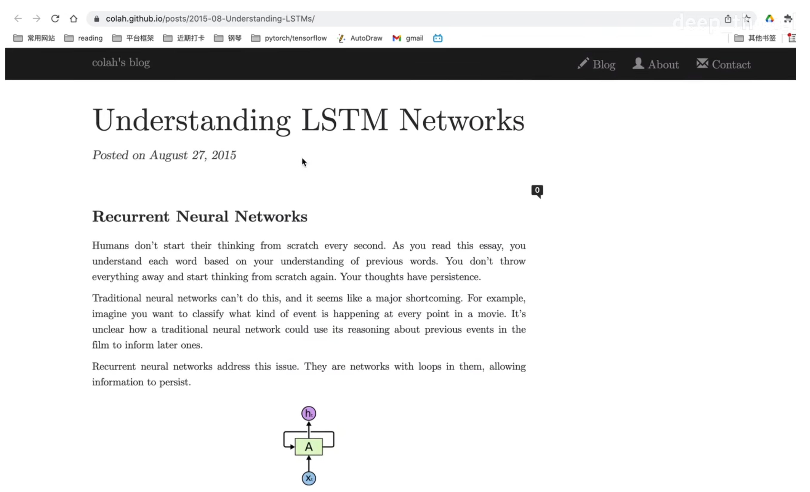

### & RNN

- LSTM比RNN多了几个门
- RNN比较简单 ： 输入 + 隐含状态，只有这两个状态

在LSTM中，多了一些门：

（1）输入门

（2）输出门

（3）遗忘门

（4）记忆单元

### LSTM 图示

图片理解：

最上面的横线，长得像传送带的东西，是一个细胞单元，或者说细胞状态

整个LSTM就是靠这个细胞状态，来不断的 更新 历史信息的

### LSTM 有哪些门？

对照官方 api：

1. `i`就是 输入门
2. `f`就是遗忘门
3. `g`就是细胞
4. `o`就是输出门
5. `c`成为`cell`，叫细胞单元，或者叫 细胞状态
6. `h`就是`LSTM`的隐含状态，或者说 输出。因为模型最终输出的是 $h_t$

### `api` 对应到图、数学公式

图示：

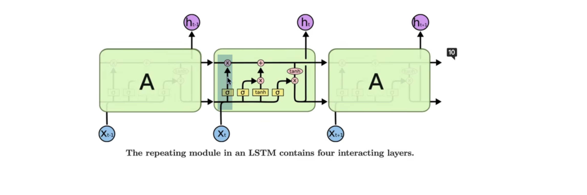

图示 & 符号：

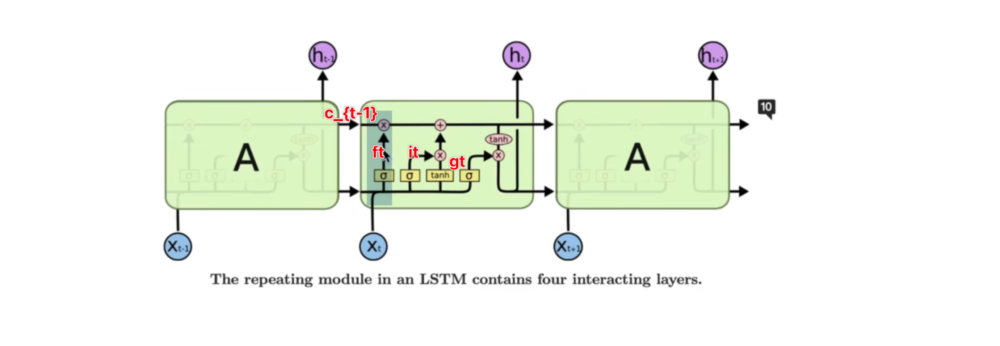

（1）遗忘门：$f_t \odot c_{t-1}$ 

 `step1：`遗忘门的输出(得到经过遗忘门的筛选信息 ) $f_t$ 

**遗忘门的输出 $f_t$ 怎么计算的？**

> $x_t$ 跟历史的输出进行交互，然后经过 $\sigma$线性函数，得到 $f_t$

`step2：`遗忘门的输出跟上一时刻的  $c_{t-1}$ 相乘，对应的数学公式：

$$f_t \odot c_{t-1}$$

（2）输入门 $i_t$ 、细胞 $g_t$

如图框：

1. 同样 $x_t$跟过往的 $x_{t-1}$进行交互，然后经过一个 $\sigma$函数，得到输入门 $i_t$
2. 然后 $x_t$ 跟上一时刻的 $x_{t-1}$，经过  $\tanh$激活函数 ，得到的是 $g_t$，称作细胞
3. $g_t$ 跟输入门相乘，相当于对当前的输入信息进行筛选

公式：

$$g_t \odot i_t$$

（3）最新细胞状态的 $c_t$ 

① 把信息$g_t \odot i_t$加到目前最新的 $c_t$ 上

② 最新的 $c_t$是上一时刻 $c_t$乘遗忘门$f_t$，得到新的 $c_t$

也就是说该丢掉的信息丢掉了再加上输入门 ，更新细胞状态，这个过程对应的公式表示：

$$c_t = f_t \odot c_{t-1} + i_t \odot g_t$$

（4）输出门 $\ o_t$

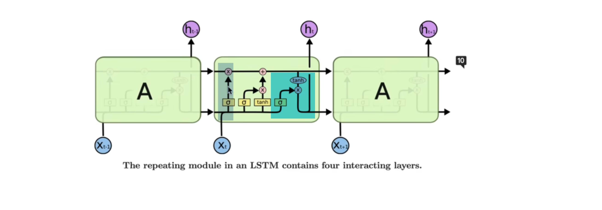

最后一根线叫做 输出门

同样是 $x_t$跟$h_{t-1}$，进行交互，经过sigmoid函数，得到$o_t$，就是输出门，最终的输出 ： $o_t × \tanh (c_t)$，数学公式表达：

$$h_t = o_t \odot \tanh(c_t)$$

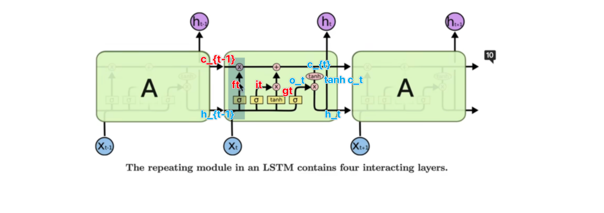

$h_t$ 跟每一时刻的输入进行交互的，也就是线性组合

$c_t$不断对 历史信息进行一个 更新

通过遗忘门、输入门，不断对 $c_t$进行一个 更新

以上是LSTM的公式 和 结构，再来看一遍数学公式：

$$i_t = \sigma(W_{ii}x_t+b_{ii}+W_{hi}h_{t-1}+b_{hi})$$

$$f_t = \sigma(W_{if}x_t + b_{if}+W_{hf}h_{t-1}+b_{hf})$$

$$g_t = \tanh(W_{ig}x_t + b_{ig}+W_{hg}h_{t-1}+b_{hg})$$

$$o_t = \sigma(W_{io}x_t+b_{io}+W_{ho}h_{t-1}+b_{ho})$$

$$c_t = f_t \odot c_{t-1}+i_t \odot g_t$$

$$h_t = o_t \odot \tanh(c_t)$$

补充：

（1）但从公式来说，$i、f、g、o$ 需要的就是 $x_t$ 和 $h_{t-1}$当前时刻的输入和历史信息

（2）对比 RNN 的公式：

$$h_t = \tanh(x_tW_{ih}^T+b_{ih}+h_{t-1}W_{hh}^T+b_{hh})$$

单从公式来说，RNN 历史信息的保存仅通过 当前时刻的输入 $x_t$ 和 上一时刻的历史信息 $h_{t-1}$

（3）再放一遍公式，体会：

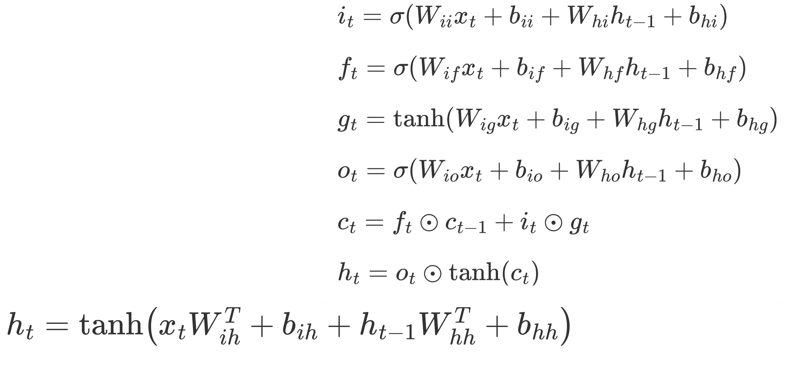

（4）LSTM 多了一个细胞状态，问题：为什么 LSTM 要设置细胞状态，为什么要这么设计公式更新细胞状态和隐藏状态？

（5）查阅资料

[ref](https://blog.csdn.net/qq_29053993/article/details/90547382)：LSTM

> 0、核心是 细胞门（对比 RNN 这个是比较好理解的。可是为什么要有细胞门呢？）
>
> 
>
> 1、忘记一些信息
>
> 遗忘门的作用是 **决定丢弃什么信息**
>
> 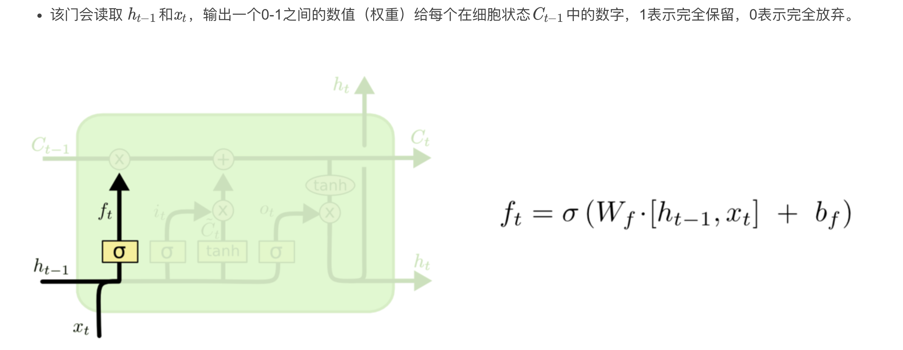
>
> 2、新东西加入 细胞状态
>
> 输入门 & 不知道怎么称呼合适的东西（学名：$\tilde{C}_t$）
>
> 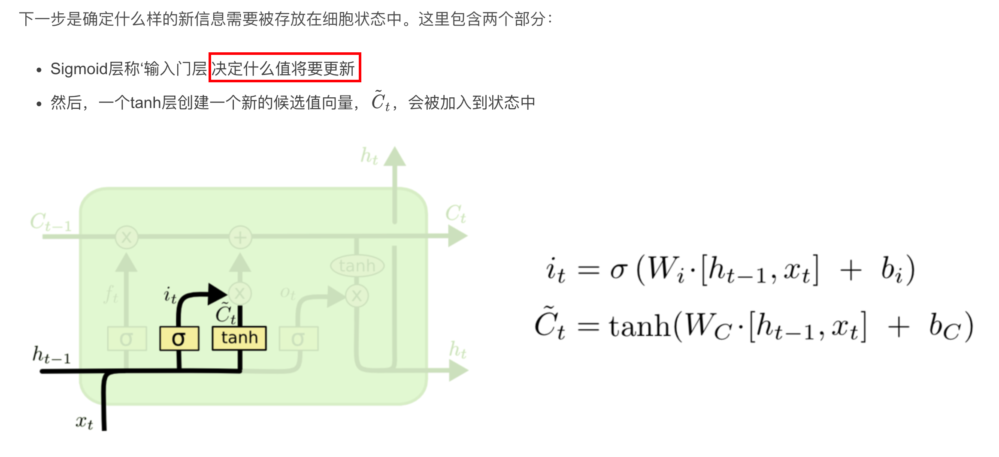
>
> $\sigma$ 函数 和 $\tanh$ 函数有什么区别？为什么 $\sigma$函数就起了那样的作用，$\tanh$函数又起了这样的作用？
>
> 3、
>
> 
>
> 

（6）RNN、LSTM、GRU通用网络框架

（7）RNN & LSTM 的应用例子（帮助理解）：

RNN 就足够：

LSTM 才可以（间隔太大）：

（9）[LSTM 的理解](https://www.jianshu.com/p/4b4701beba92)：

输入：$x_t$ 、$h_{t-1}$、$c_{t-1}$

中间：$i、f、g、o$

输出：$c_t$、$h_t$

**一、忘记门** $f$

- 要丢弃什么信息

LSTM的第一步是决定我们要从细胞状态中丢弃什么信息。

<u>怎么实现的？</u>

该决定由被称为"忘记门"的$\ Sigmoid$层实现

<u>具体怎么实现？</u> 

查看`ht-1(前一个输出)`和`xt(当前输入)`，并为单元格状态`Ct-1(上一个状态)`中的每个数字输出`0`和`1`之间的数字。

<u>为什么用 sigmoid 函数，输出代表什么意思？</u>

`1`代表完全保留，而`0`代表彻底删除，所以用 `sigmoid 函数`

<u>图示</u>

二、$i_t$、$g_t$

- 要保留什么信息？

就是决定我们要在细胞状态中存储什么信息

这部分分为两步：

1、首先，称为"输入门层"的Sigmoid层决定了将更新哪些值

2、接下来一个tanh层创建候选向量Ct，该向量将会被加到细胞的状态中

在下一步中，我们将结合这两个向量来创建更新值。

图示：

这里的 $\tilde{C}_t$ 和 $g_t$  是一个东西，学名：候选向量

问题：$\tanh$ 输出的含义是什么？

类似 sigmoid 的输出 `0 表示遗忘，1 表示记住`

三、更新细胞状态得到 $c_t$

更新上一个状态值$C_{t−1}$了，将其更新为$C_t$

将上一个状态值乘以$f_t$，以此表达期待忘记的部分 $ \iff f_t \odot c_{t-1}$

之后将得到的值加上 $i_t∗\tilde{C}_t$  $\iff + i_t \odot \tilde{C}_t$

这个得到的是新的候选值 $C_t$， 按照我们决定更新每个状态值的多少来衡量，最终的公式：

$$c_t = f_t \odot c_{t-1} + i_t \odot g_t $$

以上得到了 第一个 输出 $c_t$，现在开始第二个输出 $h_t$

四、输出什么

最后需要决定要输出什么

此输出将基于细胞状态，但 是一个过滤版本。  $tanh(C_t)$

- 首先，经过一个sigmoid层，决定了要输出的细胞状态的哪些部分  $o_t = \sigma(f(h_{t-1},x_t))$
- 然后，将单元格状态通过tanh（将值规范化到-1和1之间），并将其乘以Sigmoid门的输出   $h_t = o_t \odot \tanh(c_t)$

至此就输出了决定的那些部分

把公式精简一下：

输入：$x_t$、$h_{t-1}$

操作：(这里的符号是参照官网 api 的)

$f_t = \sigma(f(x_t,h_{t-1})) \iff \sigma(W_f[x_t,h_{t-1}]+b_f)$

$i_t = \sigma(f(x_t,h_{t-1})) \iff \sigma(W_i[x_t,h_{t-1}]+b_i)$

$g_t = \sigma(f(x_t,h_{t-1})) \iff \sigma(W_g[x_t,h_{t-1}]+b_g)$

$o_t = \sigma(f(x_t,h_{t-1})) \iff \sigma(W_o[x_t,h_{t-1}]+b_o)$

$f$ 代表仿射变换 $Wx+b$

输出：$c_t、h_t$（这个图示，画得太细，反而晕乎）

$c_t = f_t \odot c_{t-1} + i_t \odot g_t$

理解：

1、$f_t$ 指示 要忘记的历史信息（白话：$更新历史信息$，该记住的记住，该忘记的忘记，忘记多少也表达了记住多少，需要看参照）

2、$i_t$ 保留多少输入信息，为输入信息加权；

$g_t$ 表示输入信息，最后得到的是要记住多少输入信息

3、最后同时存到 $c_t$ 中

$h_t = \tanh({c_t}) \odot o_t$

理解：

最后，需要决定输出什么

输出基于细胞状态，是过滤版本

step1：首先，通过sigmoid层，决定要输出的细胞状态的哪些部分

step2：然后，将单元格状态通过tanh（将值规范化到-1和1之间）

step3：并将其乘以Sigmoid门的输出，至此输出决定的那些部分

以上是关于 LSTM 内部的计算理解

### 	torch.nn.LSTM

与 RNN 对比：

> 在参数相同的条件下，LSTM的序列建模能力是强于RNN的，所以比较大的序列建模任务都是用 LSTM做

pytorch 的官方 api：`torch.nn.LSTM`

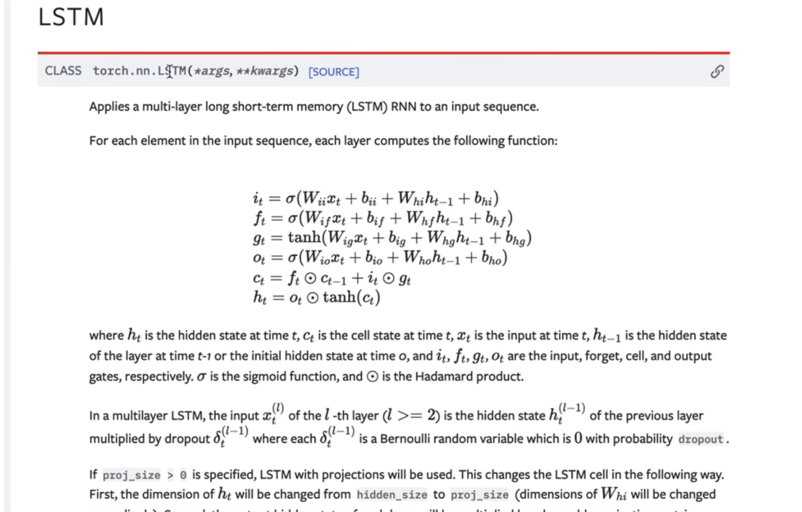

- 这是一个class，是一个类
- 要用的话

（1）首先进行实例化，得到一个算子

（2）喂入输入序列，输入序列经过LSTM网络，得到的 每个输入状态的输出，最后将得到状态的输出： $h_t$

（3）每一时刻的 $h_t$ 组合起来的输出序列

**<u>明确 LSTM 的公式：</u>**

首先，` LSTM核心：细胞状态`

一共涉及的东西：$f、i、g、o、h、c$

输入：$x_t、h_{t-1}$

公式：

$f_t=\sigma(w_f[x_t,h_{t-1}]+b_f)$ 

$i_t = \sigma(w_i[x_t,h_{t-1}]+b_i)$

$g_t = \tanh(w_g[x_t,h_{t-1}]+b_g)$

$o_t = \sigma(w_o[x_t,h_{t-1}]+b_o) $

$c_t = f_t \odot c_{t-1} + i_t \odot g_t$

$h_t = o_t \odot \tanh(c_t)$

四个门，分别是$i、f、g、o$

这里有四个门：

（1）其中有三个门非线性激活函数都是 `sigmoid`

（2）$g_t$的激活函数是 tanh函数

<u>其实这四个门的运算有很大的相似性</u>

> 有 四个 $W$
>
> 并且四个$W$都是跟$x_t$进行一个矩阵相乘
>
> 同样的 $W_{hi} 、W_{hf}$右边的四个$W$，也是跟 $h_{t-1}$，进行矩阵相乘
>
> 所以虽然看上去有4个$W_i$，但是可以把 这个 四个 $W_i$叠起来
>
> 比方说 每个$W_i$是$2$行，那么$4$个$W_i$，就可以 叠成$8$行

然后再跟 $x_t$ 进行一个相乘，就是把 这个 $四个 W乘以x$

$W×x$ 组合起来，一起算

同样这里的$W乘以h(W×h)$也是一样的

由于都是 乘以 同一个$h$

同样把 四个 $W$堆叠起来，$stack$堆叠来，算完了 再$split$

如图，还有$4$个$b_i$和$b_h$，输入 $linear$的偏置 和上一时刻 隐含状态线性层的偏置

同样这里 $4$个偏置，$4$个$b_i$ 就是直接加，不需要联合算

同样这里的$b_h$，也是$4$个偏置

维度都是跟$i_t、 f_t$ 维度是一样的，得到的 $i、f、g、o$以后，就可以算出当前时刻细胞的状态 $c_t$

About $c_t$ ：

（1）$c_t= f_t×c_{t-1}$，中间的乘是逐元素的乘，不是矩阵乘法

（2）默认$f_t$跟$c_{t-1}$维度是一样的，同一位置上的元素两两相乘

（3）同样 $i_t$和$g_t$也是一样，同一位置的两两元素 相乘

（4）乘完以后元素再加起来，得到$c_t$

$c_t$ 是当前时刻的细胞状态，就是上面的黑线，这黑线是 LSTM 的创新

??? question "（作者咋想的，要加条黑线，还有这些门的设计，why？）"

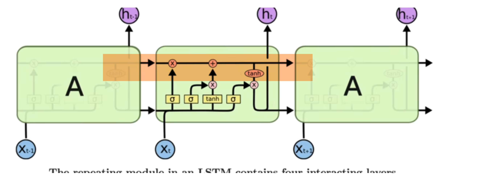

