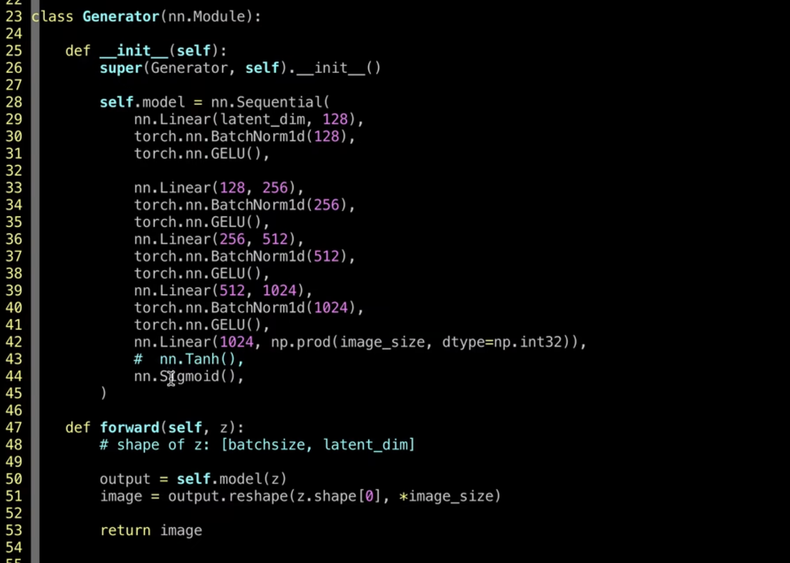
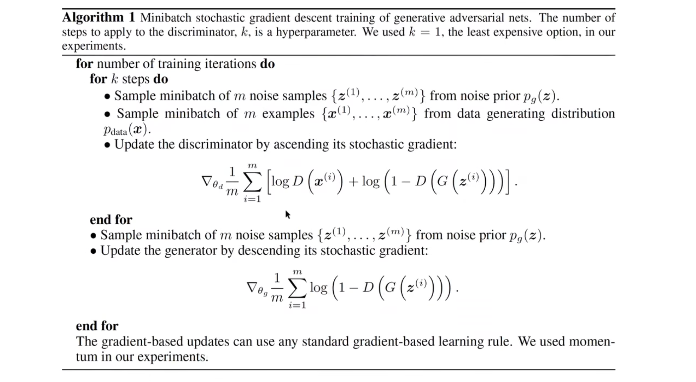
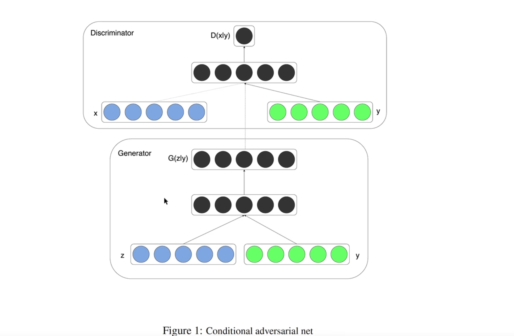

# GAN 变体

[cGAN及LSGAN的原理与PyTorch手写逐行讲解](https://www.bilibili.com/video/BV1444y1G7y2?spm_id_from=333.788.player.switch&vd_source=ddd7d236ab3e9b123c4086c415f4939e)


- 条件GAN
- 最小平方GAN or  最小二乘GAN

topic：原理 & 代码实现

minist数据集：6w张手写数字图片

GAN基于minist数据集进行无监督的图片生成任务

## 1 Recall

GAN的代码实现逻辑，首先构建Generator，Generator以一个隐变量，从高斯分布生成的随机隐变量z，作为输入，然后把z放入到很多层DNN中，DNN最后生成图片大小的生成图片，然后通过激活函数约束到一定的值域内，通过nn.Sigmoid() 或者 nn.tanh()都可以：




经过 生成器，生成一张图片

基于 随机高斯变量z，生成一张照片，z的维度可以设置一个latent_dim，比如96，并且令batchsize=64，此时每一次训练的大小 就是 64×96的二维张量

以上是生成器，接下来看判别器：


判别器的作用：

（1）准确的区分出 什么是真实样本 什么是 预测样本

（2）给出信号，使得生成器 更好的生成 更加逼近真实的样本

判别器以 图片作为输入，接着由 一系列的  nn层，谱归一化 是后面加的，最后输出一个标量值，标量值 通过nn.Sigmoid() 输出的，原始的GAN使用的是 二分类 交叉熵 的损失函数，所以使用的是nn.Sigmoid


构建 dataset，dataloader

dataset使用的torchvision的库，对数据集进行下载

解释 torchvision.transforms.Compose中   torchvision.transformsNormalize 为什么使用的 均值=0.5，方差=0.5，如果我们去计算minist数据集均值和方差 的话，均值 大概等于 0.1，标准差约等于0.3，而这里使用的均值和方差为0.5，是因为本来是使用ToTensor的语句，已经把图片的值域约束到了0\~1之间，0~1之间 减去 0.5，变成-0.5到0.5之间，-0.5到0.5再除以0.5，变成-1到1之间，所以这行的语句并不是归一到正态分布，而是把值域从0\~1变化到-1\~1之间，这是写代码的小技巧：在transforms中的组合里面，怎么把上一步的0\~1的浮点数怎么变成-1\~1之间的值域，可以通过均值和标准差归一化实现，此时我们设置均值=0.5，标准差=0.5，从原来的0\~1范围内，变成-1\~1范围内，变换到-1\~1范围内。变成-1\~1范围内，就可以在Generator中，使用tanh函数预测最终的像素值

最终tanh函数虽然输出的是-1\~1，但是我们在保存照片的时候，可以通过增加一个Normalize=True，就可以使得图片从-1\~1，再次变成0 \~1之间

在训练时，


计算g的时候，把预测的照片 送入到判别器中，把全1的标签，作为当前的标签，来得到loss值，来更新Generator

对于判别器而言，有两个loss，


`real_loss` 和 `fake_loss` 

`real_loss` 把真实的照片送入到判别器中，标签是全1 的

`fake_loss`  把预测的照片 送入到判别器中，标签是全0 的

我们希望判别器是能够区分真实照片和预测照片的


之后，依次更新 生成器和判别器即可

以上是原始GAN，通过二分类的、交叉熵loss来作为判别器的loss function

## 2 条件GAN


- 条件GAN
- 应用很广泛
- 引用次数 4k 多次

### 2.1 cGAN的创新点

- 为什么会有 条件GAN？

> 首先讨论原始GAN的生成有什么问题？
>
> 
>
> 原始GAN的图片生成过程，可以看原文的算法1
>
> （1）看判别器的输入，无论是真实的样本，还是预测的样本，输入都只有一个，$x^{(i)}$ 或者 $G(z{(i)})$，只是把照片送入到判别器之中
>
> 
>
> ，但是在minist数据库中，照片有10个类别，0\~9，10个手写字识别，10类的时候，仅仅输入一个随机的高斯变量z的话，没有输入任何其他的信息，并且希望生成器能够生成当前样本，当前从minibatch中，取得的是0，希望在z的指导下，生成0的照片，如果当前真实照片拿到的是1，我们指望随机变量z，生成为1的照片，这样也是可以的，但是有点难，就是给的信息量太少了，z就是一个随机的高斯变量，不确定性很大，因此有助于我们预测目标照片的信息就很少，这时，思考，我们还可以提供什么量呢？我们可以提供一个c，一个condition，也就是说当我们的G的输入，接收的输入不仅仅是z，而是以随机高斯变量z和条件c一起作为输入的时候，c就是condition条件，可以是标签，比如我们当前预测手写字1的照片，就可以将1 的 class信息传入到G之中，这时候G的输入不仅是z还有类别标签1，当做条件c，这时生成器能更好的知道 要生成的 图片是 1，不是2也不是3，可以使得生成器有目标的生成，以上就是cGAN的点

原始GAN公式：


以 $x$ 或者 $G(z)$ 作为输入，也就是原始GAN中以照片作为输入

现在引入$y$


$y$表示 条件信息

比如在MNIST数据集中，$y$可以表示每张照片的标签信息，比如当前手写数字照片是1的话，那这个标签就算是1，如果当前生成手写数字照片是2的话，那么这个标签就是2，也就是把$y$的信息，也作为生成器的输入，此时可以更好地学习目标照片的生成，因为我们指定当前生成器生成"1"的照片，于是我们提供标签等于1，这个信息；如果当前指定生成"2"的照片，我们就传入 "y=2" 的信息 传入网络，以上就是cGAN的论文 提出的改进点，创新思想比较简单，但是应用却很广泛

后面的应用中，基本上都是条件GAN的，而不是完全的一个高斯变量作为生成器的输入信号

### 2.2 



图：

- 上：生成器
- 下：判别器

**（1）生成器**

生成器的输入除标准的z以外，还有绿色部分，绿色部分就是条件信息

条件信息可以是连续的变量，也可以是离散的变量

比如说 手写字生成任务中，提供的条件信息就是 每一次 手写字的照片，里面数字的类别，提供的一个class信息，且这个class信息是一个one hot的变量，如果把one hot变量直接传入进去，会比较稀疏，最标准的做法，就是按照之前的word embedding一样，把class信息转化成一个 class embedding，然后再跟z拼起来，然后再输入到网络之中，这是标准的作法。（class $\rightarrow$ class embedding）

**（2）判别器**

类似的，在判别器之中，也可以加入条件信息，怎么理解？

判别器每次接收的照片，类别不太一样，比如上次接收照片的是"1"，判别器根据自己的判断，判断1是真的还是假的，第二次给判别器一张"2"的照片，又去判断2是真的还是假的，如果不告诉判别器这张 "1" 的照片 是 1，"2" 的照片是2，两张照片属于不同类别的话，判别器可能很难去判断。但是如果告诉了判别器两张照片是不同类别的话，告诉判别器当前 照片 属于 1 这个类别，判别器判断当前照片是不是真的是1，第二次给判别器 2 这张照片，然后判断当前照片是不是真的是2，所以在判别器当中 也可以引入class信息，引入条件，在minist手写字体识别任务中，判别器的输入可以通过 one hot的class label转换成 class embedding，然后跟图像拼起来，或者把class embedding经过几层DNN再拼起来

以上是cGAN核心的点

## 3 条件GAN 代码实现

```python

```

### 3.1 生成器代码解读

```python
class Generator(nn.Moudle):
    def __init__(self):
        super(Generator,self).__init__()

        self.embedding = nn.Embedding(10,label_emb_dim)
        self.model = nn.Sequential(
            nn.Linear(latent_dim+label_emb_dim,128),
            torch.nn.BatchNorm1d(128),
            torch.nn.GELU(),

            nn.Linear(128,256),
            torch.nn.BatchNorm1d(256),
            torch.nn.GELU(),
            nn.Linear(256,512),
            torch.nn.BatchNorm1d(512),
            torch.nn.GELU(),
            nn.Linear(512,1024),
            torch.nn.BatchNorm1d(1024),
            torch.nn.GELU(),
            nn.Linear(1024,np.prod(image_size,dtype=np.int32)),
            nn.Sigmoid(),
        )
    def forward(self,z,labels):
        # shape of z:[batchszie,latent_dim]
        label_embedding = self.embedding(labels)
        z = torch.cat([z,label_embedding],axis=-1)

        output = self.model(z)
        image = output.reshape(z.shape[0],*image_size)

        return image
```

cGAN进行手写字生成任务

- 生成器的forward函数中，加入labels信息
- labels表示希望生成器要生成指定的目标，而不是随便生成的，比如有10个类别，0\~9个不同类别的照片，通过指定label，比如指定1就生成1的图像，指定2就生成2的照片，这就是条件信息，通过labels传入，labels就是离散的标签变量，既然是离散的

```python
    def forward(self,z,labels):
        # shape of z:[batchszie,latent_dim]
        label_embedding = self.embedding(labels)
        z = torch.cat([z,label_embedding],axis=-1)

        output = self.model(z)
        image = output.reshape(z.shape[0],*image_size)

        return image
```

（1）第一步，通过embedding table把label传入到embedding table去找到对应的embedding vector，得到label embedding，这是第一步，把离散的label 类别信息 转化成连续的 浮点向量，

（2）第二步，得到embedding向量之后，把这个向量最简单的是，跟z拼起来，当然这个效果不一定最好，可以常识不同的特征构造方法

以上步骤得到了新的z，这个z包含了条件信息的量，这时把z继续送入到之前的生成器主干网络中，由DNN和非线性激活函数构成的主干网络之中，的都最后的image

以上在生成器之中，引入了 条件信息，这里的改变：

- `self.embedding = nn.Embedding(10,label_emb_dim)`  init中 添加了embedding的量，实例化是10行，因为有10类手写数字，第二维 `label_emb_dim` 也就是 `label_embedding` 的维度，设置为32，在forward函数中，需要把 labels 作为参数，作为一部分输入传入  `self.model`

### 3.2 判别器代码解读

```python
class Discriminator(nn.Module):
    def __init__(self):
        super(Discriminator,self).__init__()

        self.embedding = nn.Embedding(10,label_emb_dim)
        self.model = nn.Sequential(
            nn.Linear(np.prod(image_size,dtype=np.int32)+label_emb_dim,512),
            torch.nn.GELU(),
            torch.nn.utils.spectral_norm(nn.Linear(512,256)),
            torch.nn.GELU(),
            torch.nn.utils.spectral_norm(nn.Linear(256,128)),
            torch.nn.GELU(),
            torch.nn.utils.spectral_norm(nn.Linear(128,64)),
            torch.nn.GELU(),
            torch.nn.utils.spectral_norm(nn.Linear(64,32)),
            torch.nn.GELU(),
            torch.nn.utils.spectral_norm(nn.Linear(32,1)),
            nn.Sigmoid(),
        )
    def forward(self,image,labels):
        # shape of image:[batchsize,1,28,28]

        label_embedding = self.embedding(labels)
        prob = self.model(torch.cat([image.reshape(image.shape[0],-1),label_embedding],axis=-1))
        return prob
```


## 4 最小平方GAN


## 5 最小平方GAN代码实现
