# 4种卷积


- [x] 转置卷积、反卷积
- [x] 分组卷积、深度可分离卷积
- [x] 1×1卷积、逐点卷积
- [x] 膨胀卷积、空洞卷积卷积
- [ ] 可变形卷积
- [ ] 大核卷积

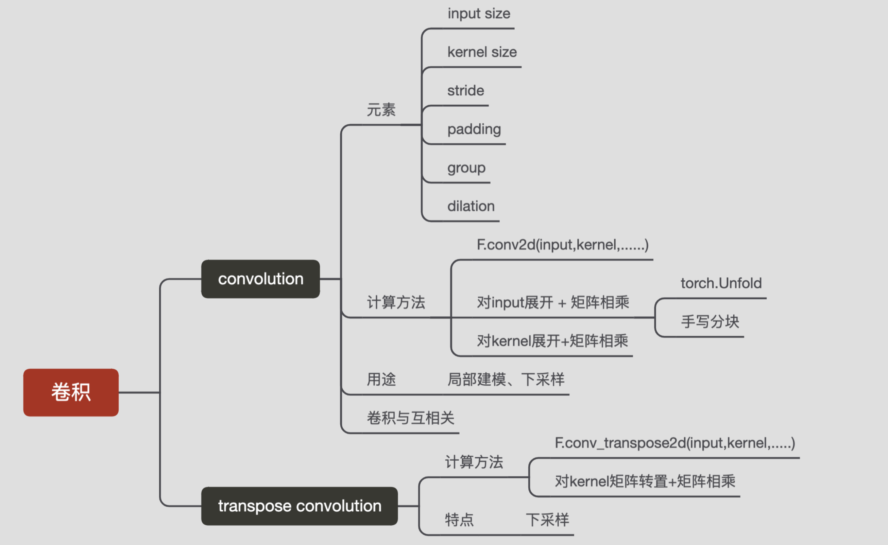


## 1 库函数实现卷积

- 类：`torch.nn.Conv2d`
- 函数：`F.conv2d`  or `torch.nn.functional.conv2d`

```python
import torch
import torch.nn as nn
import torch.nn.functional as F

in_channels = 1
out_channels = 1
kernel_size = 3
batch_size = 1
bias = False

input_size = [batch_size,in_channels,4,4]

# 第一种实现
conv_layer = torch.nn.Conv2d(in_channels,out_channels,kernel_size,bias=bias)

input_feature_map = torch.randn(input_size)
out_feature_map = conv_layer(input_feature_map)
# print(input_feature_map)
# print(conv_layer.weight)  # 1*1*3*3=out_channels*in_channels*height*width

print(out_feature_map)

out_feature_map1 = F.conv2d(input_feature_map,conv_layer.weight)

print(out_feature_map1)
```

### 首先看一下 二维卷积的api

> 

谷歌搜索 pytorch conv2d，出现两个api ：

- 一个是大写的二维卷积、 class
- 一个是 torch.nn.functional.conv2d小写的二维卷积、函数

区别：

> - （第一个区别）
>
>   - 第一个大写的是一个class，如果我们要用第一个的话，我们首先需要对这个class进行一个实例化，然后对实例化的对象，再对输入特征图进行一个卷积 操作；  
>
>   - 第二个是一个函数，不需要实例化，就直接接收一个输入特征图，直接进行一个卷积操作；以上是第一个区别； 
>
> - （第二个区别）
>   - class可以自己去创建操作，包括weight和bias，可以自动去创建，就不需要手动创建；
>   - 对于函数来说， 需要手动的传入weight和bias；

### CONV2D

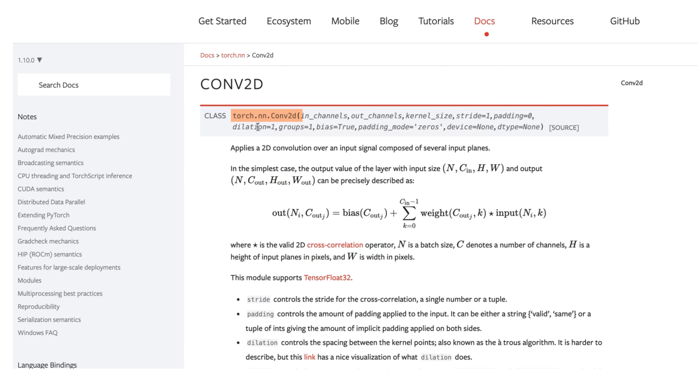

- 调用：torch.nn.Conv2d
- 需要传入的参数：
  - 输入通道
  - 输出通道
  - kernel的大小
  - 步长
  - padding填充
  - 膨胀dilation
  - group

- 区分 卷积 & 全连接：

  > 神经网络最核心的一个操作：仿射变换：将一个矩阵 乘以 输入向量 得到 另外一个向量。这是全连接网络的一个做法， 所以我们一般会对一个向量 做全连接的网络 的输入；比方说：一个word embedding向量；比方说 要预测房价，城市的人口还有物价等，不同的浮点数 组成的向量，这些都可以送入 全连接网络。
  >
  > 
  >
  > 所以全连接网络 是把 输入当成一个向量，然后统一的去乘 一个矩阵，进行操作。但是，还有很多其他东西，不能仅仅使用一个向量来进行刻画，比如图像有长度和宽度，是一个二维的，还有RGB三个通道，这些 我们不能仅仅只是把图片拉直处理，这样破坏了图片的空间结构；
  >
  > 
  >
  > 类似的还有语音，语言有时间维还有频率维，我们每个时刻发出的声音， 是由不同的频率组合的，同样对于语音这种信号，我们也不能仅仅是 当成 一维信号处理，甚至更复杂的是 图像和语音信号的结合，比如视频。所以对于这些我们不能仅仅只是当成一个向量处理，这样的话，全连接网络也就无法刻画它，我们可以用卷积网络刻画，对于卷积网络 和 哪些操作 比较相关呢？就是互相关，如果学过信号与系统的话，互相关就是 对于两个一维向量，我们把一个一维信号 沿着 另外一个一维信号，不断地进行 滑动相乘的操作，然后计算 一个相关系数。卷积也是类似的，对于一张图片，如果我们有一个卷积核的话，叫做kernel，我们会把 kernel 沿着 图片的不同区域 进行一个滑动相乘，来得到一个特征的表示


- 数学例子：

  > 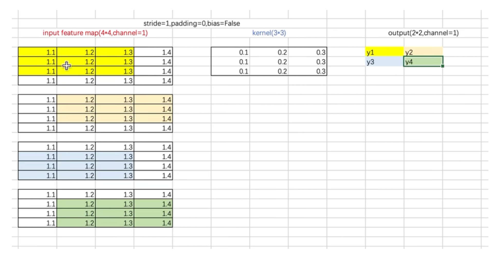
  >
  > - 假设我们的input feature map=4×4，kernel=3×3，卷积操作就是将kernel在图片上 不同位置元素相乘 element-wise，不同位置元素相乘再相加，得到输出；
  > - k=3，p=0，s=1
  > - kernel的移动轨迹是Z字型的，从左到右，从上到下
  > - 输入input future map的大小是4×4的，而且 channel=1，再用一个3×3的kernel，与输入特征图 进行卷积操作，得到output，并且output大小 2×2，channel=1，同时这里我们设置的bias=False，不加 bias；
  > - 如果我们加入 bias呢？
  >   - 如果 channel=1，那么 bias就是一个标量，直接相加就好了，这就是一个 bias的操作
  > - 如果 输入的通道数不止是1呢？比如两个通道，这个时候 就会有两个kernel，第一个kernel得到y1 y2 y3 y4；第二个kernel又会得到一个y1，y2,y3,y4,然后我们再把两个kernel得到的输出 再进行一个点对点的输出，这样得到 最终的output，这是对输入特征图有多个通道的情况。（换一种说法：输入通道的channel有几个，kernel的channel就有几个）
  > - 那如果我们 输出 特征图 也有多个通道的情况 会怎么处理呢？ 刚刚 我们得到了第一个通道，对于第二个通道，我们同样 在另外创造 不同的kernel，对输入进行一个卷积操作，最后把 输入的通道 加起来，变成 输出 通道的第二个输出（还是理解为：有几个kernel就有几个输出；kernel的通道数由输入的通道数决定）

以上是所有 卷积的过程：

- 有几个卷积核 就有几个 输出通道；
- 单个卷积核的通道数 取决于 输入特征图的通道数

- 我们将 3×3的kernel，在输入的特征图上 进行一个Z字型的滑动相乘的操作
  -  ==（拉直滑动输入区域）==其实这里的滑动相乘 可以理解为 如果把输入的特征图（被卷积核覆盖的区域）3×3的区域 拉成一个向量的话 然后我们把kernel也拉成一个向量，其实就是计算 两个向量的 一个内积。内积越大 两个向量 越相似。
- 所以卷积网络 学习的是什么呢？卷积网络 会 不断的更新 kernel和 bias。就是为了学到：
  - 比方说 人脸识别，就希望kernel能够学到 能够反映人脸的 特征，然后把kernel对图片的不同区域，进行比对，如果刚好发现，图片的某一个区域刚好与人脸的kernel很相似的话，那就说明你给我们已经找到人脸了，总之卷积神经网络是 给定一个目标 不断的学习kernel，最终希望kernel，能够跟图片的某一个区域，相似度达到一个比较高的值，得到一个比较好的特征，然后再不断的往 深层去传

使用api的时候，需要注意📢

-  Conv2d默认输入是4维的，第一维是batch size维，我们设置batch size=1，并添加到input_size即可;

- input feature map的形状：**batch size × 通道数 × 高 × 宽** 可以查看官网 找到需要的输入形状

  > 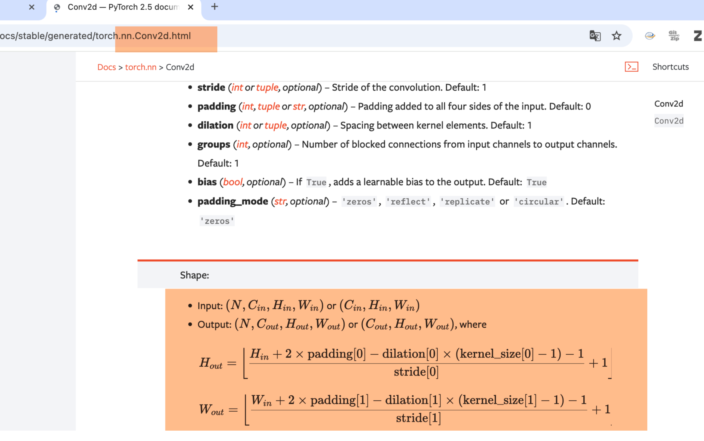

- 并且打印 卷积层的 weight，也就是kernel，还可以打印输入和输出

  > 
  >
  > > - 输出三个张量 第一个是 输入特征图、第二个是卷积的weight、或者kernel，第三个是 卷积的输出
  > >
  > > - 输出的大小是 1×1×4的；
  > >
  > > - kernel是1×1×3×3 权重就是out channel× input channel×height×width
  > >
  > > > 也就是说 对于 二维卷积，weight是4维的，那么总的数目 等于 输出通道数×输入通道数×卷积核的高度×卷积核的宽度，如果我们认为 卷积核是一个二维的图片的话，那么一共有 输入通道数 × 输出通道数 这么多个  卷积核图片


- torch.nn.Conv2d(class 的api)

-  functional的api(函数的api)

  > 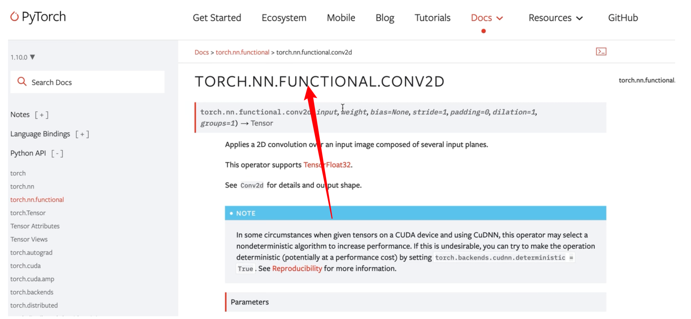

对于这个api 我们需要手动的指定 weight 和 bias，为了验证，我们可以直接把刚刚的weight传入，可以看到 结果是一样的:

```python
output_feature_map1 = F.conv2d(input_feature_map,conv_layer.weight)
```

- kernel就是在训练中，不断更新的

## 2 手撕普通卷积

从两种角度看卷积：

- 把卷积看成是 首先对输入特征图进行展开，然后再进行矩阵的相乘；
- 对kernel或者filter进行展开，然后再进行矩阵相乘；

> - 有了这种方法 可以顺其自然的引出 转置卷积；之后会讲 转置卷积 也称为反卷积，但是反卷积的说法不太准确，因为 转置卷积虽然说是上采样，但是不能从output去恢复input，转置卷积 恢复的只是 input的形状，不是input的元素值
> - 更准确的定义 就是转置卷积；为什么叫转置卷积呢？再说完 对kernel 进行展开，再进行矩阵相乘 就明白了
> - 当我们把常规的卷积 看成是对kernel的展开，然后再矩阵相乘的话，那么转置卷积可以看成 将kernel进行一个 转置操作，然后再进行矩阵相乘，就能得到转置卷积的输出

```python
input = torch.randn(5,5) # 卷积 输入特征图
kernel = torch.randn(3,3) # 卷积核
bias = torch.randn(1) # 卷积偏置，默认输出通道数目等于1

# step1 用原始的矩阵运算来实现二维卷积，先不考虑 batch size维度 和 channel维度
def matrix_multiplication_for_conv2d(input,kernel,bias=0,stride=1,padding=0):

  if padding >0:
    input = F.pad(input,(padding,padding,padding,padding))


  input_h,input_w = input.shape
  kernel_h,kernel_w = kernel.shape
  
  output_h = (math.floor((input_h - kernel_h)/stride) + 1)  # 卷积输出的高度
  output_w = (math.floor((input_w - kernel_w)/stride) + 1)  # 卷积输出的宽度 
  output = torch.zeros(output_h,output_w) # 初始化 输出矩阵
  
  for i in range(0,input_h - kernel_h + 1,stride): # 对高度进行遍历
    for j in range(0,input_w - kernel_w +1,stride):  # 对宽度维进行遍历
      region = input[i:i+kernel_h, j:j+kernel_w]  # 取出被核滑动到的区域
      output[int(i/stride),int(j/stride)] = torch.sum(region * kernel) + bias # 点乘 并赋值给输出位置的元素 
  
  return output


# step2 用原始的矩阵运算来实现二维卷积，先不考虑 batch size维度 和 channel维度，flatten版本
def matrix_multiplication_for_conv2d_flatten(input,kernel,bias=0,stride=1,padding=0):

  if padding >0:
    input = F.pad(input,(padding,padding,padding,padding))


  input_h,input_w = input.shape
  kernel_h,kernel_w = kernel.shape
  
  output_h = (math.floor((input_h - kernel_h)/stride) + 1)  # 卷积输出的高度
  output_w = (math.floor((input_w - kernel_w)/stride) + 1)  # 卷积输出的宽度 
  output = torch.zeros(output_h,output_w) # 初始化 输出矩阵
  
  region_matrix = torch.zeros(output.numel(),kernel.numel()) #存储着所有拉平后特征区域
  kernel_matrix = kernel.reshape(kernel.numel(),1) # 存储着kernel的 列向量（矩阵）形式
  row_index = 0

  for i in range(0,input_h - kernel_h + 1,stride): # 对高度进行遍历
    for j in range(0,input_w - kernel_w +1,stride):  # 对宽度维进行遍历
      region = input[i:i+kernel_h, j:j+kernel_w]  # 取出被核滑动到的区域
      region_vector = torch.flatten(region)
      region_matrix[row_index] = region_vector
      row_index +=1

  output_matrix = region_matrix @ kernel_matrix
  output = output_matrix.reshape((output_h,output_w))+bias

  return output


# 矩阵运算实现卷积的结果
mat_mul_conv_output = matrix_multiplication_for_conv2d(input,kernel,bias = bias,stride=2,padding=1)
# print(mat_mul_conv_output)

# 调用pytorch api卷积的结果
pytorch_api_conv_output = F.conv2d(input.reshape((1,1,input.shape[0],input.shape[1])),
                                   kernel.reshape((1,1,kernel.shape[0],kernel.shape[1])),
                                   padding=1,bias=bias,stride=2).squeeze(0).squeeze(0)

# 矩阵运算实现卷积的结果 flatten input版本
mat_mul_conv_output_flatten = matrix_multiplication_for_conv2d_flatten(input,kernel,bias = bias,stride=2,padding=1)
# 验证了 flatten版本卷积 与 pytorch 官方卷积的结果，正确
flag1 = torch.allclose(mat_mul_conv_output,pytorch_api_conv_output)
flag2 = torch.allclose(mat_mul_conv_output_flatten,pytorch_api_conv_output)
print(flag1)
print(flag2)
```


```python
# step3 用原始的矩阵运算来实现二维卷积，考虑 batch size维度 和 channel维度
def matrix_multiplication_for_conv2d_full(input,kernel,bias=0,stride=1,padding=0):
  
  # input kernel 都是4维张量
  if padding >0:
    input = F.pad(input,(padding,padding,padding,padding,0,0,0,0))

  bs,in_channel,input_h,input_w = input.shape
  out_channel,in_channel,kernel_h,kernel_w = kernel.shape

  if bias is None:
    bias = torch.zeros(out_channel)

  
  output_h = (math.floor((input_h - kernel_h)/stride) + 1)  # 卷积输出的高度
  output_w = (math.floor((input_w - kernel_w)/stride) + 1)  # 卷积输出的宽度 
  output = torch.zeros(bs,out_channel,output_h,output_w) # 初始化 输出矩阵


  for ind in range(bs):
    for oc in range(out_channel):
      for ic in range(in_channel):
        for i in range(0,input_h - kernel_h + 1,stride): # 对高度进行遍历
          for j in range(0,input_w - kernel_w +1,stride):  # 对宽度维进行遍历
            region = input[ind,ic,i:i+kernel_h, j:j+kernel_w]  # 取出被核滑动到的区域
            output[ind,oc,int(i/stride),int(j/stride)] += torch.sum(region * kernel[oc,ic]) # 点乘 并赋值给输出位置的元素 
      output[ind,oc] += bias[oc]
  return output

input = torch.randn(2,2,5,5)  # bs*in_channel*in_h*in_w
kernel = torch.randn(3,2,3,3) # out_channel*in_channel*kernel_h*kernel_w
bias = torch.randn(3)

# 验证matrxi_multiplication_for_conv2d_full与官方API结果是否一致
pytorch_api_conv_output = F.conv2d(input,kernel,bias=bias,padding=1,stride=2)
mm_conv2d_full_output = matrix_multiplication_for_conv2d_full(input,kernel,bias=bias,padding=1,stride=2)
flag = torch.allclose(pytorch_api_conv_output,mm_conv2d_full_output)
print("all close:",flag)
```

## 3 转置卷积

代码实现：

```python
# step4 通过对kernel进行展开来实现二维卷积，并推导出转置卷积，不考虑batch、channel大小，不考虑padding，假设stride=1
def get_kernel_matrix(kernel,input_size):
    # 基于kernel和输入特征图的大小来得到填充拉直后的kernel堆叠后的矩阵
    kernel_h,kernel_w = kernel.shape
    input_h,input_w = input.shape
    num_out_fea_map = (input_h-kernel_h+1)*(input_w-kernel_w+1)  # 卷积公式
    result = torch.zeros((num_out_fea_map,input_h*input_w)) #初始化结果矩阵，输出特征图元素个数*输入特征图元素个数
    count = 0
    for i in range(0,input_h-kernel_h+1,1):
        for j in range(0,input_w - kernel_w +1,1):
            # 填充成 跟 输入特征图一样大小
            # padded_kernel = F.pad(kernel,(i,input_h-kernel_h-i,j,input_w-kernel_w-j))
            padded_kernel = F.pad(kernel,(j,input_h-kernel_h-j,i,input_w-kernel_w-i))
            result[count] = padded_kernel.flatten()
            count +=1
    return result  


# 测试1：验证 二维卷积
kernel = torch.randn(3,3)
input = torch.randn(4,4)
kernel_matrix = get_kernel_matrix(kernel,input.shape)  # 4*16

# 通过矩阵相乘来计算卷积
mm_conv2d_output = kernel_matrix @ input.reshape((-1,1))  

# pytorch conv2d API
pytorch_conv2d_output = F.conv2d(input.unsqueeze(0).unsqueeze(0),kernel.unsqueeze(0).unsqueeze(0))
# print(kernel)
# print(kernel_matrix)
# print(mm_conv2d_output)
# print(pytorch_conv2d_output)

# 测试2  通过矩阵乘积来计算转置卷积 || 验证二维转置卷积
mm_transposed_conv2d_output = kernel_matrix.transpose(-1,-2) @ mm_conv2d_output
pytorch_transposed_conv2d_conv2d = F.conv_transpose2d(pytorch_conv2d_output,kernel.unsqueeze(0).unsqueeze(0))  #API
print(mm_transposed_conv2d_output.reshape(4,4))
print(pytorch_transposed_conv2d_conv2d)
```

```python
tensor([[ 0.9213, -4.1975, -2.0054,  1.9133],
        [ 1.1103,  6.4068, -3.9560, -1.6305],
        [-3.2193,  3.4451,  0.5374, -2.8065],
        [ 0.5796, -3.2003,  3.8138,  0.9070]])
tensor([[[[ 0.9213, -4.1975, -2.0054,  1.9133],
          [ 1.1103,  6.4068, -3.9560, -1.6305],
          [-3.2193,  3.4451,  0.5374, -2.8065],
          [ 0.5796, -3.2003,  3.8138,  0.9070]]]])
```

###  torch.unfold api


查官网，看具体用法：

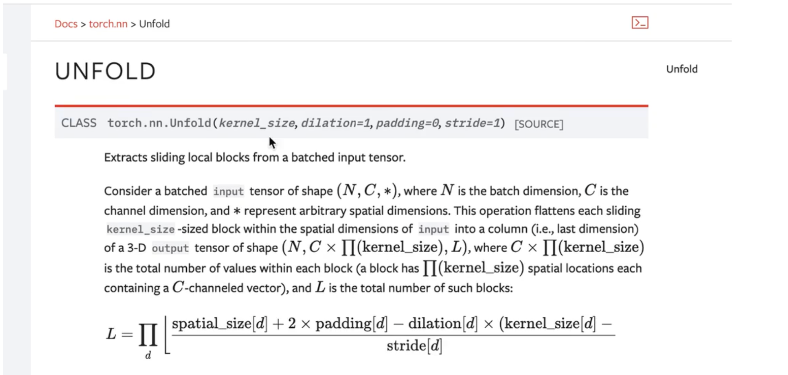

####  实例讲解


逐行解释：

- 第一行，实例化 Unfold操作，这里调用的是nn.Unfold，然后传入 kernel size，kernel size是2×3的
- 第二行，然后定义input，传入 2×5×3×4的张量
- 再把input作为unfold的输入，传进去得到output
- 得到output的形状：2×30×4

解释output的形状：

- 每个patch包含了30个数值，为什么是30个数值？就是因为这里input的形状2×5×3×4

  - 2是batch size

  - 5是 input channel

  - 3和4分别是 input的高度和宽度

  - 如果我们对input 把每一次 卷积的块 拿出来的的话，那么一共是 2×3×5 这么多个值

    > 为什么是这么多个值呢？首先2×3是kernel size的面积，然后由于 input有5个channel，其实这个是把channel一起考虑进来了，那每个patch就有30个值；

  - 然后我们这里 输入大小是 3×4，而kernel size是2×3的，那么这样的话，如果默认stride=1，padding=0的话，就一共有4个blocks，就是2×2的一个输出 $[3-2+1=2]$  ×  $[ 4-3 +1 =2]$ 

一句话总结 torch.unfold api卷积核滑动input，得到对应的region，跟卷积核一样大，拉成行向量，形状是 

（对于单个卷积核）

`batch size×input region的元素数（=kernel的元素数 通道数*h*w）×滑动了几个区域（=输出特征图的高 × 宽）`

（对于 多个卷积核 torch.unfold输出的形状是什么？）

### 什么是转置卷积？

卷积的两种角度：

- flatten input feature map region

  > 1. 我们将input进行展开，也就是说 我们是把，每一个input区域拉直，拉成一个向量 ，然后把所有的区域组合成一个矩阵，然后再跟 kernel，也把kernel拉成一个向量，然后把两个矩阵 进行几个相乘。这样得到最终的卷积结果； 
  >
  > 2. flatten input feature map region拉成行向量，kernel拉成列向量
  > 2. 把每次滑动相乘 这个input region拉直，拉成一个向量，把9个向量 拼成一个矩阵，再跟kernel，把kernel 也拉成一个列向量，进行两个矩阵的相乘；

- pad & flatten kernel

  > 1. 首先是把整个input，input是5×5，把整个input拉成一个25×1的向量，再把每一步的kernel，也把它变成一个长度为25的向量，方法是把每一步的kernel填充成5×5的大小
  >
  >    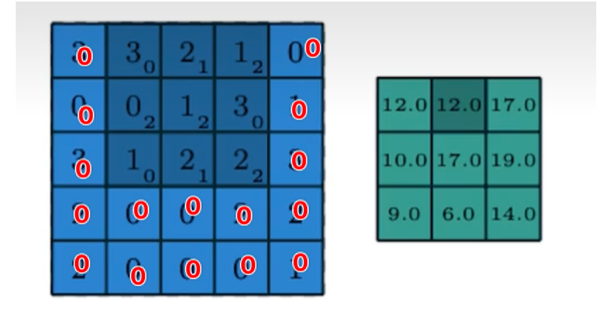
  >
  > 2. 9个kernel 跟 同一个 input 进行内积操作
  >
  > 3. 把9个kernel 拼成一个矩阵的话，相当于是一个 9×25的 kernel矩阵，跟25×1的input feature map进行矩阵相乘，最终得到 9×1，我们再把 9×1的输出 reshape一下，变成 3×3；
  >
  > 4. kernel 拉成行向量，input拉成列向量
  >
  > 5. again：把卷积看成 每一步 都是 5×5 的kernel 跟 5×5 的input 进行内积，然后求和的操作；为什么是5×5，因为我们把每一步 kernel填充成 5×5的，具体怎么 填充  看kernel的位置，按照 input的形状 进行填

### 从 kernel flatten convolution 开始

```python
# step4 通过对kernel进行展开来实现二维卷积，并推导出转置卷积，不考虑batch、channel大小，不考虑padding，假设stride=1
def get_kernel_matrix(kernel,input_size):
    # 基于kernel和输入特征图的大小来得到填充拉直后的kernel堆叠后的矩阵
    kernel_h,kernel_w = kernel.shape
    input_h,input_w = input.shape
    num_out_fea_map = (input_h-kernel_h+1)*(input_w-kernel_w+1)  # 卷积公式
    result = torch.zeros((num_out_fea_map,input_h*input_w)) #初始化结果矩阵，输出特征图元素个数*输入特征图元素个数
    count = 0
    for i in range(0,input_h-kernel_h+1,1):
        for j in range(0,input_w - kernel_w +1,1):
            # 填充成 跟 输入特征图一样大小
            # padded_kernel = F.pad(kernel,(i,input_h-kernel_h-i,j,input_w-kernel_w-j))
            padded_kernel = F.pad(kernel,(j,input_h-kernel_h-j,i,input_w-kernel_w-i))
            result[count] = padded_kernel.flatten()
            count +=1
    return result  


# 测试1：验证 二维卷积
kernel = torch.randn(3,3)
input = torch.randn(4,4)
kernel_matrix = get_kernel_matrix(kernel,input.shape)  # 4*16

# 通过矩阵相乘来计算卷积
mm_conv2d_output = kernel_matrix @ input.reshape((-1,1))  

# pytorch conv2d API
pytorch_conv2d_output = F.conv2d(input.unsqueeze(0).unsqueeze(0),kernel.unsqueeze(0).unsqueeze(0))
print(kernel)
print(kernel_matrix)
print(mm_conv2d_output)
print(pytorch_conv2d_output)
```

```python
kernel
tensor([[ 0.3170,  2.4005, -1.2991],
        [ 1.1566, -0.3610, -0.7246],
        [-0.5764, -0.7988,  1.5611]])
kernel_matrix
tensor([[ 0.3170,  2.4005, -1.2991,  0.0000,  1.1566, -0.3610, -0.7246,  0.0000,
         -0.5764, -0.7988,  1.5611,  0.0000,  0.0000,  0.0000,  0.0000,  0.0000],
        [ 0.0000,  0.3170,  2.4005, -1.2991,  0.0000,  1.1566, -0.3610, -0.7246,
          0.0000, -0.5764, -0.7988,  1.5611,  0.0000,  0.0000,  0.0000,  0.0000],
        [ 0.0000,  0.0000,  0.0000,  0.0000,  0.3170,  2.4005, -1.2991,  0.0000,
          1.1566, -0.3610, -0.7246,  0.0000, -0.5764, -0.7988,  1.5611,  0.0000],
        [ 0.0000,  0.0000,  0.0000,  0.0000,  0.0000,  0.3170,  2.4005, -1.2991,
          0.0000,  1.1566, -0.3610, -0.7246,  0.0000, -0.5764, -0.7988,  1.5611]])
mm_conv2d_output
tensor([[ 5.3770],
        [-2.0131],
        [-5.9471],
        [-2.7944]])
pytorch_conv2d_output
tensor([[[[ 5.3770, -2.0131],
          [-5.9471, -2.7944]]]])
```

### 转置卷积

- 输入：4×4，kernel：3×3，output：2×2   
  	- flatten input feature map region：4×9  @ 9×1 = 4×1
  	- padding & flatten kernel ：4×16 @ 16×1 = 4×1
- 转置卷积：   
	- 16×4 @ 4×1 = 16×1  $ reshape \rightarrow $ 4 × 4 

> 转置卷积是怎么做的呢？
>
> 其实做法很简单，就是把kernel matrix 首先转置一下；比方说本来是4×16的 矩阵；我们转置一下；转置成16×4的矩阵；
>
> 然后我们也讲了output是一个2×2的 矩阵，我们也把它拉直一下，变成4×1的矩阵；于是16×4的矩阵，跟4×1的矩阵，相乘，就变成了一个16×1的矩阵，我们在reshape一下，就变成了4×4，这样我们就把一个 2×2的特征图，变成了一个4×4的特征图；这是从原理上的解释
>
> 另外还有一种，我们这里实现了二维卷积，就类似于 y=wx(w乘以x这样的一个过程)；
>
> w跟x之间 是一个矩阵乘法；然后我们求后向梯度的时候，偏y，偏x，刚好就是w的一个转置，所以说在pytorch中，实现转置卷积 或者叫 deconvolution 或者叫transpose convolution，都是基于后向传播 来实现的；
>
> y=wx
>
> dy dx就等于w的转置
>
> 这个就是转置卷积的原理部分

- 三点需要特别注意：

  > 第一点
  >
  > > 转置卷积一般用在上采样的过程；因为普通的卷积会用在下采样，比方说这里的例子，把4×4的特征图，通过卷积变成了一个2×2的，这是常规的操作，这是下采样
  > >
  > > 那有时候，在生成的模型中，我们可能需要，输入是2×2的，输出变成4×4的，这个时候，我们可以用转置卷积实现，这是第一点；
  > >
  >
  > 第二点
  >
  > > 转置卷积 或者 后向 卷积 梯度；意思就是说 我们通过后向传播 来实现转置卷积的
  >
  > 第三点
  >
  > > 转置卷积也可以通过 填充的方式来实现，什么意思呢？就是可以把2×2的输入 填充到6×6的大小；然后再去用3×3的kernel 进行一个卷积；也能实现一个上采样的效果；但这种方法并不是框架中使用的方法；框架中的实现 是通过 后向传播的方法来实现 转置卷积的；

代码实现：

> 首先对kernel matrix进行一个转置，transpose，-1维，-2维转置一下
>
>  kernel_matrix.transpose(-1,-2)，这样得到w的一个转置，我们再把这个转置跟上面这个output `mm_conv2d_output` 进行一个矩阵相乘操作
>
> ```python
> kernel_matrix.transpose(-1,-2) @ mm_conv2d_output
> ```
>
> -  mm_conv2d_output 是一个 4×1 的矩阵，前面转置后是一个 16×4的，得到一个 16×1的结果 
>
> - 定义为 mm_transposed_conv2d_output  
>
> - 这个就是通过矩阵相乘 得到的转置卷积，也叫做反卷积； 
>
> - 这个反卷积 或者叫 转置卷积，并不是一个可逆的，不是一个逆计算，这里的output并不是当初的input，只是形状跟input一样而已
>
> ```python
> mm_transposed_conv2d_output = kernel_matrix.transpose(-1,-2) @ mm_conv2d_output
> ```
>
> 以上是矩阵乘积得到转置卷积的；

为了验证，我们可以调用pytorch转置卷积的api

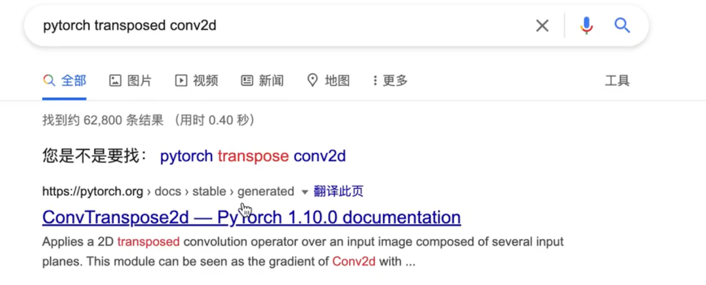

1. 类形式
2. 函数形式

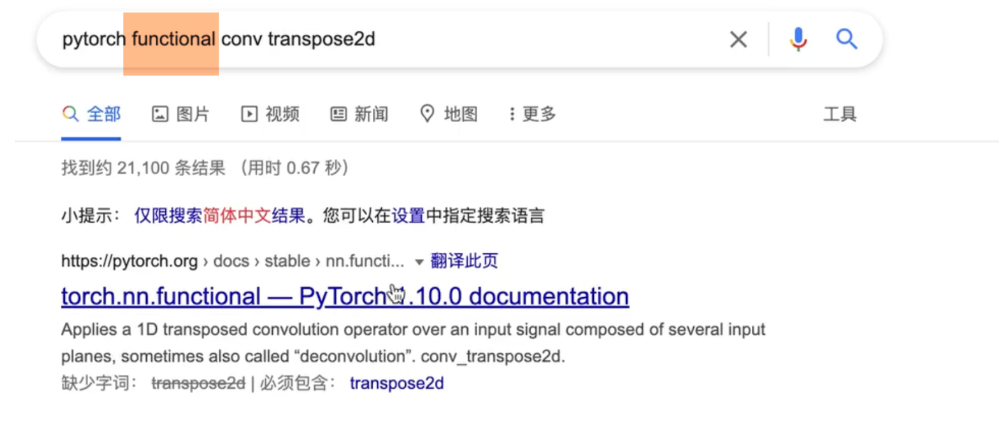

- 实例化class，调用的还是函数形式；现在我们来调用一下这个函数
- 就是F.conv_transpose2d()一样的，首先传入上面的output，就是把上面的pytorch_conv2d_output作为输入，kernel也要传进去，kernel就是之前写的kernel，同样也要对它进行两次的unsqueeze操作（batch size × channel × height × width），这样得到pytorch_transposed_conv2d_output API

```python
# 测试2  通过矩阵成绩来计算转置卷积
mm_transposed_conv2d_output = kernel_matrix.transpose(-1,-2) @ mm_conv2d_output
pytorch_transposed_conv2d_conv2d = F.conv_transpose2d(pytorch_conv2d_output,kernel.unsqueeze(0).unsqueeze(0))  #API
print(mm_transposed_conv2d_output.reshape(4,4))
print(pytorch_transposed_conv2d_conv2d)
```

**<u>关于转置卷积要说明的：</u>**

- 我们把卷积看成是 填充后的kernel跟input，得到 kernel_matrix之后，再把kernel matrix转置一下，跟convolution output进行矩阵相乘，这样得到了一个新的output，刚好output的大小和input的大小是一样的；成功实现了上采样，因为mm conv2d output是 2×2的，左边mm transposed conv2d output是 4×4的，我们就实现了上采样；
- F.conv_transposed2d()的输入，就是普通卷积的输出，kernel还是那个kernel，把它扩充一下

**<u>关于上采样的两个角度：</u>** 

-  ==（第一种实现：把kernel转置 16 × 4  $ \rightarrow $ 4×16 ）==  首先要把普通卷积的kernel matrix写出来，然后再把matrix转置一下，再跟普通卷积的输出 相乘一下；就实现了
-  ==（第二种实现：把input变大）==   直接把input进行填充；比如现在input是2×2，我们为了实现4×4，为了用普通的卷积，我们可以把2×2的填充成5×5 或者 6×6的；假如说是6×6的，我们就把上下左右 填充两行0就好了，再用普通卷积实现 也是可以的；因为反正参数都是要学习的，我们的目的就是做上采样；无论是从后向传播的角度，还是直接对input进行填充，把input变大，都能实现 上采样，不过数值是不一样的，不过没关系，反正都是要学习的

转置卷积 反卷积=transpose conv2d

## 4 膨胀卷积 & 空洞卷积

intro，官方api：


在默认的api中 dilation的值等于1，groups的值 也是等于1 的，也就是我们常用的卷积都没有指定，常用的值都为1

什么是dilation？

> dilation的意思就是说，我们普通的卷积，比如说3×3的卷积核，在一个输入特征图上 进行 卷积的话，我们每次，从输入特征图上取一块 3×3的 面积，取9个元素，并且这9个元素，都是紧挨着彼此的，就是3×3的区域，一个方形区域，这种情况，我们成为dilation=1，也就是说彼此之间间隔为1，可以这么理解，彼此的索引，差距为1，比方说第一个元素 索引为1，第二个元素 索引 就是2，那如果dilation不是等于1，而是2的话呢，说明第一个元素和第二个元素 索引相差了2，那就说明 中间还多了一个元素；
>
> 也就是说 dilation 是控制着我们输入 特征图 要取得那部分面积 是否是紧凑的，如果它的值大于1的话，它就不是紧凑的，它中间是有一些，跳过的元素的；

```python
a = torch.randn(7,7)
```

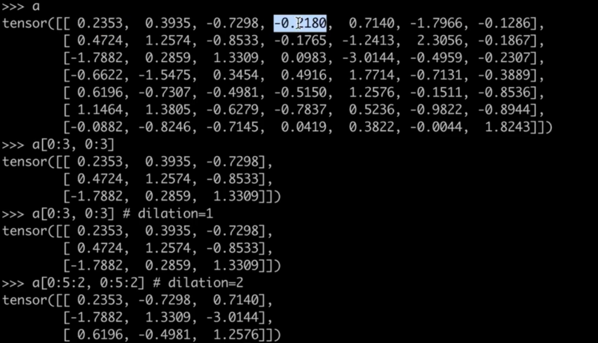

- dilation=2  a[0:5:2,0:5:2] 索引0到索引5，跳过一个取一个，最后一个取不到
- dilation=3 用索引表示的话 就是 0到7，然后间隔是3；a[0:7:3,0:7:3] # dilation=3 同样列数也是一样的 0到7 间隔是3；索引间隔为3

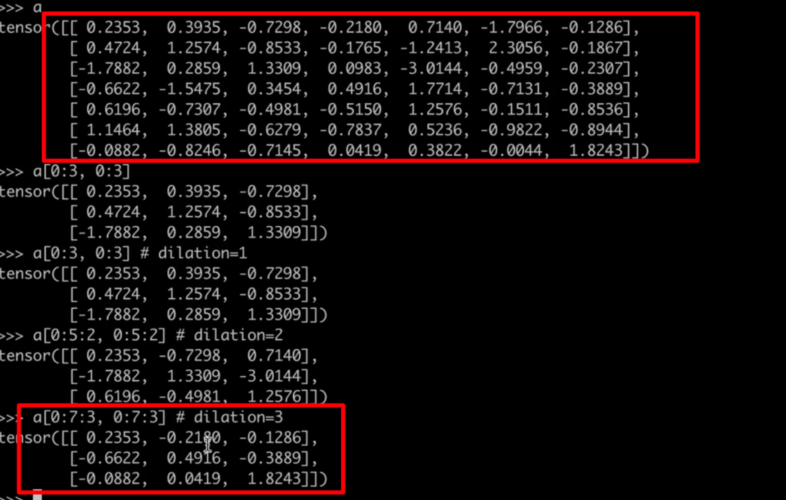

一句话说清dilation是什么？卷积的覆盖区域 索引间隔多少

> 如果 input size=7×7 kernel size=3×3，dilation=3，我们只需要 取一次就好了；
>
> 取一次 就刚好 已经到 边界了
>
> 所以7×7的input 跟 3×3的kernel 进行 卷积的话，我们不做padding stride=1的话，那么输出就是一个数，就是一个标量；这就是dilation 取 不同值 具体的运算规则
>
> 那为什么要用dilation大于1的这些情况呢？就是因为我们 增大dilation 但是并没有增大运算量；我们还是3×3的矩阵，跟3×3的矩阵 进行元素相乘；并没有因为 感受野变大 计算量 变大；所以一般 增大 dilation的目的 就是我们在 保持运算量不变的前提下，希望 增大 感受野的面积；这就是dilation

一句话为什么dilation：在不增加运算量的情况下，增大感受野

## 5 分组卷积 & 群卷积

### 什么是分组卷积？

> 分组卷积 group convolution；是对输入通道进行分组；输出通道并不是由所有的输入通道共同作用的；会有一种情况，比如输入通道是4，输出通道是2，输出通道的第一个通道只跟输入通道的第1、3个通道有关；输出通道的第二个通道只跟输入通道的第2、4个通道有关；如果输入通道有这样的关系时，我们可以采用分组卷积，设置组数group=2，这时有几个组就会有几个输出通道；这种情况是我们对每个组进行一次卷积，如果我们对每个组进行多次卷积，那么卷积核的个数就会增加了；这样也有一个问题，就是输入特征图的通道之间没有交互，所以这种情况下，在后面的卷积过程中，会有通道之间的随机混合或者用1×1的卷积；poinwise convolution；

### 补充深度可分离卷积 depthwise & pointwise：

> 深度可分离卷积，是特殊的分组卷积，有几个输入通道，就分成几个组，输入通道之间完全相互独立，deepwise convolution；这种情况下，后面通常会跟着 pointwise  convolution；

[深度可分离卷积 & 1×1卷积](https://zhuanlan.zhihu.com/p/80041030)

[卷积神经网络中的Separable Convolution](https://yinguobing.com/separable-convolution/#fn2)

一张图看懂深度可分离卷积：

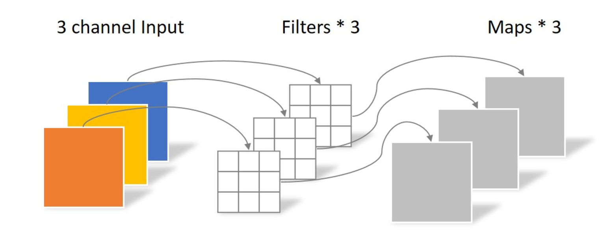

Depthwise Convolution完成后的Feature map数量与输入层的depth相同，但是这种运算对输入层的每个channel独立进行卷积运算后就结束了，没有有效的利用不同map在相同空间位置上的信息。因此需要增加另外一步操作来将这些map进行组合生成新的Feature map，即接下来的Pointwise Convolution。（[摘自](https://yinguobing.com/separable-convolution/#fn2)）

一张图看懂1×1卷积：

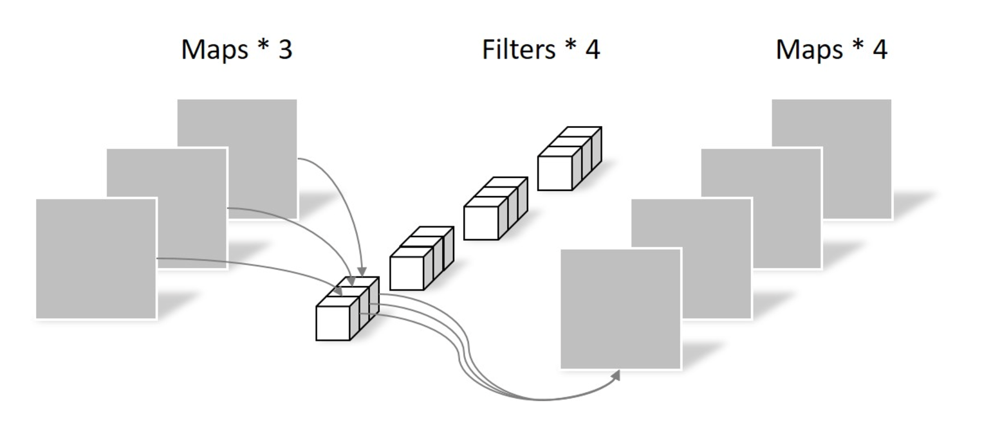

Pointwise Convolution的运算与常规卷积运算非常相似，不同之处在于卷积核的尺寸为 1×1×M，M为上一层的depth。所以这里的卷积运算会将上一步的map在深度方向上进行加权组合，生成新的Feature map。有几个Filter就有几个Feature map。（[摘自](https://yinguobing.com/separable-convolution/#fn2)）

补充普通卷积：

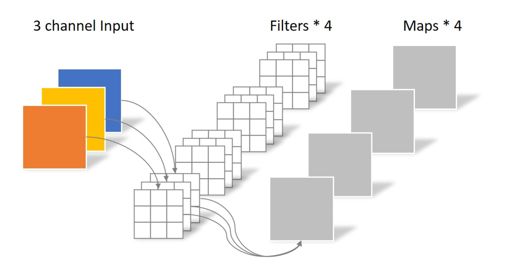

### 为什么需要分组卷积？

归纳偏置：

 每一个模型 都有自己的假设，或者叫 归纳偏置 inductive bias；

- CNN的归纳偏置就是 局部建模性 和 平移不变性
- RNN就是前后关联性
- Transformer没有什么假设，只是引入了一个position embedding而已

在我们这里引入的 group>1的话，引入的假设是什么呢？

> 我们只需要一小部分，只需要做一小部分 通道之间的建模就好了，不需要考虑 每个通道 跟所有通道的 关系；其实本质上 group=1的话，就是说 in channel，每个通道 都需要 跟 其他 通道 进行一个混合；但是当我们把 groups，设置成>1的话，就是把它们分组来考虑，就是每次呢，只在几个通道做一下卷积；然后下次 再另外的通道 做卷积；然后把结果拼起来 就好了；也就是说 通道融合 并不充分；简单说 就是 这样的

> 再重复：groups>1，就是说 通道融合 不需要 完全 充分，我们只需要在一个个group内进行融合，最后拼接，这就是group convolution 引入的一个偏置

> 其实这个偏置也很好解决，我们只需要在group convolution后面，再加上一个 1×1 point wise卷积就好了
>

> 就是说 1×1的逐点卷积，虽然没有考虑 局部建模，但是它能对通道之间 进行融合；所以最后 我们还是能够把 通道之间 进行融合的

分组卷积 & 逐点卷积

**add 各种wise** 

- 我们再说一下 这里的wise，一旦看到各种 wise，就是说 我们只考虑wise前面这个东西；
- 比方说；point wise就是说 我们只对 一个点 去算 相乘，而不是说 像 普通的卷积一样，取一个3×3的区域；那就不是一个点；
- 还比如说 channel wise，我们只对一个通道；（有点像 深度可分离卷积）
- 比如说layer wise，我们只对一层考虑等等；
- 各种 wise，比如element wise 只对元素跟元素之间；相同位置的元素进行考虑；

### 分组卷积中的变与不变

题设： in channel和out channel分别等于2和4，分析group=1和group=2

**<u>case1 ：group=1，一共是8张kernel map，（4个卷积核，每个kernel通道数等于2）</u>** 

> 首先我们拿出两张kernel map 分别与input进行卷积，然后加起来，加起来的结果赋给第一个通道；再拿两个卷积核，同样跟输入的两个通道进行卷积，然后加起来，赋值给第二个通道，以此类推，直到我们拿出最后的两个卷积核 跟 输入两个特征图 进行卷积，然后再求和 赋值给 最后一个通道；所以一共是8张kernel map

<u>**case2 ：groups=2，一共是4张kernel map，（4个卷积核，每个kernel的通道数=1）**</u> 

> ：in channels=2，groups=2，如果还让output channel=4，那么kernel map有几张？卷积核有几个？
>
> 首先，`#卷积核`   $ \stackrel{决定}{\rightarrow} $ `#输出通道数`  、`#输入通道数`   $ \stackrel{决定}{\rightarrow} $  `#单个卷积核通道数`
>
> ∴ 有4个卷积核，每个卷积核的channels=1，（∵把输入通道数分成2组，所以输入通道数变成 2÷2=1 ）
>
> ∴有4张kernel map
>

<u>**综上：**</u> 

1. kernel map减少一半 || 在每一组中，其实有两个卷积核，所以两组 一共是 4个 kernel map，相比上面 8个kernel map 就少了一半（kernel map、参数量、运算量减半）
2. 输出特征图的高度 & 宽度 不变，batch size不变

### 代码实现 dilation&groups 手撕 & 库函数

```python
def matrix_multiplication_for_conv2d_finall(input,kernel,bias=None,stride=1,padding=0,dilation=1,groups=1):
    if padding>0:
        input = F.pad(input,(padding,padding,padding,padding,0,0,0,0))

    bs,in_channel,input_h,input_w = input.shape
    out_channel,_,kernel_h,kernel_w = kernel.shape

    assert out_channel % groups == 0 and in_channel % groups==0,"groups必须要同时被输入通道和输出通道数整除！"
    input = input.reshape((bs,groups,in_channel//groups,input_h,input_w))
    kernel = kernel.reshape((groups,out_channel//groups,in_channel//groups,kernel_h,kernel_w))

    kernel_h = (kernel_h-1)*(dilation-1)+kernel_h
    kernel_w = (kernel_w-1)*(dilation-1)+kernel_w

    output_h = math.floor((input_h-kernel_h)/stride)+1
    output_w = math.floor((input_w-kernel_w)/stride)+1

    output_shape = (bs,groups,out_channel//groups,output_h,output_w)
    output = torch.zeros(output_shape)

    if bias is None:
        bias = torch.zeros(out_channel)

    for ind in range(bs): # 对batch size进行遍历
        for g in range(groups): # 对群组进行遍历
            for oc in range(out_channel//groups): # 对分组后的输出通道进行遍历
                for ic in range(in_channel//groups): # 对分组后的输入通道进行遍历
                    for i in range(0,input_h-kernel_h+1,stride): #对高度遍历
                        for j in range(0,input_w-kernel_w+1,stride): # 对宽度遍历
                            region = input[ind,g,ic,i:i+kernel_h:dilation,j:j+kernel_w:dilation] #特征区域
                            output[ind,g,oc,int(i/stride),int(j/stride)] += torch.sum(region*kernel[g,oc,ic])

                output[ind,g,oc] += bias[g*(out_channel//groups)+oc]  # 考虑偏置项
    output = output.reshape((bs,out_channel,output_h,output_w))  # 还原成四维张量
    return output

# 验证测试的代码
kernel_size=3
bs,in_channel,input_h,input_w = 2,2,5,5
out_channel=4
groups,dilation,stride,padding=2,2,2,1

input = torch.randn(bs,in_channel,input_h,input_w)
kernel = torch.randn(out_channel,in_channel//groups,kernel_size,kernel_size)
bias = torch.randn(out_channel)

# pytorch API的结果
pytorch_conv2d_api_output = F.conv2d(input,kernel,bias=bias,padding=padding,
                                     stride=stride,dilation=dilation,groups=groups)
mm_conv2d_finall_output = matrix_multiplication_for_conv2d_finall(input,kernel,bias=bias,padding=padding,
                                                                  stride=stride,dilation=dilation,groups=groups)

flag = torch.allclose(pytorch_conv2d_api_output,mm_conv2d_finall_output)
print(flag)
```

## 6 汇总代码

库函数实现卷积

```python
import torch
import torch.nn as nn
import torch.nn.functional as F
import math

in_channels = 1
out_channels = 1
kernel_size = 3
batch_size = 1
bias = False

input_size = [batch_size,in_channels,4,4]

# 第一种实现
conv_layer = torch.nn.Conv2d(in_channels,out_channels,kernel_size,bias=bias)

input_feature_map = torch.randn(input_size)
out_feature_map = conv_layer(input_feature_map)
# print(input_feature_map)
# print(conv_layer.weight)  # 1*1*3*3=out_channels*in_channels*height*width

print(out_feature_map)

out_feature_map1 = F.conv2d(input_feature_map,conv_layer.weight)

print(out_feature_map1)
```

step1 用原始的矩阵运算来实现二维卷积，先不考虑 batch size维度 和 channel维度

step2 用原始的矩阵运算来实现二维卷积，先不考虑 batch size维度 和 channel维度，flatten版本

```python
input = torch.randn(5,5) # 卷积 输入特征图
kernel = torch.randn(3,3) # 卷积核
bias = torch.randn(1) # 卷积偏置，默认输出通道数目等于1

# step1 用原始的矩阵运算来实现二维卷积，先不考虑 batch size维度 和 channel维度
def matrix_multiplication_for_conv2d(input,kernel,bias=0,stride=1,padding=0):

  if padding >0:
    input = F.pad(input,(padding,padding,padding,padding))


  input_h,input_w = input.shape
  kernel_h,kernel_w = kernel.shape
  
  output_h = (math.floor((input_h - kernel_h)/stride) + 1)  # 卷积输出的高度
  output_w = (math.floor((input_w - kernel_w)/stride) + 1)  # 卷积输出的宽度 
  output = torch.zeros(output_h,output_w) # 初始化 输出矩阵
  
  for i in range(0,input_h - kernel_h + 1,stride): # 对高度进行遍历
    for j in range(0,input_w - kernel_w +1,stride):  # 对宽度维进行遍历
      region = input[i:i+kernel_h, j:j+kernel_w]  # 取出被核滑动到的区域
      output[int(i/stride),int(j/stride)] = torch.sum(region * kernel) + bias # 点乘 并赋值给输出位置的元素 
  
  return output


# step2 用原始的矩阵运算来实现二维卷积，先不考虑 batch size维度 和 channel维度，flatten版本
def matrix_multiplication_for_conv2d_flatten(input,kernel,bias=0,stride=1,padding=0):

  if padding >0:
    input = F.pad(input,(padding,padding,padding,padding))


  input_h,input_w = input.shape
  kernel_h,kernel_w = kernel.shape
  
  output_h = (math.floor((input_h - kernel_h)/stride) + 1)  # 卷积输出的高度
  output_w = (math.floor((input_w - kernel_w)/stride) + 1)  # 卷积输出的宽度 
  output = torch.zeros(output_h,output_w) # 初始化 输出矩阵
  
  region_matrix = torch.zeros(output.numel(),kernel.numel()) #存储着所有拉平后特征区域
  kernel_matrix = kernel.reshape(kernel.numel(),1) # 存储着kernel的 列向量（矩阵）形式
  row_index = 0

  for i in range(0,input_h - kernel_h + 1,stride): # 对高度进行遍历
    for j in range(0,input_w - kernel_w +1,stride):  # 对宽度维进行遍历
      region = input[i:i+kernel_h, j:j+kernel_w]  # 取出被核滑动到的区域
      region_vector = torch.flatten(region)
      region_matrix[row_index] = region_vector
      row_index +=1

  output_matrix = region_matrix @ kernel_matrix
  output = output_matrix.reshape((output_h,output_w))+bias

  return output


# 矩阵运算实现卷积的结果
mat_mul_conv_output = matrix_multiplication_for_conv2d(input,kernel,bias = bias,stride=2,padding=1)
# print(mat_mul_conv_output)

# 调用pytorch api卷积的结果
pytorch_api_conv_output = F.conv2d(input.reshape((1,1,input.shape[0],input.shape[1])),
                                   kernel.reshape((1,1,kernel.shape[0],kernel.shape[1])),
                                   padding=1,bias=bias,stride=2).squeeze(0).squeeze(0)

# 矩阵运算实现卷积的结果 flatten input版本
mat_mul_conv_output_flatten = matrix_multiplication_for_conv2d_flatten(input,kernel,bias = bias,stride=2,padding=1)
# 验证了 flatten版本卷积 与 pytorch 官方卷积的结果，正确
flag1 = torch.allclose(mat_mul_conv_output,pytorch_api_conv_output)
flag2 = torch.allclose(mat_mul_conv_output_flatten,pytorch_api_conv_output)
print(flag1)
print(flag2)
```

step3 用原始的矩阵运算来实现二维卷积，考虑 batch size维度 和 channel维度

```python
# step3 用原始的矩阵运算来实现二维卷积，考虑 batch size维度 和 channel维度
def matrix_multiplication_for_conv2d_full(input,kernel,bias=0,stride=1,padding=0):
  
  # input kernel 都是4维张量
  if padding >0:
    input = F.pad(input,(padding,padding,padding,padding,0,0,0,0))

  bs,in_channel,input_h,input_w = input.shape
  out_channel,in_channel,kernel_h,kernel_w = kernel.shape

  if bias is None:
    bias = torch.zeros(out_channel)

  
  output_h = (math.floor((input_h - kernel_h)/stride) + 1)  # 卷积输出的高度
  output_w = (math.floor((input_w - kernel_w)/stride) + 1)  # 卷积输出的宽度 
  output = torch.zeros(bs,out_channel,output_h,output_w) # 初始化 输出矩阵


  for ind in range(bs):
    for oc in range(out_channel):
      for ic in range(in_channel):
        for i in range(0,input_h - kernel_h + 1,stride): # 对高度进行遍历
          for j in range(0,input_w - kernel_w +1,stride):  # 对宽度维进行遍历
            region = input[ind,ic,i:i+kernel_h, j:j+kernel_w]  # 取出被核滑动到的区域
            output[ind,oc,int(i/stride),int(j/stride)] += torch.sum(region * kernel[oc,ic]) # 点乘 并赋值给输出位置的元素 
      output[ind,oc] += bias[oc]
  return output

input = torch.randn(2,2,5,5)  # bs*in_channel*in_h*in_w
kernel = torch.randn(3,2,3,3) # out_channel*in_channel*kernel_h*kernel_w
bias = torch.randn(3)

# 验证matrxi_multiplication_for_conv2d_full与官方API结果是否一致
pytorch_api_conv_output = F.conv2d(input,kernel,bias=bias,padding=1,stride=2)
mm_conv2d_full_output = matrix_multiplication_for_conv2d_full(input,kernel,bias=bias,padding=1,stride=2)
flag = torch.allclose(pytorch_api_conv_output,mm_conv2d_full_output)
print("all close:",flag)
```

step4 通过对kernel进行展开来实现二维卷积，并推导出转置卷积，不考虑batch、channel大小，不考虑padding，假设stride=1

```python
# step4 通过对kernel进行展开来实现二维卷积，并推导出转置卷积，不考虑batch、channel大小，不考虑padding，假设stride=1
def get_kernel_matrix(kernel,input_size):
    # 基于kernel和输入特征图的大小来得到填充拉直后的kernel堆叠后的矩阵
    kernel_h,kernel_w = kernel.shape
    input_h,input_w = input.shape
    num_out_fea_map = (input_h-kernel_h+1)*(input_w-kernel_w+1)  # 卷积公式
    result = torch.zeros((num_out_fea_map,input_h*input_w)) #初始化结果矩阵，输出特征图元素个数*输入特征图元素个数
    count = 0
    for i in range(0,input_h-kernel_h+1,1):
        for j in range(0,input_w - kernel_w +1,1):
            # 填充成 跟 输入特征图一样大小
            # padded_kernel = F.pad(kernel,(i,input_h-kernel_h-i,j,input_w-kernel_w-j))
            padded_kernel = F.pad(kernel,(j,input_h-kernel_h-j,i,input_w-kernel_w-i))
            result[count] = padded_kernel.flatten()
            count +=1
    return result  


# 测试1：验证 二维卷积
kernel = torch.randn(3,3)
input = torch.randn(4,4)
kernel_matrix = get_kernel_matrix(kernel,input.shape)  # 4*16

# 通过矩阵相乘来计算卷积
mm_conv2d_output = kernel_matrix @ input.reshape((-1,1))  

# pytorch conv2d API
pytorch_conv2d_output = F.conv2d(input.unsqueeze(0).unsqueeze(0),kernel.unsqueeze(0).unsqueeze(0))
# print(kernel)
# print(kernel_matrix)
# print(mm_conv2d_output)
# print(pytorch_conv2d_output)

# 测试2  通过矩阵乘积来计算转置卷积 || 验证二维转置卷积
mm_transposed_conv2d_output = kernel_matrix.transpose(-1,-2) @ mm_conv2d_output
pytorch_transposed_conv2d_conv2d = F.conv_transpose2d(pytorch_conv2d_output,kernel.unsqueeze(0).unsqueeze(0))  #API
print(mm_transposed_conv2d_output.reshape(4,4))
print(pytorch_transposed_conv2d_conv2d)

```

分组卷积&膨胀卷积

```python
def matrix_multiplication_for_conv2d_finall(input,kernel,bias=None,stride=1,
                                            padding=0,dilation=1,groups=1):
    if padding>0:
        input = F.pad(input,(padding,padding,padding,padding,0,0,0,0))

    bs,in_channel,input_h,input_w = input.shape
    out_channel,_,kernel_h,kernel_w = kernel.shape

    assert out_channel % groups == 0 and in_channel % groups==0,"groups必须要同时被输入通道和输出通道数整除！"
    input = input.reshape((bs,groups,in_channel//groups,input_h,input_w))
    kernel = kernel.reshape((groups,out_channel//groups,in_channel//groups,kernel_h,kernel_w))

    kernel_h = (kernel_h-1)*(dilation-1)+kernel_h
    kernel_w = (kernel_w-1)*(dilation-1)+kernel_w

    output_h = math.floor((input_h-kernel_h)/stride)+1
    output_w = math.floor((input_w-kernel_w)/stride)+1

    output_shape = (bs,groups,out_channel//groups,output_h,output_w)
    output = torch.zeros(output_shape)

    if bias is None:
        bias = torch.zeros(out_channel)

    for ind in range(bs): # 对batch size进行遍历
        for g in range(groups): # 对群组进行遍历
            for oc in range(out_channel//groups): # 对分组后的输出通道进行遍历
                for ic in range(in_channel//groups): # 对分组后的输入通道进行遍历
                    for i in range(0,input_h-kernel_h+1,stride): #对高度遍历
                        for j in range(0,input_w-kernel_w+1,stride): # 对宽度遍历
                            region = input[ind,g,ic,i:i+kernel_h:dilation,j:j+kernel_w:dilation] #特征区域
                            output[ind,g,oc,int(i/stride),int(j/stride)] += torch.sum(region*kernel[g,oc,ic])

                output[ind,g,oc] += bias[g*(out_channel//groups)+oc]  # 考虑偏置项
    output = output.reshape((bs,out_channel,output_h,output_w))  # 还原成四维张量
    return output

# 验证测试的代码
kernel_size=3
bs,in_channel,input_h,input_w = 2,2,5,5
out_channel=4
groups,dilation,stride,padding=2,2,2,1

input = torch.randn(bs,in_channel,input_h,input_w)
kernel = torch.randn(out_channel,in_channel//groups,kernel_size,kernel_size)
bias = torch.randn(out_channel)

# pytorch API的结果
pytorch_conv2d_api_output = F.conv2d(input,kernel,bias=bias,padding=padding,
                                     stride=stride,dilation=dilation,groups=groups)
mm_conv2d_finall_output = matrix_multiplication_for_conv2d_finall(input,kernel,bias=bias,padding=padding,
                                                                  stride=stride,dilation=dilation,groups=groups)

flag = torch.allclose(pytorch_conv2d_api_output,mm_conv2d_finall_output)
print(flag)
```

