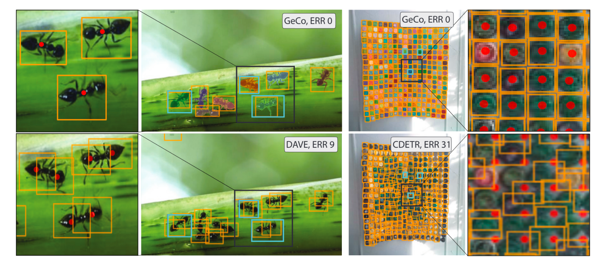
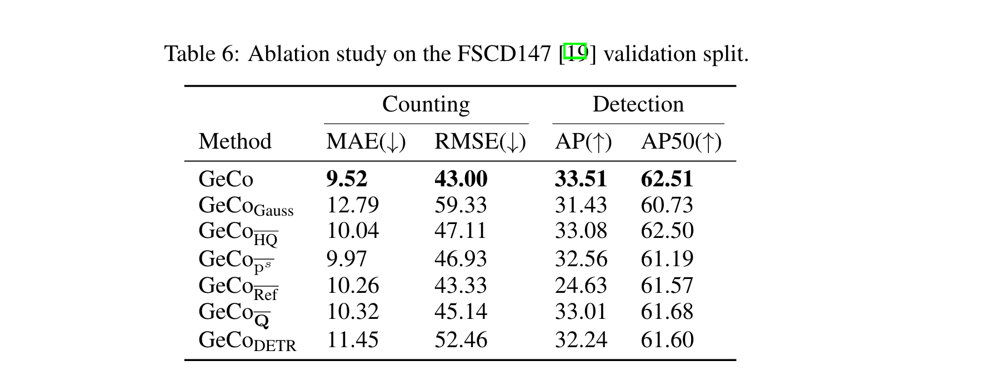
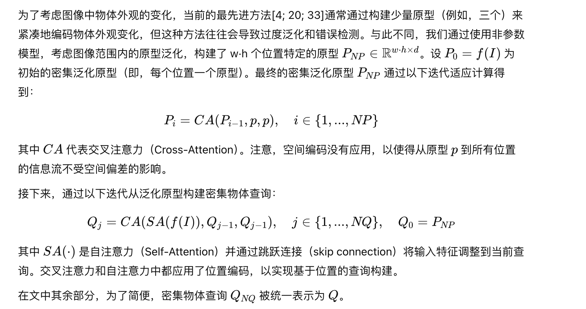
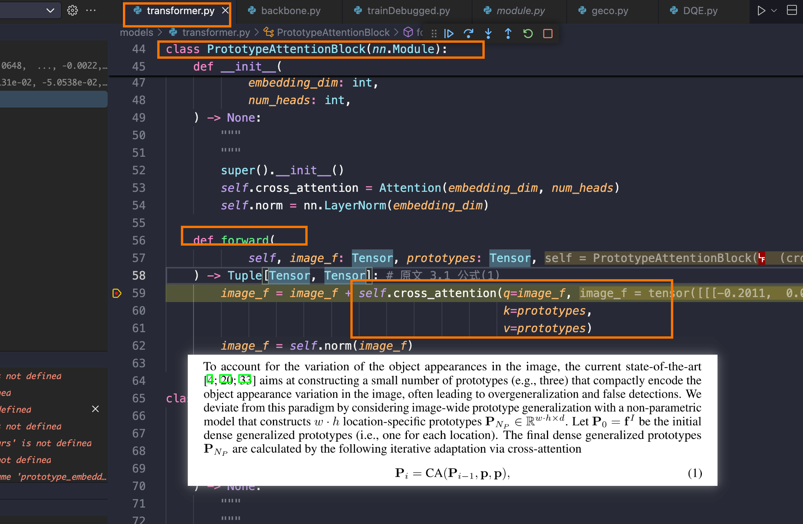
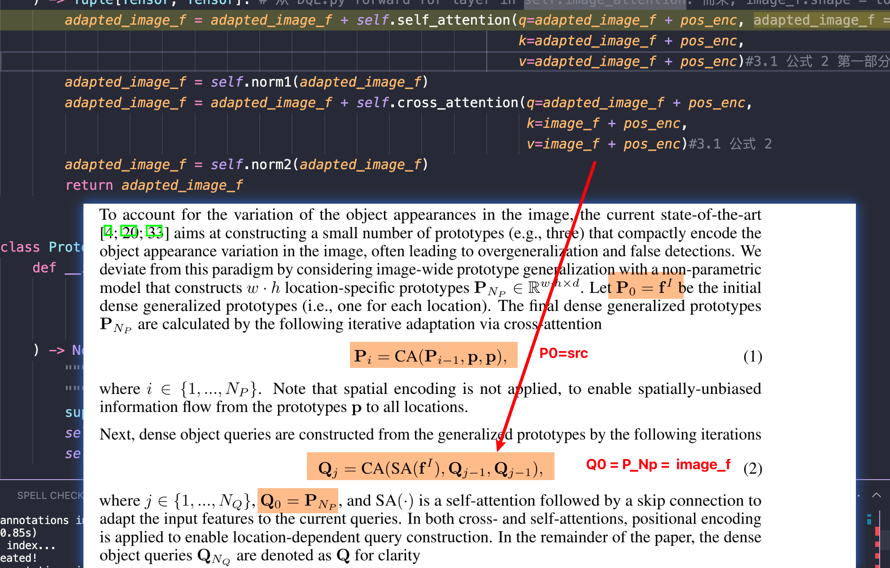
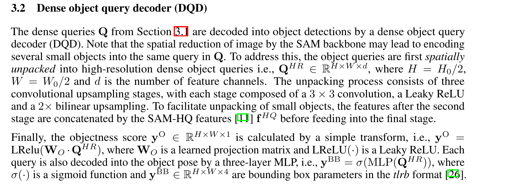
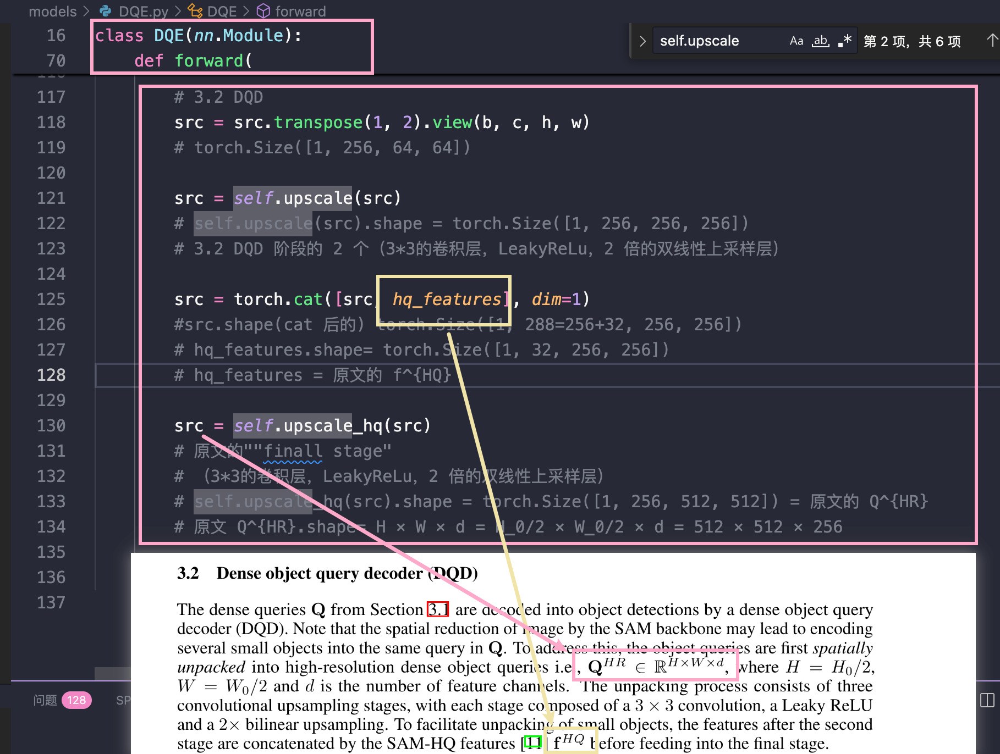
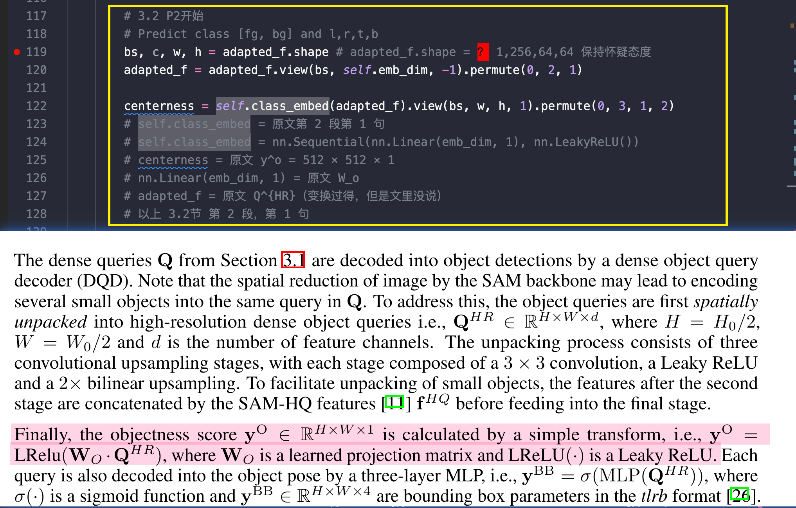

[原文链接](https://arxiv.org/pdf/2409.18686v1)

[源码链接](https://github.com/jerpelhan/GeCo)

reading in 241117

arxiv日期：2024年9月27日

标题：A Novel Unified Architecture for Low-Shot Counting by Detection and Segmentation

与分割有什么关系？

# Abstract

Low-shot object counters estimate the number of objects in an image using few or no annotated exemplars. **问题定义**

Objects are localized by matching them to prototypes, which are constructed by unsupervised image-wide object appearance aggregation. 

Due to potentially diverse object appearances, the existing approaches often lead to over-generalization and false positive detections. 

**提出问题： **   由于潜在的多样化的目标外观，现有的方法往往会导致过度泛化和误检。

Furthermore, the best-performing methods train object localization by a surrogate loss, that predicts a unit Gaussian at each object center. 

此外，性能最好的方法通过一个替代损失来训练目标定位，即在每个目标中心预测一个单位高斯。

This loss is sensitive to annotation error, hyperparameters and does not directly optimize the detection task, leading to suboptimal counts. 

这种损失对标注错误、超参数敏感，并且没有直接优化检测任务，导致次优计数。

We introduce GeCo, a novel low-shot counter that achieves accurate object detection, segmentation, and count estimation in a unified architecture. 

!!! note
	GeCo:小样本计数器，同时是实现目标检测、分割和计数

GeCo robustly generalizes the prototypes across objects appearances through a novel dense object query formulation. 

GeCo通过一种新颖的稠密对象查询公式，鲁棒地概括了跨越对象外观的原型。

In addition, a novel counting loss is proposed, that directly optimizes the detection task and avoids the issues of the standard surrogate loss. 

此外，还提出了一种新的计数损失，直接优化了检测任务，避免了标准替代损失的问题。

（说结果）GeCo surpasses the leading few-shot detection-based counters by ∼25% in the total count MAE, achieves superior detection accuracy and sets a new solid state-of-the-art result across all low-shot counting setups. The code will be available on GitHub.

GeCo在总计数MAE上超过了领先的基于小样本检测的计数器25 %，实现了更高的检测精度，并在所有的小样本计数设置中都取得了最新的固态结果。

## Introduction contribution

**（第五段）** 贡献

We address the aforementioned challenges by proposing a new single-stage low-shot counter GeCo, which is implemented as an add-on network for SAM [12] backbone. 

- 针对上面的问题，提出GeCo 

- 优点：单阶段

- SAM是啥？

A single architecture is thus trained for both few-shot and zero-shot setup, it enables counting by detection and provides segmentation masks for each of the detected objects. 

- 优点：单阶段检测计数方法， few-shot & zero-shot 都是单阶段计数
- 为每个被检测的对象提供分割掩码
- 基于检测的计数方法

**Our first contribution**  is a dense object query formulation, which applies a non-parametric model for image-wide prototype generalization (hence GeCo) in the encoder, and decodes the queries into highly dense predictions.

我们的第一个贡献是一个稠密对象查询公式，它在编码器中应用了一个非参数模型用于图像范围的原型泛化(因此是GeCo )，并将查询解码为高度稠密的预测。

 The formulation simultaneously enables reliable detection in densely-populated regions (Figure 1, column 3&4) and prevents prototype over-generalization, leading to an improved detection precision at a high recall. 

该公式同时实现了在人口密集区域(图1第3、4列)的可靠检测，并防止了原型的过度泛化，从而在高召回率的情况下提高了检测精度。

**Our second contribution**  is a new loss function for dense detection training that avoids the ad-hoc surrogate loss with unit Gaussians, it directly optimizes the detection task, and leads to improved detection not biased towards blob-like regions (Figure 1, column 1&2).

我们的第二个贡献是一个新的用于密集检测训练的损失函数，它避免了使用单位高斯的ad - hoc代理损失，它直接优化了检测任务，并导致改进的检测不偏向于团块状区域(图1第1、2列)。

说明两个贡献

- ？
- 提出了新的损失函数

**（第六段）**  结果 GeCo outperforms all detection-based counters on challenging benchmarks by 24% MAE and the density-based long-standing winner [4] by 27% MAE, while delivering superior detection accuracy. 

优于所有 基于检测 和 基于密度的 计数方法

The method shows substantial robustness to the number of exemplars. In one-shot scenario, GeCo outperforms the best detection method in 5% AP50, 

在1-shot场景的检测性能

45% MAE and by 14% in a zero-shot scenario. 

0-shot的计数性能

GeCo is the first detection-based counter that outperforms density based counters in all measures by using the number of detections as the estimator, and thus sets a milestone in low-shot detection-based counting.

## 5 Conclusion

**第一段** 

We proposed GeCo, a novel single-stage low-shot counter that integrates accurate detection, segmentation, and count prediction within a unified architecture, and covers all low-shot scenarios with a single trained model. 

GeCo

- 单阶段计数方法、准确的检测、分割性能

GeCo features remarkables dense object query formulation, and prototype generalization across the image, rather than just into a few prototypes.

？Ge Co的显著特点是对象查询描述密集，原型泛化遍布整个图像，而不仅仅是生成几个原型。

 It employs a novel loss function specifically designed for detection tasks, avoiding the biases of traditional Gaussian-based losses. 

？它采用了一种专门为检测任务设计的新颖的损失函数，避免了传统的基于高斯的损失的偏差。

The loss optimizes detection accuracy directly, leading to more precise detection and counting. 

该损失直接优化了检测精度，导致更精确的检测和计数。

<u>指出未来的研究方向</u>

**The main limitation of the presented method is that it cannot process arbitrarily large images, due to memory constraints, since it, as all current methods, operates globally. In future work, we will explore local counting and incremental image-wide count aggregation.**

**本文方法的主要局限性在于，由于内存限制，无法处理任意大的图像，因为它与现有的所有方法一样，是全局操作的。在未来的工作中，我们将探索局部计数和增量图像范围内的计数聚合。**

**（第二段）**  （说结果了，没啥可看的） Extensive analysis showcases that GeCo surpasses the best detection-based counters by approximately 25% in total count MAE, achieving state-of-the-art performance in a few-shot counting setup and demonstrates superior detection capabilities. GeCo showcases remarkable robustness to the number of provided exemplars, and sets a new state-of-the-art in one-shot as well as zero-shot counting.

大量的分析表明，GeCo在总计数MAE上超过了最好的基于检测的计数器约25 %，在少量的计数设置中达到了最先进的性能，并显示出卓越的检测能力。GeCo对所提供的样本数量表现出显著的鲁棒性，并在单样本和零样本计数中设置了新的最先进水平。

## 1 Introduction

**（第一段）**  Low-shot object counting considers estimating the number of objects of previously unobserved category in the image, given only a few annotated exemplars (few-shot) or without any supervision (zero-shot) [21]. **The current state-of-the-art methods are predominantly based on density estimation** [4; 14; 31; 25; 21; 30; 7; 30]. These methods predict a density map over the image and estimate the total count by summing the density.

最近的研究都是基于密度的计数

**（第二段）**   While being remarkably robust for global count estimation, **density outputs lack explainability such as object location and size**, which is crucial for many practical applications [32; 29]. This recently gave rise to detection-based low-shot counters [20; 19; 33], **which predict the object bounding boxes and estimate the total count as the number of detections**（基于检测的计数方法是如何具体实现的：预测边界框，数盒子数）. Nevertheless, detection-based counting falls behind the density-based methods in total count estimation, leaving a performance gap.

（点明基于密度的计数方法存在的问题）基于密度的计数准确性比较高，但是不能给出目标的定位和尺寸

基于检测的计数方法能详细给出目标的信息，但是计数准确性不高

**（第三段）**   In detection-based counters, a dominant approach to identify locations of the objects in the image involves construction of object prototypes from few (e.g., three) annotated exemplar bounding boxes and correlating them with image features [20; 33; 19].

在基于检测的计数器中，识别图像中物体位置的主要方法是通过少量的(例如,三个)带注释的样本边界框构建物体原型，并将其与图像特征[ 20 ; 33 ; 3 . 19 ]相关联。

 The exemplar construction process is trained to account for potentially large diversity of object appearances in the image, often leading to overgeneralization, which achieves a high recall, but is also prone to false positive detection. 

样例构建过程被训练用于解释图像中潜在的巨大的物体外观多样性，通常会导致过度泛化，从而实现了较高的召回率，但也容易产生误检。

!!! note
	基于检测的计数方法存在的问题：召回率太高了

Post-hoc detection verification methods have been considered [20; 33] to address the issue, but their multi-stage formulation prevents exploiting the benefits of end-to-end training.

事后检测验证方法一直被认为是[ 20 ; 33]来解决该问题，但它们的多阶段制定阻止了利用端到端训练的好处。

me：先检测再验证挺好的，但是 不是单一阶段的，他说的是DAVE，一个作者的工作


**（第四段）**    Currently, the best detection counters [20; 33] predict object locations based on the local maxima in the correlation map. 

目前，最好的检测计数器[ 20 ; 33]是根据相关图中的局部极大值来预测目标位置。

During training, the map prediction is supervised by a unit Gaussian placed on each object center. 

在训练过程中，预测由每个目标中心的单位高斯分布监督

However, the resulting surrogate loss is susceptible to the center annotation noise, requires nontrivial heuristic choice of the Gaussian kernel size and in practice leads to detection preference of compact blob-like structures (see Figure 1, column 1&2). 

然而，由此产生的替代损失容易受到中心标注噪声的影响，需要非平凡的启发式选择高斯核大小，并且在实际中导致紧凑的块状结构(见图1 ,列1和2)的检测偏好。

Recently, DETR [1] inspired counter was proposed to avoid this issue [19], however, it fails in densely populated regions even though it applies a very large number of detection queries in a regular grid (see Figure 1, column 3&4).

最近，DETR [ 1 ]启发的计数器被提出来避免这个问题[ 19 ]，然而，尽管它在规则网格(见图1 ,第3、4列)中应用了大量的检测查询，但它在人口密集的地区失败了。


Figure 1: DAVE [20] predicts object centers (red dots) biased towards blob-like structures, leading to incorrect partial detections of ants (bottom left), while GeCo(ours) addresses this with the new loss (top left). 图1：DAVE [ 20 ]预测的目标中心(红色圆点)偏向于blob - like结构，导致错误的部分蚂蚁检测(左下)，而GeCo (我们的)用新的损失(左上)来解决这个问题。

CDETR [19] fails in densely populated regions (bottom right), while GeCo addresses this with the new dense query formulation by prototype generalization (top right). Exploiting the SAM backbone, GeCo delivers segmentations as well. Exemplars are denoted in blue.CDETR [ 19 ]在人口稠密区域(右下角)失效，而Ge Co通过原型泛化(右上角)的新的稠密查询形式来解决这一问题。利用SAM骨干网，GeCo也提供了分段。图例用蓝色表示。

<u>这一段、这个图，我都看不懂；GeCo有一个新损失；GeCo，对比了DAVE（他自己的工作）、CDETR（？）</u>

**Summary**

问题的引入（背景&研究意义）：

1. Low-shot object counting
1. 基于检测 & 基于回归（近来主流，但计数就仅仅是计数，无法给出关于目标更详细的信息）
1. 基于检测
1. 基于检测
1. 本文贡献
1. 结果

## 2 Related works

**第一段**  

Traditional counting methods focus on predefined categories like vehicles[3], cells [5], people[15], and polyps, [32] requiring extensive annotated training data and lacking generalization to other categories, necessitating retraining or conceptual changes. Low-shot counting methods address this limitation by estimating counts for arbitrary categories with minimal or no annotations, enabling test-time adaptation.传统的计数方法集中于预定义的类别，如车辆[ 3 ]，细胞[ 5 ]，人[ 15 ]和息肉[ 32 ]，需要大量标注的训练数据，缺乏对其他类别的泛化能力，需要重新训练或概念更改。低样本计数方法通过使用最少或没有注释来估计任意类别的计数来解决这一限制，从而实现测试时间的自适应。

me：指出从 特定物体 发展到 通用物体计数

**第二段**  

With the proposal of the   **FSC147**   dataset [23] low-shot counting methods emerged, which predict global counts by summing over a predicted density maps. The first method [23] proposed an adaptation of a tracking backbone for density map regression. 

few-shot 问题的第一篇工作：FSC147 ；且是基于 回归的

**BMNet+ [25]** tackled learning representation and similarity metric, while **SAFECount [31]** introduced a new feature enhancement module, improving appearance generalization. **CounTR [14]** utilized a vision transformer for image feature extraction and a convolutional network for encoding the exemplar features. **LOCA [4]** argued that exemplar shape information should be considered along with the appearance, and proposed an iterative object prototype extraction module. This led to a simplified counter architecture that remains a top-performer among density-based counters.

BMNet + [ 25 ]解决了学习表示和相似性度量，而SAFECount [ 31 ]引入了新的特征增强模块，提高了外观泛化性。Coun TR [ 14 ]使用视觉转换器进行图像特征提取，使用卷积网络对样本特征进行编码。LOCA [ 4 ]认为样例的形状信息应该与外观一起考虑，并提出了一个迭代的对象原型提取模块。这导致了一个简化的计数器架构，它仍然是基于密度的计数器中的佼佼者。
!!! note

	**5篇文章**   
	1. （2021年）FSC147：第一篇  few-shot问题，提出数据集，基于回归的方法  
	2. BMNet+ [25]  
	3. SAFECount [31]  
	4. CounTR [14]   ViT图片特征提取；CNN样例框特征  
	5. LOCA [4] 外观特征、形状特征、原型迭代模块；基于密度（回归）的计数方法

**第三段**

To improve explainability of the estimated counts and estimate object locations as well, detectionbased methods emerged. 

为了提高估计计数和估计目标位置的可解释性，基于检测的方法应运而生。

**（先说 最早的）**   The first few-shot detection-based counter [19] was an extended transformer-based object detector [2] with the ability to detect objects specified by the exemplars. 

最早的基于小样本检测的计数器[ 19 ]是一种扩展的基于转换器的目标检测器[ 2 ]，具有检测样本指定目标的能力。

**（现在最好的）**   Current state-of-the-art DAVE [20] proposed a two-stage detect-and-verify paradigm for low-shot counting and detection, where in the first stage it generates object proposals with a high recall, but low precision, which is improved by a subsequent verification step. 

目前最先进的DAVE [ 20 ]提出了一个两阶段的检测-验证范式用于低镜头计数和检测，其中第一阶段生成的物体提议具有较高的召回率，但精度较低，并通过后续的验证步骤进行改进。

 PSECO [33] proposed a three-stage approach called point-segment-and-count, which employs more involved proposal generation with better detection accuracy and also applies a verification step to improve precision. 

PSECO [ 33 ]提出了一种称为点-段-计数的三阶段方法，该方法使用了更多参与的建议生成，具有更好的检测精度，并且还应用了验证步骤来提高精度。

Both DAVE and PSECO are **multi-stage methods** that train a network for the surrogate task of predicting density maps for object centers, from which the bounding boxes are predicted. 

Although detection-based counters offer additional applicability, they fall behind the best density-based counters in global count estimation.

DAVE和PSECO都是多阶段方法，用于训练一个网络，用于预测目标中心的密度图的替代任务，并从中预测边界框。尽管基于检测的计数器提供了额外的适用性，但它们落后于全局计数估计中最好的基于密度的计数器。

**summary**

DAVE和PSECO 多阶段、比不过现在最好的，现在最好的是 基于密度回归图的CountGD · 文本&图像

!!! note
	行文逻辑

	第一段：从特定 $\rightarrow$  通用 目标计数
	
	第二段：通用目标计数：基于密度回归图计数方法的发展
	
	第三段：通用目标计数：基于检测计数方法发展，可解释性比较好，计数不只是为了计数，也要有目标的特定信息：Location&size


# 摘要：

Objects are localized by matching them to prototypes, which are constructed by unsupervised image-wide object appearance aggregation. 

Due to potentially diverse object appearances, the existing approaches often lead to overgeneralization and false positive detections. 

Furthermore, the best-performing methods train object localization by a surrogate loss, that predicts a unit Gaussian at each object center. 

This loss is sensitive to annotation error, hyperparameters and does not directly optimize the detection task, leading to suboptimal counts. 

**We introduce GeCo**, a novel low-shot counter that achieves accurate object detection, segmentation, and count estimation in a unified architecture. 

GeCo robustly generalizes the prototypes across objects appearances through a novel dense object query formulation.

 In addition, a novel counting loss is proposed, that directly optimizes the detection task and avoids the issues of the standard surrogate loss.

**bg：**

- 目标外观多样化导致现有方法存在过度泛化和误检问题。
- 代理损失函数对标注误差和超参数敏感，且未直接优化检测任务。

**GeCo 的解决方案**：

- 通过**密集目标查询**机制，实现目标外观的鲁棒泛化。
- 提出**计数损失函数**，直接优化检测任务，提升计数精度。

**GeCo 的优势**：

- 在统一架构中实现目标检测、分割和计数。
- 解决了现有方法的局限性，显著提升了性能。



Figure 1: DAVE [20] predicts object centers (red dots) biased towards blob-like structures, leading to incorrect partial detections of ants (bottom left), while GeCo(ours) addresses this with the new loss (top left). CDETR [19] fails in densely populated regions (bottom right), while GeCo addresses this with the new dense query formulation by prototype generalization (top right). Exploiting the SAM backbone, GeCo delivers segmentations as well. Exemplars are denoted in blue.（蓝色框是正确的标注框）

解释：

**DAVE 的局限性：**

- 目标中心预测偏向斑点状结构，导致对复杂目标（如蚂蚁）的部分检测错误。
- DAVE 方法在目标中心预测时存在偏差，倾向于将目标中心预测为斑点状结构，导致对蚂蚁等目标的部分检测错误。GeCo 通过引入新的损失函数，有效解决了这一问题。

**CDETR 的局限性**：

- 在目标密集区域表现不佳，难以处理高密度目标。
- CDETR 在处理目标密集区域时表现较差，而 GeCo 通过引入密集查询机制和原型泛化，显著提升了在密集区域中的检测性能。

**GeCo 的改进**：

- 通过新的损失函数解决了目标中心预测偏差问题。
- 通过密集查询公式和原型泛化提升了在密集区域中的检测性能。
- 基于 SAM 骨干网络，实现了目标检测、计数和分割的统一。

❤核心：损失函数 和 密集场景的计数误差

3 Single-stage low-shot object counting by detection and segmentation

**本文的创新：**

3.1 DQE

3.2 DQD

3.3 Detections extraction and refinement

3.4  A novel loss for dense detection training

> 其实我会奇怪，消融实验的部分和提出的东西没有十分对应
>
> 

好好读读方法


基于框的计数方法

```python
outputs, ref_points, centerness, outputs_coord = model(img, bboxes)

def forward(self, x, bboxes):
    x.shape torch.Size([1, 3, 1024, 1024])
    bboxes.shape torch.Size([1, 3, 4])
```


```python
src, src_hq = self.backbone(x) # SAM backbone
```


？


根据后面的代码，用的 src，所以


$H_0=1024$


$h=64，r=16，d=256$


继续往下读：


0-shot 情况下，原型 p 的提取


原型 p 提取完以后，要进行后续的处理：

**原型生成**

- 原型p来源于few-shot（小样本）或zero-shot（零样本）学习设置，通过迁移学习实现在全图范围内的泛化应用。

**密集查询编码器（DQE）**

- 基于泛化的原型，DQE模块负责构建密集的物体检测查询向量，为后续检测提供空间密集的特征表示。

**密集查询解码器（DQD）**

- DQD模块将DQE生成的查询向量解码为初步的密集物体检测结果，实现从特征空间到检测框的映射。

**后处理优化**

- 通过非极大值抑制等后处理算法，对DQD输出的密集检测结果进行筛选和精修，最终输出高质量的检测框。

该框架通过编码-解码架构实现了从原型泛化到密集检测的端到端处理，结合后处理步骤保证了检测精度与效率的平衡




这一部分对应源码的


理由：


会有点奇怪，$P_i = CA(P_{i-1},p,p)$ 对应源码的什么部分，没找到交叉注意力模块。


找到了 3.1 公式 1



3.1 公式 2



$f^I = src$

开始 3.2



在第$3.1$节中，密集查询$Q$通过密集对象查询解码器（$DQD$）被解码为对象检测结果。

需要注意的是，$SAM$主干网络对图像的空间降采样可能导致多个小对象被编码到$Q$中的同一个查询中。

为了解决这个问题，首先将对象查询在空间上解包为高分辨率的密集对象查询，即$Q^{HR} ∈ R^{H×W×d}$，其中$H = H0/2=1024/2=512，W = W0/2$，$d=256$是特征通道数。

解包过程包括三个卷积上采样阶段，每个阶段由一个$3×3$卷积、一个$Leaky ReLU$和一个$2×双线性上采样$组成。


为了便于小对象的解包，第二阶段后的特征会与$SAM-HQ$特征$f^{HQ}$拼接后输入到最终阶段。


最后，通过一个简单的变换计算对象得分$y^o ∈ \mathbb{R}^{H×W×1}$，即$y^o = \mathrm{LRelu(W_O · Q^{HR})}$，其中$\mathrm{W_O}$是学习到的投影矩阵，$\mathrm{LReLU(·)}$是$\mathrm{Leaky ReLU}$。每个查询还通过一个三层$MLP$解码为对象姿态，即$y^{BB} = \sigma(MLP(QHR))$，其中$σ(·)$是sigmoid函数，$y^{BB} ∈ R^{H×W×4}$是$tlrb$格式[26]的边界框参数。

-  $tlrb$格式 什么格式？
- DQD 不是一个函数

- 找到分别对应源码的哪里

- DQD将密集查询Q解码为对象检测结果，并详细介绍了如何通过空间解包和特征增强来解决小对象编码问题，最终计算出对象得分和边界框参数





==说明 tlrb 格式==

bounding box（边界框）通常用于标注图像中的目标物体。常见的边界框格式有多种，包括 `xyxy`、`xywh` 和 `tlrb` 等。

`tlrb` 格式表示的是边界框的四个边的相对位置，具体如下：

- `t` (top): 边界框的上边缘相对于图像顶部的距离。
- `l` (left): 边界框的左边缘相对于图像左侧的距离。
- `r` (right): 边界框的右边缘相对于图像左侧的距离。
- `b` (bottom): 边界框的下边缘相对于图像顶部的距离。

在代码中，`outputs_coord` 是一个形状为 `(bs, w, h, 4)` 的张量，其中 `bs` 是批次大小，`w` 和 `h` 是特征图的宽度和高度，`4` 表示 `tlrb` 格式的四个边界参数。

以下是代码中相关部分的解释：

```python
outputs_coord = self.bbox_embed(adapted_f).sigmoid().view(bs, w, h, 4).permute(0, 3, 1, 2)
```

- `self.bbox_embed(adapted_f)`: 使用一个多层感知机（MLP）对 `adapted_f` 进行处理，得到边界框的四个边界参数。
- `.sigmoid()`: 使用 sigmoid 函数将输出限制在 `[0, 1]` 范围内。
- `.view(bs, w, h, 4)`: 将输出重新调整形状为 `(bs, w, h, 4)`。
- `.permute(0, 3, 1, 2)`: 调整维度顺序，使其变为 `(bs, 4, w, h)`。

这样，`outputs_coord` 就包含了每个像素点的边界框参数，格式为 `tlrb`。

## 3.2节 第 2 段，最后一句


## 3.3 节


最终的检测结果是从 $y^O$ 和 $y^{BB}$ 中提取的，具体步骤如下：

1. 在阈值化的 $y^O$ 上，使用 $3×3$ 的非极大值抑制（NMS）算法，从 $y^{BB}$ 中读取局部最大值处的边界框参数。
2. 将这些边界框作为提示，输入到 $SAM$ 解码器 [12] 中，利用已经计算好的主干特征 $f^I$ 对其进行细化。
3. 通过最小-最大操作将边界框适配到掩码上，并最终应用 $IoU = 0.5$ 的非极大值抑制，以去除重复的检测结果。
4. 这个过程最终输出预测的边界框 $B^P$ 及其对应的掩码 $M^P$。

**读什么？**

- 读论文与代码的对应
- 读代码的输入、处理、输出

3.4 A novel loss for dense detection training


GeCotraining需要对密集目标性得分yO和边界框参数yBB进行监督。理想情况下，网络应该学会预测那些可以被非极大值抑制（NMS）可靠检测到的目标上的点，同时这些点也可以可靠地预测出边界框参数。因此，我们提出了一种新的密集目标检测损失函数，旨在追求这一特性。


