# 通道注意力及其变体

## √ SENet

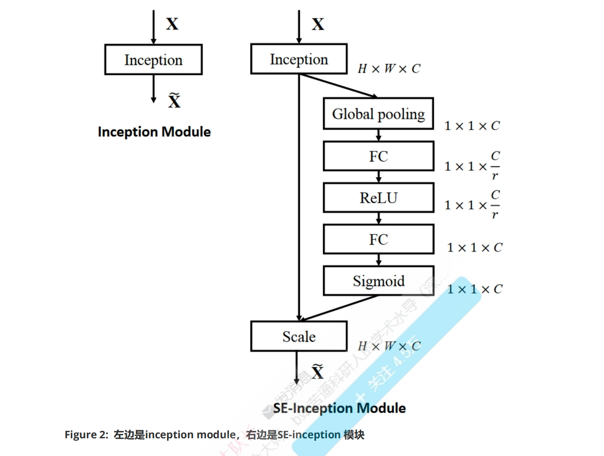


```python
import numpy as np
import torch
from torch import nn
from torch.nn import init

"Squeeze-and-Excitation Networks"

class SEAttention(nn.Module):

    def __init__(self, channel=512,reduction=16):
        super().__init__()
        # 在空间维度上,将H×W压缩为1×1
        self.avg_pool = nn.AdaptiveAvgPool2d(1)
        # 包含两层全连接,先降维,后升维。最后接一个sigmoid函数
        self.fc = nn.Sequential(
            nn.Linear(channel, channel // reduction, bias=False),
            nn.ReLU(inplace=True),
            nn.Linear(channel // reduction, channel, bias=False),
            nn.Sigmoid()
        )


    def init_weights(self):
        for m in self.modules():
            if isinstance(m, nn.Conv2d):
                init.kaiming_normal_(m.weight, mode='fan_out')
                if m.bias is not None:
                    init.constant_(m.bias, 0)
            elif isinstance(m, nn.BatchNorm2d):
                init.constant_(m.weight, 1)
                init.constant_(m.bias, 0)
            elif isinstance(m, nn.Linear):
                init.normal_(m.weight, std=0.001)
                if m.bias is not None:
                    init.constant_(m.bias, 0)

    def forward(self, x):
        # (B,C,H,W)
        B, C, H, W = x.size()
        # Squeeze: (B,C,H,W)-->avg_pool-->(B,C,1,1)-->view-->(B,C)
        y = self.avg_pool(x).view(B, C)
        # Excitation: (B,C)-->fc-->(B,C)-->(B, C, 1, 1)
        y = self.fc(y).view(B, C, 1, 1)
        # scale: (B,C,H,W) * (B, C, 1, 1) == (B,C,H,W)
        out = x * y
        return out


if __name__ == '__main__':
    # (B,C,H,W)
    input=torch.randn(1,512,7,7)
    # 定义通道注意力
    Model = SEAttention(channel=512,reduction=8)
    output=Model(input)
    print(output.shape) 
```


```python
import numpy as np
import torch
from torch import nn
from torch.nn import init

class SEAttention(nn.Module):
    # 初始化SE模块，channel为通道数，reduction为降维比率
    def __init__(self, channel=512, reduction=16):
        super().__init__()
        self.avg_pool = nn.AdaptiveAvgPool2d(1)  # 自适应平均池化层，将特征图的空间维度压缩为1x1
        self.fc = nn.Sequential(  # 定义两个全连接层作为激励操作，通过降维和升维调整通道重要性
            nn.Linear(channel, channel // reduction, bias=False),  # 降维，减少参数数量和计算量
            nn.ReLU(inplace=True),  # ReLU激活函数，引入非线性
            nn.Linear(channel // reduction, channel, bias=False),  # 升维，恢复到原始通道数
            nn.Sigmoid()  # Sigmoid激活函数，输出每个通道的重要性系数
        )

    # 权重初始化方法
    def init_weights(self):
        for m in self.modules():  # 遍历模块中的所有子模块
            if isinstance(m, nn.Conv2d):  # 对于卷积层
                init.kaiming_normal_(m.weight, mode='fan_out')  # 使用Kaiming初始化方法初始化权重
                if m.bias is not None:
                    init.constant_(m.bias, 0)  # 如果有偏置项，则初始化为0
            elif isinstance(m, nn.BatchNorm2d):  # 对于批归一化层
                init.constant_(m.weight, 1)  # 权重初始化为1
                init.constant_(m.bias, 0)  # 偏置初始化为0
            elif isinstance(m, nn.Linear):  # 对于全连接层
                init.normal_(m.weight, std=0.001)  # 权重使用正态分布初始化
                if m.bias is not None:
                    init.constant_(m.bias, 0)  # 偏置初始化为0

    # 前向传播方法
    def forward(self, x):
        b, c, _, _ = x.size()  # 获取输入x的批量大小b和通道数c
        y = self.avg_pool(x).view(b, c)  # 通过自适应平均池化层后，调整形状以匹配全连接层的输入
        y = self.fc(y).view(b, c, 1, 1)  # 通过全连接层计算通道重要性，调整形状以匹配原始特征图的形状
        return x * y.expand_as(x)  # 将通道重要性系数应用到原始特征图上，进行特征重新校准

# 示例使用
if __name__ == '__main__':
    input = torch.randn(50, 512, 7, 7)  # 随机生成一个输入特征图
    se = SEAttention(channel=512, reduction=8)  # 实例化SE模块，设置降维比率为8
    output = se(input)  # 将输入特征图通过SE模块进行处理
    print(output.shape)  # 打印处理后的特征图形状，验证SE模块的作用

```

- SE模块首先通过全局平均池化操作对输入特征图的空间维度（高度H和宽度W）进行聚合，为每个通道生成一个通道描述符。这一步有效地将全局空间信息压缩成一个通道向量，捕获了通道特征响应的全局分布。这一全局信息对于接下来的重新校准过程至关重要。
- 在压缩步骤之后，应用一个激励机制，该机制本质上是由两个全连接（FC）层和一个非线性激活函数（通常是sigmoid）组成的自门控机制。第一个FC层降低了通道描述符的维度，应用ReLU非线性激活，随后第二个FC层将其投影回原始通道维度。这个过程建模了通道间的非线性交互，并产生了一组通道权重。
- 激励操作的输出用于重新校准原始输入特征图。输入特征图的每个通道都由激励输出中对应的标量进行缩放。这一步骤有选择地强调信息丰富的特征，同时抑制不太有用的特征，使模型能够专注于任务中最相关的特征。

**SE Net的核心贡献是通过SE块显式建模通道间的依赖关系**

## √ SKNet


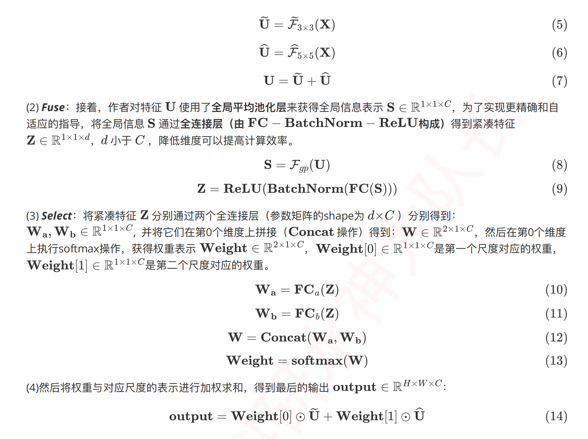


```python
import numpy as np
import torch
from torch import nn
from torch.nn import init
from collections import OrderedDict

"Selective Kernel Networks"

class SKAttention(nn.Module):

    def __init__(self, channel=512,kernels=[1,3,5,7],reduction=8,group=1,L=32):
        super().__init__()
        self.d=max(L,channel//reduction)
        self.convs=nn.ModuleList([])
        # 有几个卷积核,就有几个尺度, 每个尺度对应的卷积层由Conv-bn-relu实现
        for k in kernels:
            self.convs.append(
                nn.Sequential(OrderedDict([
                    ('conv',nn.Conv2d(channel,channel,kernel_size=k,padding=k//2,groups=group)),
                    ('bn',nn.BatchNorm2d(channel)),
                    ('relu',nn.ReLU())
                ]))
            )
        # 将全局向量降维
        self.fc=nn.Linear(channel,self.d)
        self.fcs=nn.ModuleList([])
        for i in range(len(kernels)):
            self.fcs.append(nn.Linear(self.d,channel))
        self.softmax=nn.Softmax(dim=0)


    def forward(self, x):
        # (B, C, H, W)
        B, C, H, W = x.size()
        # 存放多尺度的输出
        conv_outs=[]
        # Split: 执行K个尺度对应的卷积操作
        for conv in self.convs:
            scale = conv(x)  #每一个尺度的输出shape都是: (B, C, H, W),是因为使用了padding操作
            conv_outs.append(scale)
        feats=torch.stack(conv_outs,0) # 将K个尺度的输出在第0个维度上拼接: (K,B,C,H,W)

        # Fuse: 首先将多尺度的信息进行相加,sum()默认在第一个维度进行求和
        U=sum(conv_outs) #(K,B,C,H,W)-->(B,C,H,W)
        # 全局平均池化操作: (B,C,H,W)-->mean-->(B,C,H)-->mean-->(B,C)  【mean操作等价于全局平均池化的操作】
        S=U.mean(-1).mean(-1)
        # 降低通道数,提高计算效率: (B,C)-->(B,d)
        Z=self.fc(S)

        # 将紧凑特征Z通过K个全连接层得到K个尺度对应的通道描述符表示, 然后基于K个通道描述符计算注意力权重
        weights=[]
        for fc in self.fcs:
            weight=fc(Z) #恢复预输入相同的通道数: (B,d)-->(B,C)
            weights.append(weight.view(B,C,1,1)) # (B,C)-->(B,C,1,1)
        scale_weight=torch.stack(weights,0) #将K个通道描述符在0个维度上拼接: (K,B,C,1,1)
        scale_weight=self.softmax(scale_weight) #在第0个维度上执行softmax,获得每个尺度的权重: (K,B,C,1,1)

        # Select
        V=(scale_weight*feats).sum(0) # 将每个尺度的权重与对应的特征进行加权求和,第一步是加权，第二步是求和：(K,B,C,1,1) * (K,B,C,H,W) = (K,B,C,H,W)-->sum-->(B,C,H,W)
        return V


if __name__ == '__main__':
    # (B,C,H,W)
    input=torch.randn(1,512,7,7)
    Model = SKAttention(channel=512,reduction=8)
    output=Model(input)
    print(output.shape)

    
```


## √ CBAM

论文《CBAM: Convolutional Block Attention Module》


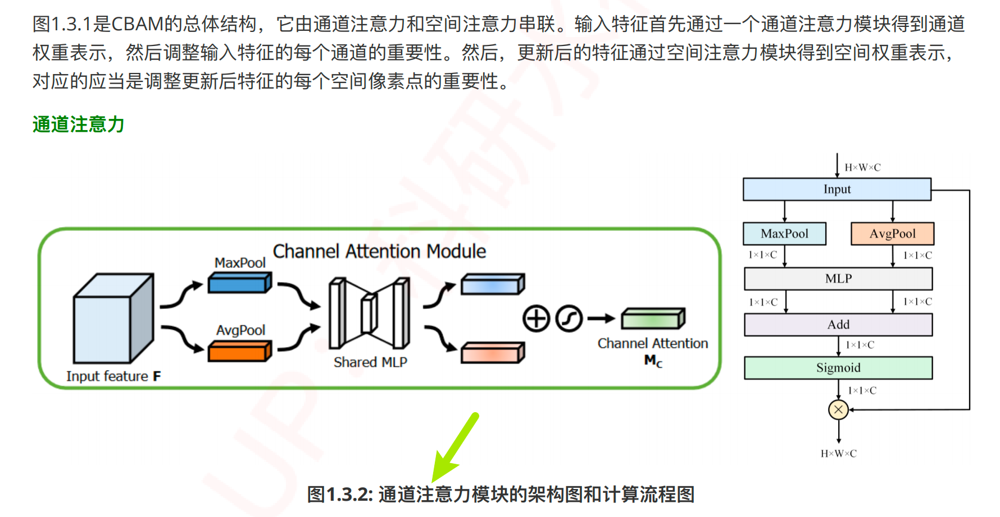

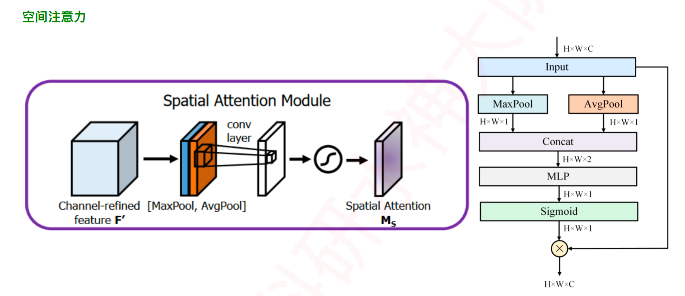


**作用：**

是为了提升前馈卷积神经网络性能而提出的一种简单而有效的注意力模块。CBAM通过顺序地推断两个维度上的注意力图（通道和空间），然后将这些注意力图乘以输入特征图进行自适应特征精炼。

1、**通道注意力模块（Channel Attention Module）**：

通过利用特征之间的通道关系来生成通道注意力图。每个通道的特征图被视为一个特征探测器，通道注意力关注于给定输入图像中“什么”是有意义的。为了有效地计算通道注意力，CBAM首先对输入特征图的空间维度进行压缩，同时使用平均池化和最大池化操作来捕获不同的空间上下文描述符，这些被送入共享的多层感知机（MLP）以产生通道注意力图。

2、**空间注意力模块（Spatial Attention Module）**：

利用特征之间的空间关系来生成空间注意力图。与通道注意力不同，空间注意力关注于“在哪里”是一个有信息的部分，这与通道注意力是互补的。为了计算空间注意力，CBAM首先沿着通道轴应用平均池化和最大池化操作，然后将它们连接起来生成一个高效的特征描述符。在该描述符上应用一个卷积层来生成空间注意力图。

**好处：**

**双重注意力机制**：

CBAM首次将 **通道注意力（Channel Attention）和空间注意力（Spatial Attention）顺序** 结合起来，对输入特征进行两阶段的精炼。这种设计让模型先关注于“哪些通道是重要的”，然后再关注于“空间上哪些位置是重要的”，从而更加全面地捕获特征中的关键信息。

```python
import torch
from torch import nn

# 通道注意力模块
class ChannelAttention(nn.Module):
    def __init__(self, in_planes, ratio=16):
        super(ChannelAttention, self).__init__()
        self.avg_pool = nn.AdaptiveAvgPool2d(1)  # 自适应平均池化
        self.max_pool = nn.AdaptiveMaxPool2d(1)  # 自适应最大池化

        # 两个卷积层用于从池化后的特征中学习注意力权重
        self.fc1 = nn.Conv2d(in_planes, in_planes // ratio, 1, bias=False)  # 第一个卷积层，降维
        self.relu1 = nn.ReLU()  # ReLU激活函数
        self.fc2 = nn.Conv2d(in_planes // ratio, in_planes, 1, bias=False)  # 第二个卷积层，升维
        self.sigmoid = nn.Sigmoid()  # Sigmoid函数生成最终的注意力权重

    def forward(self, x):
        avg_out = self.fc2(self.relu1(self.fc1(self.avg_pool(x))))  # 对平均池化的特征进行处理
        max_out = self.fc2(self.relu1(self.fc1(self.max_pool(x))))  # 对最大池化的特征进行处理
        out = avg_out + max_out  # 将两种池化的特征加权和作为输出
        return self.sigmoid(out)  # 使用sigmoid激活函数计算注意力权重

# 空间注意力模块
class SpatialAttention(nn.Module):
    def __init__(self, kernel_size=7):
        super(SpatialAttention, self).__init__()

        assert kernel_size in (3, 7), 'kernel size must be 3 or 7'  # 核心大小只能是3或7
        padding = 3 if kernel_size == 7 else 1  # 根据核心大小设置填充

        # 卷积层用于从连接的平均池化和最大池化特征图中学习空间注意力权重
        self.conv1 = nn.Conv2d(2, 1, kernel_size, padding=padding, bias=False)  
        self.sigmoid = nn.Sigmoid()  # Sigmoid函数生成最终的注意力权重

    def forward(self, x):
        avg_out = torch.mean(x, dim=1, keepdim=True)  # 对输入特征图执行平均池化
        max_out, _ = torch.max(x, dim=1, keepdim=True)  # 对输入特征图执行最大池化
        x = torch.cat([avg_out, max_out], dim=1)  # 将两种池化的特征图连接起来
        x = self.conv1(x)  # 通过卷积层处理连接后的特征图
        return self.sigmoid(x)  # 使用sigmoid激活函数计算注意力权重

# CBAM模块
class CBAM(nn.Module):
    def __init__(self, in_planes, ratio=16, kernel_size=7):
        super(CBAM, self).__init__()
        self.ca = ChannelAttention(in_planes, ratio)  # 通道注意力实例
        self.sa = SpatialAttention(kernel_size)  # 空间注意力实例

    def forward(self, x):
        out = x * self.ca(x)  # 使用通道注意力加权输入特征图
        result = out * self.sa(out)  # 使用空间注意力进一步加权特征图
        return result  # 返回最终的特征图

# 示例使用
if __name__ == '__main__':
    block = CBAM(64)  # 创建一个CBAM模块，输入通道为64
    input = torch.rand(1, 64, 64, 64)  # 随机生成一个输入特征图
    output = block(input)  # 通过CBAM模块处理输入特征图
    print(input.size(), output.size())  # 打印输入和输出的

```

## 	√ECA

论文《ECA-Net: Efficient Channel Attention for Deep Convolutional Neural Networks》


**作用：**

ECA模块旨在通过引入一种高效的通道注意力机制来增强深度卷积神经网络的特征表示能力。它着重于捕获通道间的动态依赖关系，从而使网络能够更加精确地重视对当前任务更重要的特征，提升模型在各种视觉任务上的性能。

**机制：**

ECA模块的核心机制是通过一个简单而高效的**一维卷积**来自适应地捕捉通道之间的依赖性，而**无需降维和升维**的过程。这种设计避免了传统注意力机制中复杂的多层感知机（MLP）结构，减少了模型复杂度和计算负担。ECA通过计算一个自适应的核大小，直接在通道特征上应用一维卷积，从而学习到每个通道相对于其他通道的重要性。


```python
import numpy as np
import torch
from torch import nn
from torch.nn import init
from collections import OrderedDict

"ECA-Net: Efficient Channel Attention for Deep Convolutional Neural Networks"

class ECAAttention(nn.Module):

    def __init__(self, kernel_size=3):
        super().__init__()
        self.gap=nn.AdaptiveAvgPool2d(1)
        self.conv=nn.Conv1d(1,1,kernel_size=kernel_size,padding=(kernel_size-1)//2)
        '''
            参数说明：
            in_channels=1：输入通道数为1
            out_channels=1：输出通道数为1
            kernel_size=kernel_size：卷积核的大小，这里由构造函数的参数 kernel_size 指定
            padding=(kernel_size-1)//2：填充大小，这里使用了对称填充，使得卷积操作后输出的长度与输入的长度相同
            问题：1D 卷积和 2D卷积的区别是什么？
            答：1D 卷积和 2D 卷积都有通道的概念，不同的是，1D 卷积，卷积的是序列，2D 卷积卷积的图
            区别就是卷积的对象不同

            这个 padding = （kernel_size - 1）//2 也是不变卷积
        '''
        self.sigmoid=nn.Sigmoid()

    def init_weights(self):
        for m in self.modules():
            if isinstance(m, nn.Conv2d):
                init.kaiming_normal_(m.weight, mode='fan_out')
                if m.bias is not None:
                    init.constant_(m.bias, 0)
            elif isinstance(m, nn.BatchNorm2d):
                init.constant_(m.weight, 1)
                init.constant_(m.bias, 0)
            elif isinstance(m, nn.Linear):
                init.normal_(m.weight, std=0.001)
                if m.bias is not None:
                    init.constant_(m.bias, 0)

    def forward(self, x):
        y=self.gap(x)  # 在空间方向执行全局平均池化: (B,C,H,W)-->(B,C,1,1)
        y=y.squeeze(-1).permute(0,2,1)  # 将通道描述符去掉一维,便于在通道上执行卷积操作:(B,C,1,1)-->(B,C,1)-->(B,1,C)
        y=self.conv(y)  # 在通道维度上执行1D卷积操作,建模局部通道之间的相关性: (B,1,C)-->(B,1,C) 1: 表示单通道，C : 表示每个通道 C 个元素
        y=self.sigmoid(y) # 生成权重表示: (B,1,C) 对所有元素 sigmoid，因为 sigmoid 生成的是绝对权重
        y=y.permute(0,2,1).unsqueeze(-1)  # 重塑shape: (B,1,C)-->(B,C,1)-->(B,C,1,1)
        return x*y.expand_as(x)  # 权重对输入的通道进行重新加权: (B,C,H,W) * (B,C,1,1) = (B,C,H,W)

        


if __name__ == '__main__':
    # (B, C, H, W)
    input=torch.randn(1,512,7,7)
    Model = ECAAttention(kernel_size=3)
    output=Model(input)
    print(output.shape)

    
```


**优势：**

1、**无需降维升维**：

与传统的注意力机制相比，ECA模块无需进行降维和升维的操作，这样不仅保留了原始通道特征的信息完整性，还进一步减少了模型复杂度。

、**自适应核大小**：

ECA模块根据通道数自适应地调整一维卷积的核大小，使其能够灵活地捕捉不同范围内的通道依赖性，这种自适应机制使得ECA在不同规模的网络和不同深度的层次中都能有效工作。

```python
import torch
from torch import nn
from torch.nn import init

# 定义ECA注意力模块的类
class ECAAttention(nn.Module):

    def __init__(self, kernel_size=3):
        super().__init__()
        self.gap = nn.AdaptiveAvgPool2d(1)  # 定义全局平均池化层，将空间维度压缩为1x1
        # 定义一个1D卷积，用于处理通道间的关系，核大小可调，padding保证输出通道数不变
        self.conv = nn.Conv1d(1, 1, kernel_size=kernel_size, padding=(kernel_size - 1) // 2)
        self.sigmoid = nn.Sigmoid()  # Sigmoid函数，用于激活最终的注意力权重

    # 权重初始化方法
    def init_weights(self):
        for m in self.modules():
            if isinstance(m, nn.Conv2d):
                init.kaiming_normal_(m.weight, mode='fan_out')  # 对Conv2d层使用Kaiming初始化
                if m.bias is not None:
                    init.constant_(m.bias, 0)  # 如果有偏置项，则初始化为0
            elif isinstance(m, nn.BatchNorm2d):
                init.constant_(m.weight, 1)  # 批归一化层权重初始化为1
                init.constant_(m.bias, 0)  # 批归一化层偏置初始化为0
            elif isinstance(m, nn.Linear):
                init.normal_(m.weight, std=0.001)  # 全连接层权重使用正态分布初始化
                if m.bias is not None:
                    init.constant_(m.bias, 0)  # 全连接层偏置初始化为0

    # 前向传播方法
    def forward(self, x):
        y = self.gap(x)  # 对输入x应用全局平均池化，得到bs,c,1,1维度的输出
        y = y.squeeze(-1).permute(0, 2, 1)  # 移除最后一个维度并转置，为1D卷积准备，变为bs,1,c
        y = self.conv(y)  # 对转置后的y应用1D卷积，得到bs,1,c维度的输出
        y = self.sigmoid(y)  # 应用Sigmoid函数激活，得到最终的注意力权重
        y = y.permute(0, 2, 1).unsqueeze(-1)  # 再次转置并增加一个维度，以匹配原始输入x的维度
        return x * y.expand_as(x)  # 将注意力权重应用到原始输入x上，通过广播机制扩展维度并执行逐元素乘法

# 示例使用
if __name__ == '__main__':
    block = ECAAttention(kernel_size=3)  # 实例化ECA注意力模块，指定核大小为3
    input = torch.rand(1, 64, 64, 64)  # 生成一个随机输入
    output = block(input)  # 将输入通过ECA模块处理
    print(input.size(), output.size())  # 打印输入和输出的尺寸，验证ECA模块的作用

```


## √ Coordinate Attention

论文《Coordinate Attention for Efficient Mobile Network Design》


- Coordinate Attention提出了一种新的注意力机制，用于在移动网络中嵌入位置信息到通道注意力中。这种方法不仅关注“哪些通道是重要的”，而且关注“在哪里”关注，通过更精细地控制空间选择性注意力图的生成，进一步提升模型性能。

**机制：**

1、**坐标信息嵌入**：

与传统的通道注意力通过2D全局池化将特征张量转换为单一特征向量不同，Coordinate Attention将通道注意力分解为两个1D特征编码过程，分别沿两个空间方向聚合特征。这种方法能够捕捉沿一个空间方向的长程依赖性，同时保留沿另一个空间方向的精确位置信息。

2、**坐标注意力生成**：

将沿垂直和水平方向聚合的特征图编码成一对方向感知和位置敏感的注意力图，这两个注意力图被互补地应用到输入特征图上，增强了对兴趣对象的表示。

**优势：** 

1、**方向感知和位置敏感**：

Coordinate Attention通过生成方向感知和位置敏感的注意力图，使模型能够更准确地定位和识别兴趣对象。这种注意力图能够精确地高亮兴趣区域，提升了模型对空间结构的理解能力。

2、**灵活性和轻量级**：

Coordinate Attention的设计简洁而高效，可以轻松嵌入到经典的移动网络结构中，如MobileNetV2、MobileNeXt和EfficientNet，几乎不增加计算开销，适用于计算资源受限的环境。

3、**跨任务性能提升**：

Coordinate Attention不仅在ImageNet分类任务上有效，更在下游任务如对象检测和语义分割上展现出更好的性能。这证明了其对于捕捉关键信息的能力，尤其在需要密集预测的任务中表现出色。

**优质注释》** 记得学学

```python
import torch
import torch.nn as nn
import torch.nn.functional as F

"Coordinate Attention for Efficient Mobile Network Design"

class h_sigmoid(nn.Module):
    def __init__(self, inplace=True):
        super(h_sigmoid, self).__init__()
        self.relu = nn.ReLU6(inplace=inplace)

    def forward(self, x):
        return self.relu(x + 3) / 6

class h_swish(nn.Module):
    def __init__(self, inplace=True):
        super(h_swish, self).__init__()
        self.sigmoid = h_sigmoid(inplace=inplace)

    def forward(self, x):
        return x * self.sigmoid(x)

class CoordAtt(nn.Module):
    def __init__(self, inp, oup, reduction=32):
        super(CoordAtt, self).__init__()
        self.pool_h = nn.AdaptiveAvgPool2d((None, 1))
        
        '''
            自适应平均池化：
            自适应平均池化不需要指定池化窗口的大小和步幅，而是直接指定输出的特征图大小
            (None, 1)
            None: 在第一个维度（通常是高度）上，输出的尺寸将自动调整以匹配输入的高度。也就是说，输入的高度是多少，输出的高度就是多少
            1: 在第二个维度（通常是宽度）上，输出的宽度将被调整为 1。
            经过 nn.AdaptiveAvgPool2d((None, 1)) 操作后，输出的特征图大小将变为 (C, H, 1)。也就是说，宽度被压缩为 1，而高度保持不变
        '''
        self.pool_w = nn.AdaptiveAvgPool2d((1, None))
        mip = max(8, inp // reduction)

        self.conv1 = nn.Conv2d(inp, mip, kernel_size=1, stride=1, padding=0)
        self.bn1 = nn.BatchNorm2d(mip)
        self.act = h_swish()
        self.relu = nn.ReLU()
        
        self.conv_h = nn.Conv2d(mip, oup, kernel_size=1, stride=1, padding=0)
        self.conv_w = nn.Conv2d(mip, oup, kernel_size=1, stride=1, padding=0)
        

    def forward(self, x):
        identity = x

        B,C,H,W = x.size()
        x_h = self.pool_h(x) # 压缩水平方向: (B, C, H, W) --> (B, C, H, 1)
        x_w = self.pool_w(x).permute(0, 1, 3, 2) # 压缩垂直方向: (B, C, H, W) --> (B, C, 1, W) --> (B,C,W,1)

        # 坐标注意力生成
        y = torch.cat([x_h, x_w], dim=2) # 拼接水平和垂直方向的向量: (B,C,H+W,1)
        y = self.conv1(y) # 通过Conv进行变换,并降维: (B,C,H+W,1)--> (B,d,H+W,1)
        y = self.bn1(y)   # BatchNorm操作: (B,d,H+W,1)
        y = self.relu(y)  # Relu操作: (B,d,H+W,1)
        
        x_h, x_w = torch.split(y, [H, W], dim=2) # 沿着空间方向重新分割为两部分: (B,d,H+W,1)--> x_h:(B,d,H,1); x_w:(B,d,W,1)
        x_w = x_w.permute(0, 1, 3, 2) # x_w: (B,d,W,1)--> (B,d,1,W)

        a_h = self.conv_h(x_h).sigmoid() # 恢复与输入相同的通道数,并生成垂直方向的权重: (B,d,H,1)-->(B,C,H,1)
        a_w = self.conv_w(x_w).sigmoid() # 恢复与输入相同的通道数,并生成水平方向的权重: (B,d,1,W)-->(B,C,1,W)
        '''
            问题：sigmoid 在哪个方向进行？
            答：
                sigmoid 是逐元素应用的，不依赖于特定的方向
                对每个输入元素独立地进行计算，而不是在某个特定的方向上进行
        '''

        out = identity * a_w * a_h # 将垂直、水平方向权重应用于输入,从而反映感兴趣的对象是否存在于相应的行和列中: (B,C,H,W) * (B,C,1,W) * (B,C,H,1) = (B,C,H,W)
        '''
        广播机制：
            identity 是一个形状为 (M, N) 的数组
            a_w 是一个形状为 (M, 1) 的数组 → a_w 的形状会被广播为 (M, N)，即在列方向上复制 N 次
            a_h 是一个形状为 (1, N) 的数组 → a_h 的形状会被广播为 (M, N)，即在行方向上复制 M 次
            最后：逐元素相乘。identity、a_w 和 a_h 的形状都变为 (M, N)，可以进行逐元素相乘
        '''

        return out

if __name__ == '__main__':
    # (B, C, H, W)
    input=torch.randn(1,512,7,7)
    Model = CoordAtt(inp=512,oup=512) # input_channel,output_channel
    output=Model(input)
    print(output.shape)
```

注释

```python
import torch
import torch.nn as nn
import torch.nn.functional as F

# 定义h_sigmoid激活函数，这是一种硬Sigmoid函数
class h_sigmoid(nn.Module):
    def __init__(self, inplace=True):
        super(h_sigmoid, self).__init__()
        self.relu = nn.ReLU6(inplace=inplace)  # 使用ReLU6实现

    def forward(self, x):
        return self.relu(x + 3) / 6  # 公式为ReLU6(x+3)/6，模拟Sigmoid激活函数

# 定义h_swish激活函数，这是基于h_sigmoid的Swish函数变体
class h_swish(nn.Module):
    def __init__(self, inplace=True):
        super(h_swish, self).__init__()
        self.sigmoid = h_sigmoid(inplace=inplace)  # 使用上面定义的h_sigmoid

    def forward(self, x):
        return x * self.sigmoid(x)  # 公式为x * h_sigmoid(x)

# 定义Coordinate Attention模块
class CoordAtt(nn.Module):
    def __init__(self, inp, oup, reduction=32):
        super(CoordAtt, self).__init__()
        # 定义水平和垂直方向的自适应平均池化
        self.pool_h = nn.AdaptiveAvgPool2d((None, 1))  # 水平方向
        self.pool_w = nn.AdaptiveAvgPool2d((1, None))  # 垂直方向

        mip = max(8, inp // reduction)  # 计算中间层的通道数

        # 1x1卷积用于降维
        self.conv1 = nn.Conv2d(inp, mip, kernel_size=1, stride=1, padding=0)
        self.bn1 = nn.BatchNorm2d(mip)  # 批归一化
        self.act = h_swish()  # 激活函数

        # 两个1x1卷积，分别对应水平和垂直方向
        self.conv_h = nn.Conv2d(mip, oup, kernel_size=1, stride=1, padding=0)
        self.conv_w = nn.Conv2d(mip, oup, kernel_size=1, stride=1, padding=0)

    def forward(self, x):
        identity = x  # 保存输入作为残差连接

        n, c, h, w = x.size()  # 获取输入的尺寸
        x_h = self.pool_h(x)  # 水平方向池化
        x_w = self.pool_w(x).permute(0, 1, 3, 2)  # 垂直方向池化并交换维度以适应拼接

        y = torch.cat([x_h, x_w], dim=2)  # 拼接水平和垂直方向的特征
        y = self.conv1(y)  # 通过1x1卷积降维
        y = self.bn1(y)  # 批归一化
        y = self.act(y)  # 激活函数

        x_h, x_w = torch.split(y, [h, w], dim=2)  # 将特征拆分回水平和垂直方向
        x_w = x_w.permute(0, 1, 3, 2)  # 恢复x_w的原始维度

        a_h = self.conv_h(x_h).sigmoid()  # 通过1x1卷积并应用Sigmoid获取水平方向的注意力权重
        a_w = self.conv_w(x_w).sigmoid()  # 通过1x1卷积并应用Sigmoid获取垂直方向的注意力权重

        out = identity * a_w * a_h  # 应用注意力权重到输入特征，并与残差连接相乘

        return out  # 返回输出

# 示例使用
if __name__ == '__main__':
    block = CoordAtt(64, 64)  # 实例化Coordinate Attention模块
    input = torch.rand(1, 64, 64, 64)  # 创建一个随机输入
    output = block(input)  # 通过模块处理输入
    print(output.shape())  # 打印输入和输出的尺寸

```


## CoTAttention

论文《Contextual Transformer Networks for Visual Recognition》


> 作用

Contextual Transformer (CoT) block 设计为视觉识别的一种新颖的 Transformer 风格模块。该设计充分利用输入键之间的上下文信息指导动态注意力矩阵的学习，从而加强视觉表示的能力。CoT block 首先通过 3x3 卷积对输入键进行上下文编码，得到输入的静态上下文表示。然后，将编码后的键与输入查询合并，通过两个连续的 1x1 卷积学习动态多头注意力矩阵。学习到的注意力矩阵乘以输入值，实现输入的动态上下文表示。最终将静态和动态上下文表示的融合作为输出。

> 机制

1、**上下文编码**：

通过 3x3 卷积在所有邻居键内部空间上下文化每个键表示，捕获键之间的静态上下文信息。

2、**动态注意力学习**：

基于查询和上下文化的键的连接，通过两个连续的 1x1 卷积产生注意力矩阵，这一过程自然地利用每个查询和所有键之间的相互关系进行自我注意力学习，并由静态上下文指导。

3、**静态和动态上下文的融合**：

将静态上下文和通过上下文化自注意力得到的动态上下文结合，作为 CoT block 的最终输出。

> 优势

1、**上下文感知**：

CoT 通过在自注意力学习中探索输入键之间的富上下文信息，使模型能够更准确地捕获视觉内容的细微差异。

2、**动静态上下文的统一**：

CoT 设计巧妙地将上下文挖掘与自注意力学习统一到单一架构中，既利用键之间的静态关系又探索动态特征交互，提升了模型的表达能力。

3、**灵活替换与优化**：

CoT block 可以直接替换现有 ResNet 架构中的标准卷积，不增加参数和 FLOP 预算的情况下实现转换为 Transformer 风格的骨干网络（CoTNet），通过广泛的实验验证了其在多种应用（如图像识别、目标检测和实例分割）中的优越性。

```python
# 导入必要的PyTorch模块
import torch
from torch import nn
from torch.nn import functional as F

class CoTAttention(nn.Module):
    # 初始化CoT注意力模块
    def __init__(self, dim=512, kernel_size=3):
        super().__init__()
        self.dim = dim  # 输入的通道数
        self.kernel_size = kernel_size  # 卷积核大小

        # 定义用于键(key)的卷积层，包括一个分组卷积，BatchNorm和ReLU激活
        self.key_embed = nn.Sequential(
            nn.Conv2d(dim, dim, kernel_size=kernel_size, padding=kernel_size//2, groups=4, bias=False),
            nn.BatchNorm2d(dim),
            nn.ReLU()
        )

        # 定义用于值(value)的卷积层，包括一个1x1卷积和BatchNorm
        self.value_embed = nn.Sequential(
            nn.Conv2d(dim, dim, 1, bias=False),
            nn.BatchNorm2d(dim)
        )

        # 缩小因子，用于降低注意力嵌入的维度
        factor = 4
        # 定义注意力嵌入层，由两个卷积层、一个BatchNorm层和ReLU激活组成
        self.attention_embed = nn.Sequential(
            nn.Conv2d(2*dim, 2*dim//factor, 1, bias=False),
            nn.BatchNorm2d(2*dim//factor),
            nn.ReLU(),
            nn.Conv2d(2*dim//factor, kernel_size*kernel_size*dim, 1)
        )

    def forward(self, x):
        # 前向传播函数
        bs, c, h, w = x.shape  # 输入特征的尺寸
        k1 = self.key_embed(x)  # 生成键的静态表示
        v = self.value_embed(x).view(bs, c, -1)  # 生成值的表示并调整形状

        y = torch.cat([k1, x], dim=1)  # 将键的静态表示和原始输入连接
        att = self.attention_embed(y)  # 生成动态注意力权重
        att = att.reshape(bs, c, self.kernel_size*self.kernel_size, h, w)
        att = att.mean(2, keepdim=False).view(bs, c, -1)  # 计算注意力权重的均值并调整形状
        k2 = F.softmax(att, dim=-1) * v  # 应用注意力权重到值上
        k2 = k2.view(bs, c, h, w)  # 调整形状以匹配输出

        return k1 + k2  # 返回键的静态和动态表示的总和

# 实例化CoTAttention模块并测试
if __name__ == '__main__':
    block = CoTAttention(64)  # 创建一个输入通道数为64的CoTAttention实例
    input = torch.rand(1, 64, 64, 64)  # 创建一个随机输入
    output = block(input)  # 通过CoTAttention模块处理输入
    print(output.shape)  # 打印输入和输出的尺寸

```

## √ TripletAttention

论文《Rotate to Attend: Convolutional Triplet Attention Module》三分支注意力


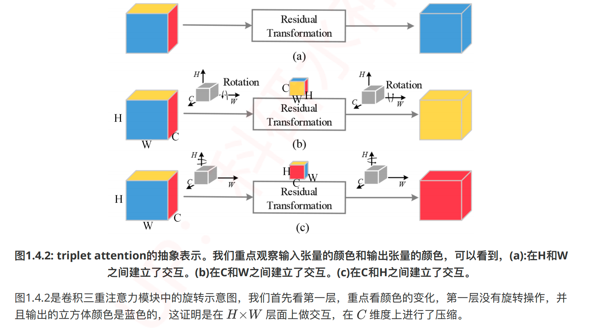

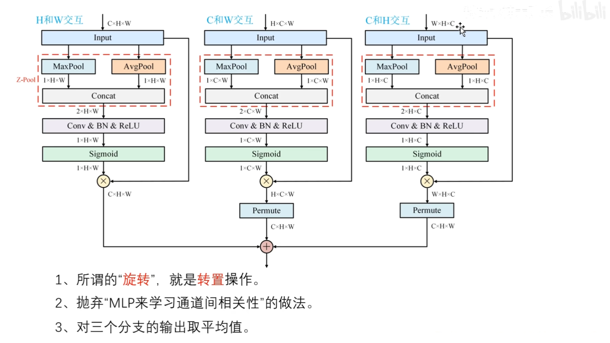

Triplet Attention是一种新颖的注意力机制，它通过**捕获跨维度交互**，利用**三分支结构**来计算注意力权重。对于输入张量，Triplet Attention通过**旋转操作**建立维度间的依赖关系，随后通过残差变换对信道和空间信息进行编码，实现了几乎不增加计算成本的情况下，有效增强视觉表征的能力。

> 机制

1、**三分支结构**：

Triplet Attention包含三个分支，每个分支负责捕获输入的空间维度H或W与信道维度C之间的交互特征。

2、**跨维度交互**：

通过在每个分支中对输入张量进行排列（permute）操作，并通过Z-pool和k×k的卷积层处理，以捕获跨维度的交互特征。

3、**注意力权重的生成**：

利用sigmoid激活层生成注意力权重，并应用于排列后的输入张量，然后将其排列回原始输入形状。

> 独特优势

1、**跨维度交互**：

Triplet Attention通过捕获输入张量的跨维度交互，提供了丰富的判别特征表征，较之前的注意力机制（如SENet、CBAM等）能够更有效地增强网络的性能。

2、**几乎无计算成本增加**：

相比于传统的注意力机制，Triplet Attention在提升网络性能的同时，几乎不增加额外的计算成本和参数数量，使得它可以轻松地集成到经典的骨干网络中。

3、**无需降维**：

与其他注意力机制不同，Triplet Attention不进行维度降低处理，这避免了因降维可能导致的信息丢失，保证了信道与权重间的直接对应关系。

优质注释：

```python
import torch
import torch.nn as nn

"Rotate to Attend: Convolutional Triplet Attention Module"

class BasicConv(nn.Module):
    def __init__(self, in_planes, out_planes, kernel_size, stride=1, padding=0, dilation=1, groups=1, relu=True, bn=True, bias=False):
        super(BasicConv, self).__init__()
        self.out_channels = out_planes
        self.conv = nn.Conv2d(in_planes, out_planes, kernel_size=kernel_size, stride=stride, padding=padding, dilation=dilation, groups=groups, bias=bias)
        self.bn = nn.BatchNorm2d(out_planes,eps=1e-5, momentum=0.01, affine=True) if bn else None
        self.relu = nn.ReLU() if relu else None

    def forward(self, x):
        x = self.conv(x)
        if self.bn is not None:
            x = self.bn(x)
        if self.relu is not None:
            x = self.relu(x)
        return x

class ZPool(nn.Module):
    def forward(self, x):
        # 以建立CW之间的交互为例, x:(B, H, C, W)
        a = torch.max(x,1)[0].unsqueeze(1) # 全局最大池化: (B, H, C, W)->(B, 1, C, W);  torch.max返回的是数组:[最大值,对应索引]
        '''
            torch.max 计算张量的最大值
            x 是 输入张量
            1 是 dim 参数，表示沿着第 1 维度（通常是行方向）计算最大值
            torch.max(x, 1) 返回一个元组 (values, indices)，其中 values 是每行的最大值，indices 是对应的索引
            [0] : [0] 取出元组中的第一个元素，即 values，也就是最大值
            .unsqueeze(1) 在指定维度上增加一个大小为 1 的维度
            values 的形状是 (n,)，那么 values.unsqueeze(1) 的形状将变为 (n, 1)

            我懂了，想象的时候，要想成一张彩色的 RGB 图，不要想成数表，因此 torch.max(x,1)[0]的形状是 (B, 1, C, W)；对于一张图片来说有 W×C 个最大值，本来是彩色的 RGB 图，变成了一张灰度图，沿着通道方向取最大值
        '''
        b = torch.mean(x,1).unsqueeze(1)   # 全局平均池化: (B, H, C, W)->(B, 1, C, W);
        c = torch.cat((a, b), dim=1)       # 在对应维度拼接最大和平均特征: (B, 2, C, W)
        return c

class AttentionGate(nn.Module):
    def __init__(self):
        super(AttentionGate, self).__init__()
        kernel_size = 7
        self.compress = ZPool()
        self.conv = BasicConv(2, 1, kernel_size, stride=1, padding=(kernel_size-1) // 2, relu=False)
    def forward(self, x):
        # 以建立CW之间的交互为例, x:(B, H, C, W)
        x_compress = self.compress(x) # 在对应维度上执行最大池化和平均池化,并将其拼接: (B, H, C, W) --> (B, 2, C, W);
        x_out = self.conv(x_compress) # 通过conv操作将最大池化和平均池化特征映射到一维: (B, 2, C, W) --> (B, 1, C, W);
        scale = torch.sigmoid_(x_out) # 通过sigmoid函数生成权重: (B, 1, C, W);
        return x * scale              # 对输入进行重新加权表示: (B, H, C, W) * (B, 1, C, W) = (B, H, C, W) 广播，复制，沿着通道方向复制成一样的

class TripletAttention(nn.Module):
    def __init__(self, no_spatial=False):
        super(TripletAttention, self).__init__()
        self.cw = AttentionGate()
        self.hc = AttentionGate()
        self.no_spatial=no_spatial
        if not no_spatial:
            self.hw = AttentionGate()
    def forward(self, x):
        # 建立C和W之间的交互:
        x_perm1 = x.permute(0,2,1,3).contiguous() # (B, C, H, W)--> (B, H, C, W);  执行“旋转操作”,建立C和W之间的交互,所以要在H维度上压缩
        x_out1 = self.cw(x_perm1) # (B, H, C, W)-->(B, H, C, W);  在H维度上进行压缩、拼接、Conv、sigmoid操作, 然后通过权重重新加权
        x_out11 = x_out1.permute(0,2,1,3).contiguous() # 恢复与输入相同的shape,也就是重新旋转回来: (B, H, C, W)-->(B, C, H, W)

        # 建立H和C之间的交互:
        x_perm2 = x.permute(0,3,2,1).contiguous() # (B, C, H, W)--> (B, W, H, C); 执行“旋转操作”,建立H和C之间的交互,所以要在W维度上压缩
        x_out2 = self.hc(x_perm2) # (B, W, H, C)-->(B, W, H, C);  在W维度上进行压缩、拼接、Conv、sigmoid操作, 然后通过权重重新加权
        x_out21 = x_out2.permute(0,3,2,1).contiguous() # 恢复与输入相同的shape,也就是重新旋转回来: (B, W, H, C)-->(B, C, H, W)

        # 建立H和W之间的交互:
        if not self.no_spatial:
            x_out = self.hw(x) # (B, C, H, W)-->(B, C, H, W);  在C维度上进行压缩、拼接、Conv、sigmoid操作, 然后通过权重重新加权
            x_out = 1/3 * (x_out + x_out11 + x_out21) # 取三部分的平均值进行输出
        else:
            x_out = 1/2 * (x_out11 + x_out21)
        return x_out

if __name__ == '__main__':
    # (B, C, H, W)
    input=torch.randn(1,512,7,7)
    Model = TripletAttention()
    output=Model(input)
    print(output.shape)
    
```

注释

```python
import torch
import torch.nn as nn

# 定义一个基本的卷积模块，包括卷积、批归一化和ReLU激活
class BasicConv(nn.Module):
    def __init__(self, in_planes, out_planes, kernel_size, stride=1, padding=0, dilation=1, groups=1, relu=True, bn=True, bias=False):
        super(BasicConv, self).__init__()
        self.out_channels = out_planes
        # 定义卷积层
        self.conv = nn.Conv2d(in_planes, out_planes, kernel_size=kernel_size, stride=stride, padding=padding, dilation=dilation, groups=groups, bias=bias)
        # 条件性地添加批归一化层
        self.bn = nn.BatchNorm2d(out_planes, eps=1e-5, momentum=0.01, affine=True) if bn else None
        # 条件性地添加ReLU激活函数
        self.relu = nn.ReLU() if relu else None

    def forward(self, x):
        x = self.conv(x)  # 应用卷积
        if self.bn is not None:
            x = self.bn(x)  # 应用批归一化
        if self.relu is not None:
            x = self.relu(x)  # 应用ReLU
        return x

# 定义ZPool模块，结合最大池化和平均池化结果
class ZPool(nn.Module):
    def forward(self, x):
        # 结合最大值和平均值
        return torch.cat((torch.max(x, 1)[0].unsqueeze(1), torch.mean(x, 1).unsqueeze(1)), dim=1)

# 定义注意力门，用于根据输入特征生成注意力权重
class AttentionGate(nn.Module):
    def __init__(self):
        super(AttentionGate, self).__init__()
        kernel_size = 7  # 设定卷积核大小
        self.compress = ZPool()  # 使用ZPool模块
        self.conv = BasicConv(2, 1, kernel_size, stride=1, padding=(kernel_size - 1) // 2, relu=False)  # 通过卷积调整通道数

    def forward(self, x):
        x_compress = self.compress(x)  # 应用ZPool
        x_out = self.conv(x_compress)  # 通过卷积生成注意力权重
        scale = torch.sigmoid_(x_out)  # 应用Sigmoid激活
        return x * scale  # 将注意力权重乘以原始特征

# 定义TripletAttention模块，结合了三种不同方向的注意力门
class TripletAttention(nn.Module):
    def __init__(self, no_spatial=False):
        super(TripletAttention, self).__init__()
        self.cw = AttentionGate()  # 定义宽度方向的注意力门
        self.hc = AttentionGate()  # 定义高度方向的注意力门
        self.no_spatial = no_spatial  # 是否忽略空间注意力
        if not no_spatial:
            self.hw = AttentionGate()  # 定义空间方向的注意力门

    def forward(self, x):
        # 应用注意力门并结合结果
        x_perm1 = x.permute(0, 2, 1, 3).contiguous()  # 转置以应用宽度方向的注意力
        x_out1 = self.cw(x_perm1)
        x_out11 = x_out1.permute(0, 2, 1, 3).contiguous()  # 还原转置
        x_perm2 = x.permute(0, 3, 2, 1).contiguous()  # 转置以应用高度方向的注意力
        x_out2 = self.hc(x_perm2)
        x_out21 = x_out2.permute(0, 3, 2, 1).contiguous()  # 还原转置
        if not self.no_spatial:
            x_out = self.hw(x)  # 应用空间注意力
            x_out = 1 / 3 * (x_out + x_out11 + x_out21)  # 结合三个方向的结果
        else:
            x_out = 1 / 2 * (x_out11 + x_out21)  # 结合两个方向的结果（如果no_spatial为True）
        return x_out

# 示例代码
if __name__ == '__main__':
    input = torch.randn(50, 512, 7, 7)  # 生成随机输入
    triplet = TripletAttention()  # 实例化TripletAttention
    output = triplet(input)  # 应用TripletAttention
    print(output.shape)  # 打印输出形状

```


## √⭐ASFF

论文《Learning Spatial Fusion for Single-Shot Object Detection》

[ASFF](https://mp.weixin.qq.com/s/LzAFyaH5Pj42uGHS8_0DWQ)


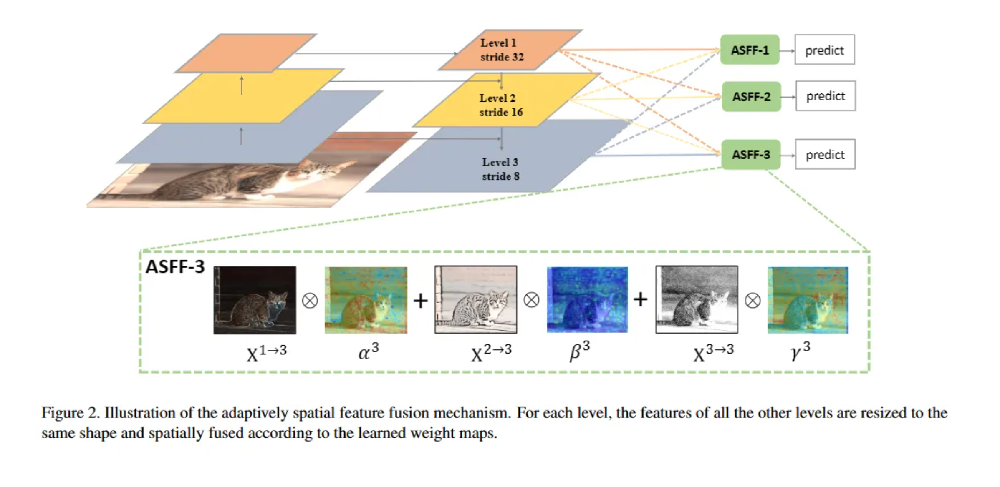

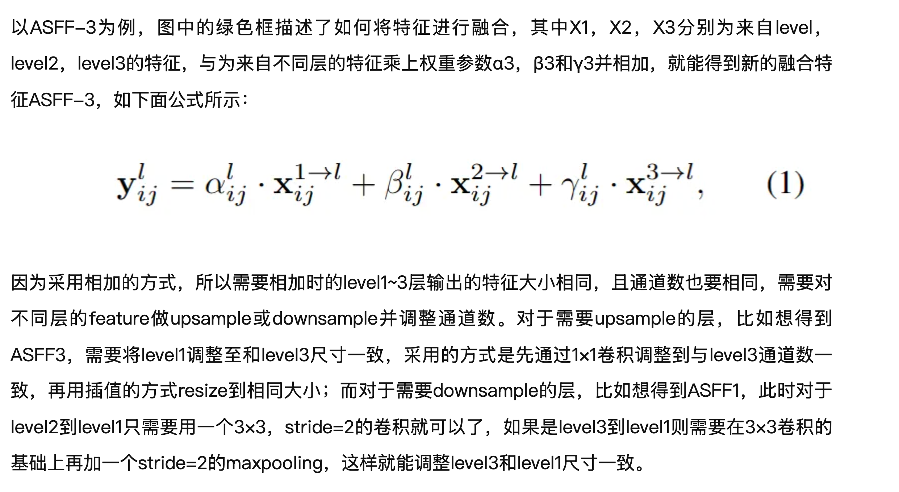

**主要解决：不同特征尺度不一致的问题** 

softmax：


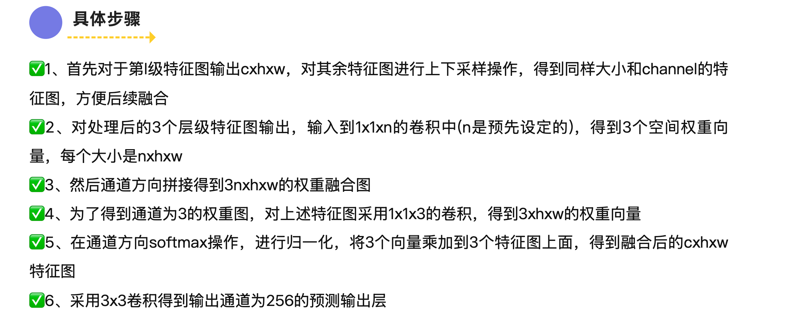

（实践出真知）

**优质注释**

```python
import torch
import torch.nn as nn
import torch.nn.functional as F


def autopad(k, p=None):  # kernel, padding
    # Pad to 'same'
    if p is None:
        p = k // 2 if isinstance(k, int) else [x // 2 for x in k]  # auto-pad
    return p


class Conv(nn.Module):
    # Standard convolution
    def __init__(self, c1, c2, k=1, s=1, p=None, g=1, act=True):  # ch_in, ch_out, kernel, stride, padding, groups
        super(Conv, self).__init__()
        self.conv = nn.Conv2d(c1, c2, k, s, autopad(k, p), groups=g, bias=False)
        self.bn = nn.BatchNorm2d(c2)
        self.act = nn.SiLU() if act is True else (act if isinstance(act, nn.Module) else nn.Identity())

    def forward(self, x):
        return self.act(self.bn(self.conv(x)))

    def forward_fuse(self, x):
        return self.act(self.conv(x))


class ASFF(nn.Module):
    def __init__(self, level, multiplier=1, rfb=False, vis=False, act_cfg=True):
        """
        multiplier should be 1, 0.5
        which means, the channel of ASFF can be
        512, 256, 128 -> multiplier=0.5
        1024, 512, 256 -> multiplier=1
        For even smaller, you need change code manually.
        """
        # init asff_module = ASFF(level=1, multiplier=1, rfb=False, vis=False)
        super(ASFF, self).__init__()
        self.level = level
        self.dim = [int(1024 * multiplier), int(512 * multiplier),
                    int(256 * multiplier)]
        # print(self.dim)

        self.inter_dim = self.dim[self.level]
        if level == 0:
            self.stride_level_1 = Conv(int(512 * multiplier), self.inter_dim, 3, 2)

            self.stride_level_2 = Conv(int(256 * multiplier), self.inter_dim, 3, 2)

            self.expand = Conv(self.inter_dim, int(
                1024 * multiplier), 3, 1)
        elif level == 1:
            self.compress_level_0 = Conv(
                int(1024 * multiplier), self.inter_dim, 1, 1)
            self.stride_level_2 = Conv(
                int(256 * multiplier), self.inter_dim, 3, 2)
            self.expand = Conv(self.inter_dim, int(512 * multiplier), 3, 1)
        elif level == 2:
            self.compress_level_0 = Conv(
                int(1024 * multiplier), self.inter_dim, 1, 1)
            self.compress_level_1 = Conv(
                int(512 * multiplier), self.inter_dim, 1, 1)
            self.expand = Conv(self.inter_dim, int(
                256 * multiplier), 3, 1)

        # when adding rfb, we use half number of channels to save memory
        compress_c = 8 if rfb else 16
        self.weight_level_0 = Conv(
            self.inter_dim, compress_c, 1, 1)
        self.weight_level_1 = Conv(
            self.inter_dim, compress_c, 1, 1)
        self.weight_level_2 = Conv(
            self.inter_dim, compress_c, 1, 1)

        self.weight_levels = Conv(
            compress_c * 3, 3, 1, 1)
        self.vis = vis

    def forward(self, x):  # l,m,s
        """
        #
        256, 512, 1024
        from small -> large
        """
        # forward output_feature = asff_module([level_2_feature, level_1_feature, level_0_feature])
        x_level_0 = x[2]  # 最大特征层 level_0_feature = (1, 1024, 20, 20)  # 大尺寸特征图 尺寸小通道多
        x_level_1 = x[1]  # 中间特征层 level_1_feature = (1, 512, 40, 40)   # 中尺寸特征图
        x_level_2 = x[0]  # 最小特征层 level_2_feature = (1, 256, 80, 80)   # 小尺寸特征图

        if self.level == 0:
            level_0_resized = x_level_0
            level_1_resized = self.stride_level_1(x_level_1)
            level_2_downsampled_inter = F.max_pool2d(
                x_level_2, 3, stride=2, padding=1)
            level_2_resized = self.stride_level_2(level_2_downsampled_inter)
        elif self.level == 1:
            level_0_compressed = self.compress_level_0(x_level_0) # (1, 1024, 20, 20) → self.compress_level_0 =  Conv2d(1024, 512, kernel_size=(1, 1), stride=(1, 1), bias=False) → (1, 512, 20, 20)
            
            level_0_resized = F.interpolate(
                level_0_compressed, scale_factor=2, mode='nearest') # (1, 512, 20, 20) → F.interpolate→ [1, 512, 40, 40]
            level_1_resized = x_level_1 #  [1, 512, 40, 40] → = → [1, 512, 40, 40]
            level_2_resized = self.stride_level_2(x_level_2) # [1, 256, 80, 80] → self.stride_level_2 = Conv2d(256, 512, kernel_size=(3, 3), stride=(2, 2), padding=(1, 1), bias=False) → [1, 512, 40, 40]
        elif self.level == 2:
            level_0_compressed = self.compress_level_0(x_level_0)
            level_0_resized = F.interpolate(
                level_0_compressed, scale_factor=4, mode='nearest')
            x_level_1_compressed = self.compress_level_1(x_level_1)
            level_1_resized = F.interpolate(
                x_level_1_compressed, scale_factor=2, mode='nearest')
            level_2_resized = x_level_2

        level_0_weight_v = self.weight_level_0(level_0_resized) # [1, 512, 40, 40] → self.weight_level_0 = (conv): Conv2d(512, 16, kernel_size=(1, 1), stride=(1, 1), bias=False) → [1, 16, 40, 40]
        level_1_weight_v = self.weight_level_1(level_1_resized) # [1, 512, 40, 40] → self.weight_level_1 = Conv2d(512, 16, kernel_size=(1, 1), stride=(1, 1), bias=False) → [1, 16, 40, 40]
        level_2_weight_v = self.weight_level_2(level_2_resized) # [1, 512, 40, 40] → self.weight_level_2 = Conv2d(512, 16, kernel_size=(1, 1), stride=(1, 1), bias=False) → [1, 16, 40, 40]

        levels_weight_v = torch.cat(
            (level_0_weight_v, level_1_weight_v, level_2_weight_v), 1) # [1, 16, 40, 40],[1, 16, 40, 40],[1, 16, 40, 40] → cat → [1, 48, 40, 40]
        levels_weight = self.weight_levels(levels_weight_v) # [1, 48, 40, 40] → self.weight_levels = (conv): Conv2d(48, 3, kernel_size=(1, 1), stride=(1, 1), bias=False) → [1, 3, 40, 40]
        levels_weight = F.softmax(levels_weight, dim=1) # [1, 3, 40, 40] → F.softmax → [1, 3, 40, 40]

        fused_out_reduced = level_0_resized * levels_weight[:, 0:1, :, :] + \
                            level_1_resized * levels_weight[:, 1:2, :, :] + \
                            level_2_resized * levels_weight[:, 2:, :, :]
        # [1, 512, 40, 40] * [1, 1, 40, 40] + [1, 512, 40, 40] * [1, 1, 40, 40] + [1, 512, 40, 40] * [1, 1, 40, 40] →  [1, 512, 40, 40]
        out = self.expand(fused_out_reduced) # [1, 512, 40, 40] → self.expand = (conv): Conv2d(512, 512, kernel_size=(3, 3), stride=(1, 1), padding=(1, 1), bias=False) → [1, 512, 40, 40]

        if self.vis:# self.vis = False
            return out, levels_weight, fused_out_reduced.sum(dim=1)
        else:
            return out


if __name__ == "__main__":
    # 模拟的输入特征图，模拟三个不同尺度的特征图，例如来自一个多尺度特征提取网络的输出
    level_0_feature = torch.randn(1, 1024, 20, 20)  # 大尺寸特征图
    level_1_feature = torch.randn(1, 512, 40, 40)   # 中尺寸特征图
    level_2_feature = torch.randn(1, 256, 80, 80)   # 小尺寸特征图

    # 初始化ASFF模块，level表示当前ASFF模块处理的是哪个尺度的特征层，这里以处理中尺寸特征层为例
    # multiplier用于调整通道数，rfb和vis分别表示是否使用更丰富的特征表示和是否可视化
    asff_module = ASFF(level=1, multiplier=1, rfb=False, vis=False)

    # 通过ASFF模块传递特征图
    output_feature = asff_module([level_2_feature, level_1_feature, level_0_feature])

    # 打印输出特征图的形状，确保ASFF模块正常工作
    print(f"Output feature shape: {output_feature.shape}")

# TODO 计算流程图、原文框架图、公式表示
```


## 	√DANet

标题：Dual Attention Network for Scene Segmentation

双重注意力网络


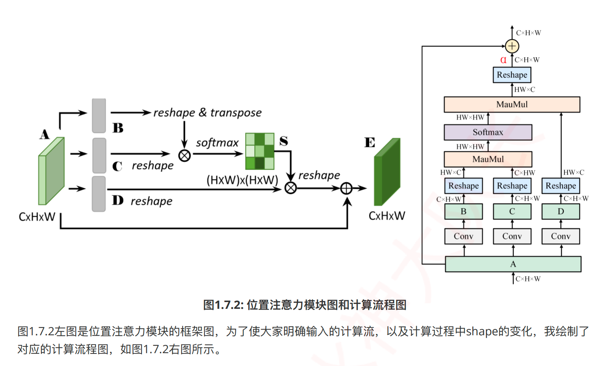

我应该也学一下 自己绘制 计算流程图

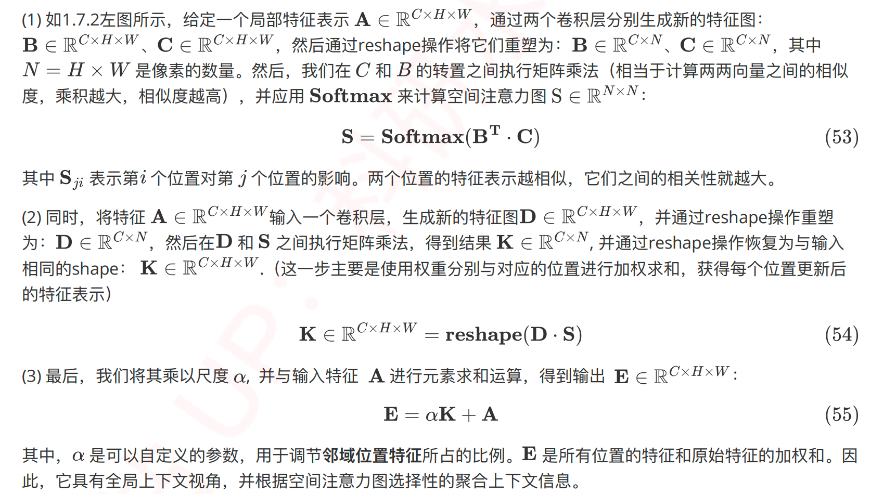


优质注释

```python
import numpy as np
import torch
from torch import nn
from torch.nn import init

"Dual Attention Network for Scene Segmentation"


class ScaledDotProductAttention(nn.Module):
    '''
    Scaled dot-product attention
    '''

    def __init__(self, d_model, d_k, d_v, h,dropout=.1):
        ''' 调用init：self.pa=ScaledDotProductAttention(d_model,d_k=d_model,d_v=d_model,h=1)
        :param d_model: Output dimensionality of the model
        :param d_k: Dimensionality of queries and keys
        :param d_v: Dimensionality of values
        :param h: Number of heads  也许我关于 QKV 的理解有误：nd ///  n_q×d_q . d_q × n_k . n_k × d_v
        '''
        super(ScaledDotProductAttention, self).__init__()
        self.fc_q = nn.Linear(d_model, h * d_k)
        self.fc_k = nn.Linear(d_model, h * d_k)
        self.fc_v = nn.Linear(d_model, h * d_v)
        self.fc_o = nn.Linear(h * d_v, d_model)
        self.dropout=nn.Dropout(dropout)

        self.d_model = d_model
        self.d_k = d_k
        self.d_v = d_v
        self.h = h

        self.init_weights()


    def init_weights(self):
        for m in self.modules():
            if isinstance(m, nn.Conv2d):
                init.kaiming_normal_(m.weight, mode='fan_out')
                if m.bias is not None:
                    init.constant_(m.bias, 0)
            elif isinstance(m, nn.BatchNorm2d):
                init.constant_(m.weight, 1)
                init.constant_(m.bias, 0)
            elif isinstance(m, nn.Linear):
                init.normal_(m.weight, std=0.001)
                if m.bias is not None:
                    init.constant_(m.bias, 0)

    def forward(self, queries, keys, values, attention_mask=None, attention_weights=None):
        '''这里的调用 y=B,N(HW),C → y=self.pa(y,y,y) → self.pa=ScaledDotProductAttention(d_model,d_k=d_model,d_v=d_model,h=1)
        Computes
        :param queries: Queries (b_s, nq, d_model) == (B,N,C)
        :param keys: Keys (b_s, nk, d_model) == (B,N,C)
        :param values: Values (b_s, nk, d_model) == (B,N,C)
        :param attention_mask: Mask over attention values (b_s, h, nq, nk); C=h*nk. True indicates masking.
        :param attention_weights: Multiplicative weights for attention values (b_s, h, nq, nk).
        :return:
        '''
        b_s, nq = queries.shape[:2] # n_q 是 query 的序列长度
        nk = keys.shape[1] # n_k key 和 value 的序列长度=像素个数=HW；再次强调，QKV 嵌入维度相同，序列长度可以不同

        # 注意力与卷积相结合是我的不明白
        # QK^TV Q n1×d K=V n2×d 
        # Q的来源可以和 KV 不同，KV 的来源 shape 必须一样，但是嵌入空间必须一致
        # n1×d . d×n2 . n2×d = n1×d

        q = self.fc_q(queries).view(b_s, nq, self.h, self.d_k).permute(0, 2, 1, 3)  # (b_s, h, nq, d_k) 其实这里的d_k 嵌入维度 应该是 embedding_dim//h 因为 head=1，所以这里的  d_k = embedding_dim // → self.fc_q = nn.Linear(d_model, h * d_k) → self.pa=ScaledDotProductAttention(d_model,d_k=d_model,d_v=d_model,h=1) 
        k = self.fc_k(keys).view(b_s, nk, self.h, self.d_k).permute(0, 2, 3, 1)  # (b_s, h, d_k, nk)
        v = self.fc_v(values).view(b_s, nk, self.h, self.d_v).permute(0, 2, 1, 3)  # (b_s, h, nk, d_v) 这几个形状的注释很准确，甚至过分准确了

        att = torch.matmul(q, k) / np.sqrt(self.d_k)  # (b_s, h, nq, nk)
        if attention_weights is not None:
            att = att * attention_weights
        if attention_mask is not None:
            att = att.masked_fill(attention_mask, -np.inf)
        att = torch.softmax(att, -1)
        att=self.dropout(att)

        out = torch.matmul(att, v).permute(0, 2, 1, 3).contiguous().view(b_s, nq, self.h * self.d_v)  # (b_s, nq, h*d_v)
        out = self.fc_o(out)  # (b_s, nq, d_model) 再把嵌入维度降回去 恢复原来的嵌入维度
        return out


class SimplifiedScaledDotProductAttention(nn.Module):
    '''
    Scaled dot-product attention
    '''

    def __init__(self, d_model, h,dropout=.1):
        '''
        :param d_model: Output dimensionality of the model
        :param d_k: Dimensionality of queries and keys
        :param d_v: Dimensionality of values
        :param h: Number of heads
        '''
        super(SimplifiedScaledDotProductAttention, self).__init__()

        self.d_model = d_model
        self.d_k = d_model//h
        self.d_v = d_model//h
        self.h = h

        self.fc_o = nn.Linear(h * self.d_v, d_model)
        self.dropout=nn.Dropout(dropout)


        self.init_weights()


    def init_weights(self):
        for m in self.modules():
            if isinstance(m, nn.Conv2d):
                init.kaiming_normal_(m.weight, mode='fan_out')
                if m.bias is not None:
                    init.constant_(m.bias, 0)
            elif isinstance(m, nn.BatchNorm2d):
                init.constant_(m.weight, 1)
                init.constant_(m.bias, 0)
            elif isinstance(m, nn.Linear):
                init.normal_(m.weight, std=0.001)
                if m.bias is not None:
                    init.constant_(m.bias, 0)

    def forward(self, queries, keys, values, attention_mask=None, attention_weights=None):
        '''
        Computes
        :param queries: Queries (b_s, nq, d_model)
        :param keys: Keys (b_s, nk, d_model)
        :param values: Values (b_s, nk, d_model)
        :param attention_mask: Mask over attention values (b_s, h, nq, nk). True indicates masking.
        :param attention_weights: Multiplicative weights for attention values (b_s, h, nq, nk).
        :return:
        '''
        b_s, nq = queries.shape[:2]
        nk = keys.shape[1]

        q = queries.view(b_s, nq, self.h, self.d_k).permute(0, 2, 1, 3)  # (b_s, h, nq, d_k)
        k = keys.view(b_s, nk, self.h, self.d_k).permute(0, 2, 3, 1)  # (b_s, h, d_k, nk)
        v = values.view(b_s, nk, self.h, self.d_v).permute(0, 2, 1, 3)  # (b_s, h, nk, d_v)

        att = torch.matmul(q, k) / np.sqrt(self.d_k)  # (b_s, h, nq, nk)
        if attention_weights is not None:
            att = att * attention_weights
        if attention_mask is not None:
            att = att.masked_fill(attention_mask, -np.inf)
        att = torch.softmax(att, -1)
        att=self.dropout(att)

        out = torch.matmul(att, v).permute(0, 2, 1, 3).contiguous().view(b_s, nq, self.h * self.d_v)  # (b_s, nq, h*d_v)
        out = self.fc_o(out)  # (b_s, nq, d_model)
        return out


class PositionAttentionModule(nn.Module):

    def __init__(self,d_model=512,kernel_size=3,H=7,W=7):
        super().__init__()
        self.cnn=nn.Conv2d(d_model,d_model,kernel_size=kernel_size,padding=(kernel_size-1)//2) # 不变卷积，通道数相当于嵌入维度 512；in_channel=d_modle out_channel=d_model;这一步就是聚合一下局部特征
        self.pa=ScaledDotProductAttention(d_model,d_k=d_model,d_v=d_model,h=1)
    
    def forward(self,x):
        # (B, C, H, W)
        B, C, H, W=x.shape # (B, C, H, W)
        y=self.cnn(x) # (B, C, H, W) --> (B, C, H, W)
        y=y.view(B,C,-1).permute(0,2,1) # (B, C, H, W) --> (B,C,N)-->(B,N,C)   N=H*W 序列长度就是 H*W
        y=self.pa(y,y,y) #(B,N,C)
        return y


class ChannelAttentionModule(nn.Module):
    
    def __init__(self,d_model=512,kernel_size=3,H=7,W=7):
        super().__init__()
        self.cnn=nn.Conv2d(d_model,d_model,kernel_size=kernel_size,padding=(kernel_size-1)//2)
        self.pa=SimplifiedScaledDotProductAttention(H*W,h=1) # 区别在哪儿？为什么没有复用
    
    def forward(self,x):
        # (B, C, H, W)
        B,C,H,W=x.shape
        y=self.cnn(x) # (B, C, H, W) --> (B, C, H, W)
        y=y.view(B,C,-1)  # (B, C, H, W)-->(B, C, N)  N=H*W
        y=self.pa(y,y,y)  # (B, C, N) 图像数据在进入到注意力计算之前就已经展平维度了。
        return y


class DAModule(nn.Module):

    def __init__(self,d_model=512,kernel_size=3,H=7,W=7):
        super().__init__()
        # 位置注意力和通道注意力的区别就是：通道注意力没有通过卷积操作生成qkv
        self.position_attention_module=PositionAttentionModule(d_model=512,kernel_size=3,H=7,W=7)
        self.channel_attention_module=ChannelAttentionModule(d_model=512,kernel_size=3,H=7,W=7)
    
    def forward(self,input):
        # (B, C, H, W)
        B,C,H,W=input.shape # (B, C, H, W)
        p_out=self.position_attention_module(input) # 执行位置注意力: (B, C, H, W)-->(B,N,C) 位置注意力和空间注意力很像
        c_out=self.channel_attention_module(input)  # 执行通道注意力:(B, C, H, W)--> (B, C, N)
        p_out=p_out.permute(0,2,1).view(B,C,H,W) #(B,N,C)-->(B,C,N)-->(B,C,H,W)
        c_out=c_out.view(B,C,H,W) # (B,C,N)-->(B,C,H,W)

        p_out = input + 0.5 * p_out
        c_out = input + 0.2 * c_out

        return p_out+c_out


# 两个注意力机制就不细讲了哦, 基本一模一样,只不过通道注意力没有通过卷积生成新的qkv,作者说会破坏原有通道之间的相关性。
if __name__ == '__main__':
    # (B, C, H, W)
    input=torch.randn(1,512,7,7)
    Model=DAModule(d_model=512,kernel_size=3,H=7,W=7)
    output = Model(input)
    print(output.shape)

```

这个代码 还是有点复杂的。什么多头注意力的，不会
